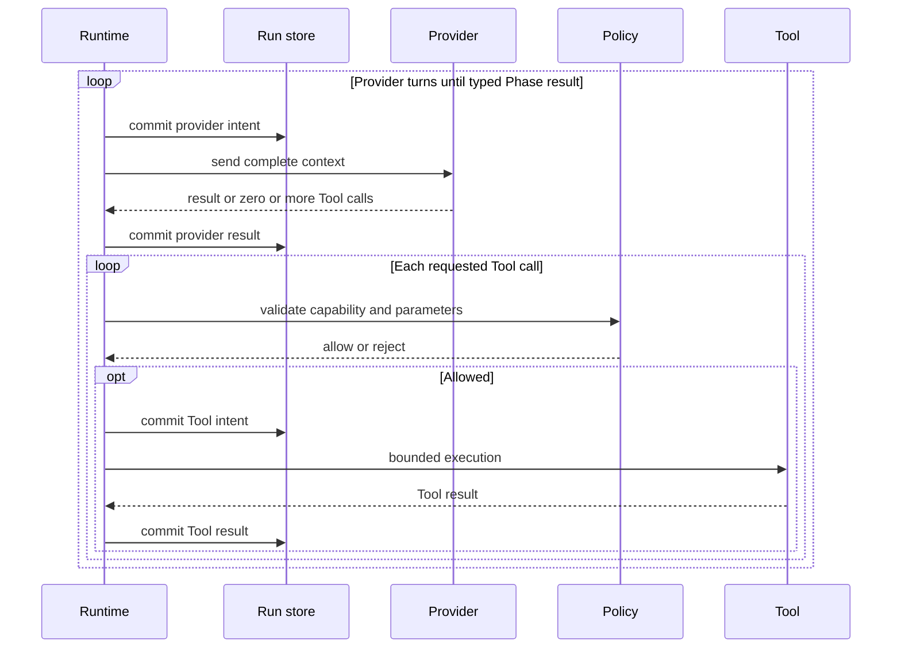
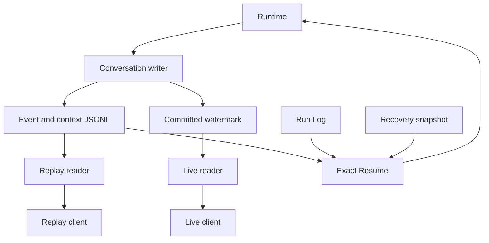

# Protocol

The protocol is the **integration seam** between the tools. Tools are protocol clients, not compiled-in modules. This file is the canonical contract; build tools against it, not against each other's internals. ADR-0029 selects local JSON-RPC over stdio for designed control/RPC surfaces, but M1's implemented runtime stream is bare JSONL events. The envelope is transport-agnostic and all cross-tool state is addressed by IDs.

Flow Agent is a **standalone host-local product**, and its event stream is a public runtime contract in its own right (CLI JSONL mode, future RPC mode and local session log all carry these events — see [`docs/concept/V-Spec_FlowAgent.html`](docs/concept/V-Spec_FlowAgent.html)). A Meta-Harness on the same host consumes that contract; neither Meta-Harness nor Liquid is required to run Flow Agent.

## Participants

- **Flow Agent** — standalone CLI that emits execution events and accepts commands on its current host; its event stream is public.
- **Meta-Harness** — self-contained, host-scoped headless control plane: consumes events from CLI agents on its own host through adapters; issues control/config commands; emits metrics; and exposes a local-or-remote CLI/API/service surface for Liquid and BYOA (transport: D-023; see [`docs/concept/V-Spec_MetaHarness.html`](docs/concept/V-Spec_MetaHarness.html)). It never controls another host's processes.
- **Liquid** — standalone local-first workspace product. Each interactive or headless instance reads and mutates a local replica, exchanges committed Workspace changes through the central Sync Server, and may present projections from one or more Meta-Harness instances. Every projection retains its instance identity, freshness and authority. Liquid exposes its **own** Workspace CLI/API so external agents and integrations use typed actions through its Role, permission and History pipeline (see [`docs/concept/V-Spec_Liquid.html`](docs/concept/V-Spec_Liquid.html), D-027). Flow Agent and Meta-Harness do not mutate Liquid storage internals.
- **Sync Server** — central star-topology service for resumable Workspace change exchange. It neither runs Liquid Apps nor routes Meta-Harness commands.
- **Adapters** — translate external agents (Codex CLI, Claude Code and future agents) into the same contract.

## Topology and ownership invariants

- Agent-process ownership is host-local: a Meta-Harness may start, stop and observe only CLI processes on its own host.
- API reachability is independent of execution locality: Liquid or BYOA may call a Meta-Harness from another device when authenticated transport exists.
- Liquid routes every live command to the Meta-Harness instance that owns the addressed session or configuration. A merged projection never creates cross-instance authority.
- Liquid replicas connect to the Sync Server, never directly to one another. The M3 MVP replication unit is an authorized Workspace, not a hand-selected set of Blocks.
- M3 MVP user devices sync each authorized Workspace in full. Resource-scoped Roles govern Liquid reads and actions but are not a confidentiality boundary against the authorized device owner or same-identity local processes inspecting replica bytes. A headless Liquid replica requires explicit workspace-level opt-in before it receives that Workspace.
- Workspace admission and resource authorization remain separate. Replicated resources retain stable identities, committed changes remain resource-addressed and sync remains versioned so a later protocol can define a finite authorized-resource closure without replacing the object or History model. Selective replication is not part of the MVP.
- The Sync Server and headless Liquid replica are separate logical participants even when one deployment co-locates them.
- Workspace sync and live agent control are separate planes. Sync exchanges Liquid Actions/state; it does not tunnel Meta-Harness commands or imply that cached agent state is controllable offline.
- Loss of sync connectivity does not change a Liquid replica's working store: local reads and mutations continue, while resumable exchange waits for connectivity.
- Agents use Liquid through the Workspace CLI/API and effective Roles. No visibility, View placement, Connection or Meta-Harness reachability grants implicit Workspace authority.

## Configuration and accepted post-M1.1 target invariants

The Global Flow configuration invariant is implemented in M1.1. The remaining invariants are accepted post-M1.1 targets:

- After provisioning, one host can execute the local Watershed core path with network interfaces disabled. Remote provider, sync, MCP and control transports are optional capabilities; [D-059](docs/decisions/open-decisions.html#d-059) owns the finite provisioning and local-inference contract.
- Flow Agent resolves one Global Flow configuration authority from `FLOW_AGENT_HOME`, defaulting to `$HOME/.flow` on Unix and `%USERPROFILE%\.flow` on Windows. Its `config.yaml` and configured registry are the sole implicit technical configuration sources. Workspace `.flow/config.yaml`, Workspace registries and other ambient project configuration are never probed, merged or fallback sources; missing, invalid, inaccessible, unsafe or conflicting global state fails before Run/session mutation. Project-specific behavior is an explicitly selected Flow from the global registry.
- A Flow's model/runtime requirements are distinct from a device-local Runtime binding. Endpoints, model/runtime artifacts, typed provider/audience-bound credential references, credential material and resource policy do not travel as Flow or Conversation authority.
- Portable continuation imports a D-062-authenticated terminal checkpoint and creates a new child Run. It revalidates the selected Flow, runtime resources, capabilities and authority before effects; completed effects are never redispatched. Exact two-id recovery remains a separate recovery contract for one incomplete Run.
- Disconnected continuations from one checkpoint create distinct Conversation branches. No device silently claims the same linear Run or transfers a host-local lease. The finite archive, transfer, fencing and collision rules remain [D-058](docs/decisions/open-decisions.html#d-058); destination authority and offline approvals remain [D-060](docs/decisions/open-decisions.html#d-060).

## MVP boundary

Protocol v0 is designed for the Flow Agent CLI MVP and later Meta-Harness integration. It does **not** require a Watershed project-history/VCS engine. Host Git/project events may appear as artifacts when the host tool provides them, but protocol correctness must not depend on Watershed owning version control.

## Runtime event families (v0 scope)

- **Session lifecycle:** `session.started | session.paused | session.resumed | session.completed | session.failed`.
- **Flow/activity:** `flow.started | flow.completed | flow.failed | phase.entered | phase.completed | phase.failed`.
- **Transcript:** `message.delta | message.completed` (near-real-time transcript sync; deltas are first-class).
- **Tool/runtime:** `tool.started | tool.progress | tool.completed | tool.failed | tool.timed_out`.
- **Artifacts:** `artifact.logged` (logs, summaries, handoff packs, checkpoints, host-provided diffs).
- **Attention:** `attention.requested` (input/approval required).
- **Metrics:** `metric.sample` (AgentPulse).
- **Errors:** `error` (generic runtime/protocol error event).

Runtime events use the v0 Flow Agent short-form name set decided in ADR-0036. `message.delta` and `tool.progress` stay first-class for near-real-time consumers. Do not maintain a second event naming convention.

M1 Flow Agent emits the families exercised by the explicit fixture profile and runtime error paths. M1.1 also emits `tool.timed_out`; `session.paused`, `artifact.logged`, `attention.requested` and `metric.sample` remain v0-designed names for later emitters.

### v0 lifecycle ordering

- `session.started` is the first event. `session.completed` or `session.failed` is last and requires every started flow, Phase execution, Tool and message to be terminal.
- A flow-scoped event follows its unique `flow.started` and precedes that flow's `flow.completed` or `flow.failed`. A subflow's `parent_flow_id` identifies its unchanged, active parent.
- `phase.entered` opens one uniquely identified Phase iteration. A composite Phase may open only its ordered child Phases; it makes no provider turn. A leaf Phase may open provider messages and provider-requested Tools. The matching `phase.completed` carries the typed result; `phase.failed` closes that Phase and its active ancestors on failure.
- Repeating a Phase creates a new `phase_execution_id` and increments its local `iteration`. Repetition stops when exact typed equality satisfies the declared `until` predicate; reaching `max_iterations` first fails the Phase. All nested iterations count toward the top-level Flow limit.
- `tool.started` belongs to the active leaf Phase. Its progress and terminal event use the same flow, Phase and Tool identity. Preflight rejection occurs before `tool.started`; after it, exactly one terminal Tool event follows.
- `message.delta` belongs to the active leaf Phase and starts a message identity; provider transcript content is UTF-8-split into ordered deltas that fit the canonical event limit, and further deltas plus the matching `message.completed` retain its role. Completed lifecycle identities cannot be reused.

Command/request messages are not runtime event types. The future RPC/control surface uses JSON-RPC over stdio for local transport (ADR-0029); ADR-0055 selects the initial method set as `flow.start`, `flow.status`, `flow.cancel`, `flow.tail` and `flow.export`. Resulting runtime events may use `correlation_id` to link back to a request, and must still address state by IDs.

## Required v0 event-envelope fields

The v0 wire format is one UTF-8 JSON object per event. JSONL mode and the session's ordered event segments store one event object per line; future RPC event delivery carries the same object in JSON-RPC payloads. Protocol v0 has an exclusive JSON container-recursion limit of 128 across the complete event object: the envelope root counts, a path containing at most 127 arrays or objects is accepted, and entering the 128th is rejected before recursive processing. Constructed payloads, additive fields, ordinary and canonical event serialization, and the public canonical-JSON helper enforce the same boundary; for the helper, the supplied value is the root.

| Field | Type / rule |
| --- | --- |
| `protocol_version` | string, fixed to `"0"` for v0 |
| `event_id` | non-empty opaque string, unique within the session |
| `event_type` | one of the v0 runtime event names above |
| `session_id` | exactly the `run_session_id` of the linear run that emitted the event |
| `flow_id` | optional runtime flow invocation id when flow-scoped; unique within the session |
| `parent_flow_id` | optional parent runtime flow invocation id for subflow events |
| `sequence` | unsigned integer, starts at 1 and increases by exactly 1 per `run_session_id` |
| `timestamp` | canonical RFC 3339 UTC form ending in literal `Z`; numeric zero offsets are not accepted |
| `source` | non-empty opaque string identifying the emitter, e.g. `flow-agent-cli` |
| `payload` | JSON object; event-specific fields below |
| `correlation_id` | optional non-empty opaque string linking request/result events |

Consumers retain unknown top-level fields so additive v0 extensions survive replay and forwarding unchanged.

M1 Flow Agent derives timestamps from its event clock: `timestamp = base + (sequence - 1) seconds`. Fixture workspaces use a fixed base for byte-stable golden streams; non-fixture workspaces use a wall-clock base captured once at session start rather than sampling wall time per event.

## v0 ID safety and flow identity

- `conversation_id` and `run_session_id` are opaque tokens, not paths. Both match `^[a-z0-9_-]{1,128}$` except Windows DOS device basenames (`con`, `prn`, `aux`, `nul`, `com1`–`com9`, `lpt1`–`lpt9`). Producers reject path separators (`/`, `\`), drive prefixes, absolute paths, percent-encoded separators, `.`, `..`, empty strings and all other non-matching values before filesystem access. Lowercase-only ids avoid filename aliases on case-insensitive targets. In M1.1 every runtime event `session_id` is byte-for-byte its run's `run_session_id`; the enclosing `conversation_id` is supplied by the addressed command or resolved from `history.jsonl`, never inferred from event bytes.
- `flow_id` is a runtime invocation id, not the registry/definition id. The root flow and every subflow invocation get distinct `flow_id` values within the session. Reusing one subflow definition twice therefore emits two different `flow_id` values, each with `parent_flow_id` equal to the containing runtime flow invocation id.
- Flow definition identity travels in payload fields, not in `flow_id`. `flow.*` events carry `flow_definition_id`; `flow_name` is optional display metadata.

## M1.1 authoring CLI grammar (ADR-0091, ADR-0097, ADR-0104, ADR-0110)

`core/core-script/schemas/registry-block.schema.json` documents the intended field/type shape; the `core-script` parser and model own executable acceptance as specified in [`SECURITY.md`](SECURITY.md#principle-scripts-define-enforcement-must-match-the-claim). The descriptor below is the complete CLI mapping. Outside a delimited group, flags may appear in any order. A singleton appears exactly once unless shown optional, a repeatable flag or group appends in occurrence order, and an absent repeat means an empty array. Unknown flags, duplicate singletons, incomplete groups and fields invalid for the selected kind fail before filesystem mutation.

```text
common              := --id ID --name NAME
flow init           := flow init [--registry-root PATH]
flow validate       := flow validate [FLOW_REF]
instruction         := flow create instruction common
                       (--prompt-file PATH | --prompt-stdin) instruction-parameter*
phase               := flow create phase common [--instruction-ref REF]* [--tool-ref REF]*
                       [--phase-ref REF]* --output-contract-file PATH
                       [--result-from REF] [phase-loop] transition*
flow                 := flow create flow common --phase-ref REF [--phase-ref REF]*
                       [--subflow-ref REF]* transition*
predefined tool     := flow create tool common --tool-kind predefined-command
                       --command-id COMMAND_ID [--argv TEXT]* parameter*
                       --max-concurrent-processes-and-threads U32
                       [--read-only-mount PATH]* [--writable-mount PATH]*
                       [--runtime-profile (exact|host-system-read)] network
own-script tool     := flow create tool common --tool-kind own-script
                       (--script-body-file PATH | --script-body-stdin) parameter*
                       --max-concurrent-processes-and-threads U32
                       [--read-only-mount PATH]* [--writable-mount PATH]*
                       [--runtime-profile (exact|host-system-read)] network

instruction-parameter
                    := --parameter --parameter-name NAME
                       --parameter-contract-file PATH --end-parameter
parameter           := --parameter --parameter-name PARAM_NAME
                       --parameter-value-type (none|string|integer|workspace-relative-path|enum)
                       --parameter-required (true|false)
                       [--parameter-allowed-value TEXT]*
                       [--parameter-value-pattern TEXT]
                       [--parameter-max-length U16]
                       [--parameter-min I64] [--parameter-max I64]
                       --end-parameter
phase-loop          := --loop --loop-max-iterations U8
                       --loop-until-file PATH --end-loop
transition          := --transition --transition-from-phase-ref REF
                       --transition-to-phase-ref REF
                       --transition-when-file PATH --end-transition
network             := --network deny
                      | --network-default deny network-allow*
network-allow       := --network-allow --network-kind cidr
                       --network-transport (tcp|udp) --network-cidr CIDR
                       --network-port U16 --end-network-allow
```

`flow init`, `flow validate` and `flow create` operate only on the Global Flow home.

The field mapping is literal: `--id`/`--name` map to every block's `id`/`name`; hyphenated singleton flags map to the same snake-case field; singular repeat flags map to the corresponding array (`--argv` to `command.argv`, `--instruction-ref` to `instruction_refs`, `--tool-ref` to `tool_refs`, `--phase-ref` to `phase_refs`, `--subflow-ref` to `subflow_refs`, `--read-only-mount` to `read_only_mounts`, and `--writable-mount` to `writable_mounts`). `--max-concurrent-processes-and-threads` maps to the required positive `max_concurrent_processes_and_threads` Tool capability. `--runtime-profile` maps to `runtime_profile`; absence selects `exact`, while `host-system-read` requires explicit Agentic Engineer authoring. An Instruction parameter group maps to `parameters[]`; a Tool parameter group maps to `allowed_parameters[]`. Loop and Transition files contain one bounded `ValuePredicate`; output and parameter-contract files contain one closed `ValueContract`. `--network deny` maps to the scalar policy; `--network-default deny` plus ordered `network-allow` groups maps to `{default:"deny",allow:[...]}`. For an own-script Tool, the body source maps to `script_body`, while `command: script:<tool-id>` and `script_runtime: posix-sh` are derived and cannot be overridden.

Group fields occur only inside their matching begin/end markers and in the displayed order. Every Tool parameter requires `name`, `value_type` and `required`. Type `none` permits no constraint flags; `string` requires exactly one pattern and maximum length; `enum` requires at least one allowed value; `integer` permits only optional minimum/maximum; `workspace-relative-path` permits only optional pattern/maximum length. Network is exactly one of the two displayed forms; every allow group is complete and `kind` is `cidr`. A Flow requires at least one direct Phase. A leaf Phase has no child `phase_refs`, omits `result_from` and child Transitions, and may declare Instructions and Tools. A composite Phase has child `phase_refs`, declares exactly one `result_from` child with the same output contract, and declares no Instructions or Tools. A loop permits 1–32 iterations. Each Transition names two direct sibling Phases, points strictly forward, and its predicate is valid against the source output contract.

Each Tool value placeholder consumes exactly one argv token. Text is preserved as exact UTF-8 after OS-shell argument decoding; Flow Agent performs no secondary splitting, unescaping, interpolation or locale conversion. Enums and Boolean values are the exact lowercase literals shown. `I64` uses `0` or `-?[1-9][0-9]*` within signed 64-bit range; unsigned values use canonical decimal without leading zeroes and remain within their schema bounds. Prompt and script-body sources are mutually exclusive, stdin may be consumed once, and input is rejected incrementally on byte 65,537 before UTF-8 decoding or filesystem mutation. A prompt file's name has no semantics: an explicitly selected file may be named `SYSTEM.md` or anything else. Separately, Flow Agent reads optional `AGENTS.md` instructions first from the global home and then from the harness-start Workspace, so the local file has later context precedence. These files are bounded instruction/context inputs only: their content cannot select or alter providers, models, registries, Runtime bindings, credentials or resource policy. The resulting one-block YAML must round-trip through the parser and semantic validator before publication.

## M1.1 runtime values (ADR-0092, ADR-0098)

Root Flow input, Phase input/results, Instruction parameter values, provider-requested Tool parameters and Tool outputs share one closed, explicitly tagged `flow-value-v0` union. Every value is exactly `{"type":tag,"value":payload}`. The tags are `boolean`, `integer`, `string`, `list`, `map` and `session-object`; v0 has no floating-point value, null value or implicit coercion. An integer payload is a canonical decimal JSON string in the signed 64-bit range: `0` is the only zero, a negative value has one leading `-`, and leading zeroes or `+` are rejected. A session object contains only a canonical `session-object:sha256:<64-lowercase-hex>` URI.

The payload grammar is recursive and closed: Boolean and string payloads use their matching JSON scalar; an integer uses the canonical decimal string above; list and map payloads contain `flow-value-v0` values; and a session-object payload is the canonical URI. Each tagged value counts as one node and one depth level; each direct list or map member increases depth by one. Wrapper fields, the list/map payload container and map keys add no separate flow-value node or depth level.

Depth is at most 16 including the root. One list or map has at most 1,024 members, one value has at most 4,096 nodes and 64 KiB of [canonical inline JSON](#canonical-protocol-json-serialization-v0), and one run-input document has at most 1,024 values and 1 MiB of canonical JSON. Map keys are non-empty NFC strings of at most 256 Unicode scalars, unique after normalization and canonically ordered.

The versioned run-input document is `{"schema":"flow-run-input-v0","value":value}` and enters through at most one `flow run ... --inputs <file|->` source. The raw input source is capped at 1 MiB and rejected while reading before JSON parsing; canonical JSON has the separate 1 MiB limit above. The parser rejects duplicate member names and enforces ADR-0089's exclusive container-recursion limit of 128; semantic value depth is enforced separately. The complete value enters the selected root Flow's first selected Phase. No M1.1 registry Connection, port or implicit parameter route exists.

A successful Phase returns exactly one value matching its declared `output` contract. The complete value becomes the input of the next selected sibling Phase; the last selected direct Phase result becomes the Flow result and then the input of each declared subflow in order. A composite Phase makes no provider call: it runs its direct child sequence and returns the executed child named by `result_from`, whose output contract must exactly match the composite contract. Skipping that child through a Transition fails the composite.

A successful leaf-Phase provider/Tool loop follows this durable path:



A leaf Phase runs the provider loop. Its Instructions are rendered from their declared `{{name}}` placeholders: when parameters exist, the Phase input must be a map containing each named value and every value must satisfy its Instruction contract. Its declared Tools are sent to the provider as available capabilities. A Tool reference never schedules execution; only an explicit provider Tool call does. The call supplies one complete parameter map keyed by exact allowed-parameter names. Parameter kinds accept only their matching scalar tag, a flag accepts only Boolean `true`, and invalid values fail before launch. Present parameters render after literal base arguments in canonical name order: flags emit their name alone; every other value emits separate name and value tokens, with integers rendered in canonical decimal. No shell, locale or environment interpretation occurs. The provider may request zero or more available Tools before returning the typed Phase result. Flow Agent sets no separate limit on provider turns, Tool calls in one response or total Tool calls in one Run. Agentic Engineers decide whether a long Run is intended and constrain it through Flow structure and Building Blocks; every call still obeys the existing capability, event, byte, process, storage and deadline limits. During Responses SSE decoding, [RS-13](flow-agent/benchmarks/M1_1_BUDGETS.md#responses-stream) bounds accepted non-sentinel canonical JSON before any event is retained; SSE framing, inserted line feeds and the terminal sentinel do not count. Because a Tool result is unknowable before execution, Flow Agent does not reserve a worst-case result against a later provider-input budget before Tool dispatch. It durably commits the actual result, then applies the complete retained provider-input limit [RS-12](flow-agent/benchmarks/M1_1_BUDGETS.md#responses-stream) before any later provider request; an over-limit result ends the Run without another provider or Tool dispatch.

After one sibling Phase succeeds, its owner's ordered Transitions whose `from_phase_ref` names that Phase are evaluated in declaration order. The first predicate whose path resolves and whose value is exactly equal in type and value selects its later sibling target; otherwise execution falls through to the next sibling. Predicates do not coerce, project or transform the handed-off result. A Transition cannot point backward or leave its owner's direct sibling list. Failure never takes a Transition.

An optional Phase loop repeats that whole Phase, including a composite's children, with the prior successful result as the next iteration input. `until` uses the same exact typed predicate; a match completes the Phase, while a miss repeats until the declared 1–32 maximum. Reaching the maximum without a match fails. One top-level Flow permits at most 512 Phase iterations across all nesting, loops and subflows.

M1.1 deliberately has no value projection/mapping language, backward edge, general retry/fallback policy, automatic Instruction-to-Tool import, dynamic structural proposal, or addressable artifact routing. Future typed routes among Flows, Phases, Instructions, subflows, Tools and artifacts require a new finite schema, permissions, endpoint matrix, provenance and replay decision. The removed Connection registry kind does not pre-commit the name or shape of that future mechanism.

`flow-tool-result-v0` is one outer `flow-value-v0` map. Its exact canonical zero-exit, empty-stream bytes are `{"type":"map","value":{"exit_code":{"type":"integer","value":"0"},"schema":{"type":"string","value":"flow-tool-result-v0"},"status":{"type":"string","value":"completed"},"stderr":{"type":"string","value":""},"stdout":{"type":"string","value":""}}}`. `schema`, `status` and `exit_code` are therefore tagged values, not raw JSON scalars; `status` is `completed`, `failed`, `timed-out` or `cancelled`. The map has exactly `schema`, `status`, `stdout` and `stderr`, plus `exit_code` only when a numeric normal exit was observed before the final classification; omission is the sole no-exit representation. The outer map and each child count under the ordinary node/depth rules: the complete value has five nodes without `exit_code`, six with it, and depth two. Stdout and stderr are string or session-object flow values: binary bytes or valid UTF-8 that cannot fit inline become one verified session object per stream. Valid UTF-8 streams remain strings only when the complete tagged Tool-result value fits the ordinary value limit; otherwise every non-empty inline stream becomes an object and an empty stream remains an empty string. The complete value is validated against all ordinary value limits before publication. The [TR-01/TR-02](flow-agent/benchmarks/M1_1_BUDGETS.md#tool-runner) per-stream collector caps remain below the existing immutable-object limit; their boundary evidence must pass before productive behavior is enabled.

Preflight and policy rejection occurs before `tool.started`, creates no Tool result and retains the existing preflight-failure lifecycle. Process setup begins only after `tool.started`; a validated execution produces exactly one terminal Tool event and one synchronized terminal Run Log record. A dispatched intent without validated terminal evidence remains `uncertain` under the durable-attempt rule below. A terminal record's `classification` and failure event `error` use the exact value below.

| Final condition | Terminal event | Result status | Classification / `error` | `exit_code` |
|---|---|---|---|---|
| normal exit 0 | `tool.completed` | `completed` | omitted | `0` |
| normal nonzero exit | `tool.failed` | `failed` | `nonzero_exit` | observed signed code |
| signal termination | `tool.failed` | `failed` | `signal_termination` | omitted |
| setup failure | `tool.failed` | `failed` | `process_setup_failed` | omitted |
| cancellation | `tool.failed` | `cancelled` | `cancelled` | omitted |
| policy runtime deadline | `tool.timed_out` | `timed-out` | `tool_timed_out` | omitted |
| process/thread capacity exhausted | `tool.failed` | `failed` | `process_capacity_exceeded` | observed signed code when available |
| stdout, stderr or simultaneous cap breach | `tool.failed` | `failed` | `stdout_cap_exceeded`, `stderr_cap_exceeded` or `stdout_stderr_cap_exceeded` | prior observed normal code only |
| group signaling failure | `tool.failed` | `failed` | `process_signal_failed` | prior observed normal code only |
| reap failure | `tool.failed` | `failed` | `process_reap_failed` | prior observed normal code only |
| collector read or join failure | `tool.failed` | `failed` | `output_collector_failed` | prior observed normal code only |
| drain deadline without EOF | `tool.failed` | `failed` | `output_drain_timeout` | prior observed normal code only |

One serialized terminal arbiter chooses the primary trigger. At one arbitration point, an output cap takes precedence over cancellation, cancellation over the runtime deadline, and the deadline over a process exit; otherwise the first observed trigger wins. A capacity event classifies `process_capacity_exceeded` only when cancellation, deadline or output handling has not already determined the result. Cleanup-induced exits never add `exit_code`. After any primary trigger, live-group signaling and reap use the separate TERM-grace and forced-reap deadlines in `SECURITY.md`; only after group cleanup succeeds or fails does the one fixed monotonic output-drain deadline begin. A later collector failure replaces the primary classification, and missing EOF at the drain deadline replaces every earlier classification with `output_drain_timeout`; collectors then force-close and retain only each bounded prefix. Any result other than `completed` is synchronized, emits its listed Tool event, then closes the active Phase and its ancestors with `phase.failed`, emits innermost-to-root `flow.failed` events and final `session.failed`; no Transition, loop iteration or later Phase runs. Workspace side effects are never inferred as values, and branching or Resume never rolls them back.

## M1.1 Codex subscription provider

M1.1 owns the versioned Codex wire contract in this section. Changes require review and matching protocol fixtures.

The exact operator commands are `flow auth login openai-codex <--browser|--device>`, `flow auth status openai-codex` and `flow auth logout openai-codex`. Flow Agent stores credentials at `%APPDATA%\flow-agent\credentials.json` on Windows, `$HOME/Library/Application Support/flow-agent/credentials.json` on macOS and `${XDG_CONFIG_HOME:-$HOME/.config}/flow-agent/credentials.json` on other Unix systems; the resolved configuration base must be absolute.

The public OAuth client id is `app_EMoamEEZ73f0CkXaXp7hrann`. Browser login opens `https://auth.openai.com/oauth/authorize` with `response_type=code`, that client id, redirect URI `http://localhost:1455/auth/callback`, scope `openid profile email offline_access`, a fresh state, PKCE `code_challenge` with `code_challenge_method=S256`, `id_token_add_organizations=true`, `codex_cli_simplified_flow=true` and `originator=flow-agent`. Its listener binds only `127.0.0.1:1455`; it does not resolve `localhost`, listen on IPv6 or accept a callback-host override. The complete callback HTTP head is at most 16,384 bytes. The callback accepts only `/auth/callback`, requires byte-exact equality with the generated state and exactly one authorization code; state and code have no separate byte limits inside that bounded head. The presented instruction tells the operator to cancel and use the independent `--device` command if the browser callback does not complete, including when the browser selects IPv6 for `localhost`; M1.1 accepts no manually pasted browser code or redirect URL. Code exchange posts form fields `grant_type=authorization_code`, `client_id`, `code`, `code_verifier` and the same redirect URI to `https://auth.openai.com/oauth/token`.

Device login posts JSON `{client_id}` to `https://auth.openai.com/api/accounts/deviceauth/usercode`, presents `https://auth.openai.com/codex/device`, and polls `https://auth.openai.com/api/accounts/deviceauth/token` with JSON `{device_auth_id,user_code}` at the server interval. The interval is a positive whole number of seconds encoded as a JSON integer or trimmed decimal string and must satisfy [OA-16](flow-agent/benchmarks/M1_1_BUDGETS.md#oauth-and-authentication). Authorization-pending responses continue; `slow_down` adds its protocol-specified increment with checked arithmetic and rejects a value beyond OA-16. Every wait is capped by the remaining complete-poll deadline in [OA-23](flow-agent/benchmarks/M1_1_BUDGETS.md#oauth-and-authentication). Its returned authorization code and verifier use the same token exchange with redirect URI `https://auth.openai.com/deviceauth/callback`. Both exchanges require `access_token`, `id_token`, `refresh_token` and `expires_in`, where `expires_in` is a positive JSON integer number of seconds satisfying [OA-17](flow-agent/benchmarks/M1_1_BUDGETS.md#oauth-and-authentication). Flow Agent computes `expires` with checked `current_epoch_milliseconds + expires_in * 1000` arithmetic and obtains `accountId` plus regulated-account routing from ID-token claim `['https://api.openai.com/auth']`. A missing, malformed, out-of-range or overflowing token, routing claim, interval or expiry value fails with the stable redacted authentication/protocol classification and leaves the prior credential record unchanged.

Flow Agent stores only its own `openai-codex` entry as `{type:"oauth",access,refresh,expires,accountId,isFedramp}` and never reads or imports another client's cache. Records without explicit routing metadata fail closed and require reauthentication. On Unix the cache parent is mode `0700` and the file is mode `0600`; Windows creates and verifies current-user-only protection or fails closed. An operating-system-managed bounded exclusive store lock protects every mutation and is released when its holder ends, so a persistent lock-file name cannot block later authentication. When at most five minutes remain, resolution acquires that lock, re-reads the record, refreshes only if it is still near expiry, and posts form fields `grant_type=refresh_token`, `refresh_token` and `client_id` to the token endpoint. Refresh retains any access, ID-derived routing or refresh value omitted by the provider; returned values replace their prior value, returned ID routing must preserve the account id, and a returned access token without `expires_in` supplies its bounded JWT `exp`. A valid response writes and synchronizes a complete staged `openai-codex` record under the lock; failure before rename leaves the prior record and fails authentication. Rename is the atomic publication commit. A later target-protection or parent-directory synchronization failure returns the distinct redacted published-but-not-finalized credential result: the complete replacement remains published, authentication fails without another provider request, and the lock and staging name are released. The next locked credential operation re-reads and validates that complete record, retries its protection and directory finalization, then deterministically uses the replacement without repeating refresh when it is no longer near expiry. Logout removes only that local record under the lock. Flow Agent makes no server revocation request, so M1.1 makes no revocation claim.

Flow Agent sends direct streaming requests to `https://chatgpt.com/backend-api/codex/responses` with the bearer token and ID-token-derived ChatGPT account routing while retaining orchestration, Tool execution, context and persistence ownership. A regulated account carries `X-OpenAI-Fedramp: true`; routing without an explicit persisted classification fails before provider contact. Requests are provider-stateless: each carries the complete deterministic context and declared function Tools; opaque ordered provider output required for continuation is persisted before Tool launch and replayed byte-identically with function results. Durable output uses the closed `flow-provider-output-v2` reference schema and one or more verified immutable objects. Each `response.output_item.done` event carries exactly one output item. Missing authentication fails before contact. A definitive HTTP rejection or terminal provider error ends the attempt as `provider_error`, persists and displays an optional HTTP status plus the provider's direct message truncated to 4,000 Unicode characters, and is never retried. Flow Agent does not sanitize or reinterpret that provider text. A failure before a response is definitive, or an incomplete/indeterminate stream, leaves the attempt `uncertain`; it is also never retried automatically. Flow Agent itself never inserts its own provider credentials, account ids or raw authentication bodies into events, histories, Run Logs, diagnostics, exports or Tool environments. ADR-0107 selects the interval and expiry maxima, reachable authentication/response parser caps, credential-store lock deadline, and authentication/Responses connect, response-header, idle/inter-event and overall deadlines; ADR-0119 selects the retained provider-input aggregate cap and ADR-0120 the decoded SSE-stream cap. ADR-0113 uses one internal asynchronous Rustls-backed transport so these deadlines remain independently enforceable behind synchronous Flow Agent commands; the exact gates are in `flow-agent/benchmarks/M1_1_BUDGETS.md`.

Every provider request includes an opaque `prompt_cache_key`: 64 lowercase hexadecimal SHA-256 characters derived from length-prefixed `flow-prompt-cache-key-v0`, provider identity `openai-codex`, `conversation_id` and configured model. Raw identifiers and prompt content never appear in the key; changing the Conversation or model changes the key. Flow Agent sends no private cache-affinity header, cache retention option or explicit cache breakpoint. Each completed provider attempt durably retains whichever optional unsigned 64-bit counters the endpoint reports: uncached `input_tokens`, `output_tokens`, `cache_read_tokens` and `cache_write_tokens`. Uncached input equals reported total input minus cache-read and cache-write tokens; an overflow, non-integer, negative value or cached subtotal above total input is a protocol failure. Missing counters remain absent. Flow Agent claims observed reuse only when the endpoint reports cache-read tokens and assigns neither currency cost nor subscription-quota value to these counters.

Before durable intent, the concrete Run writer inventories its current event, context, metadata and object usage and admits the complete applicable [PR-01/PR-02](flow-agent/benchmarks/M1_1_BUDGETS.md#productive-dispatch-reservation) envelope. Admission uses checked arithmetic against every stream, metadata, object, bundle and lifecycle-closure limit; rejection persists no intent and starts no provider request or Tool process. The complete finite evidence table is canonical in `flow-agent/benchmarks/M1_1_BUDGETS.md`.

Before every explicit provider attempt or provider-requested Tool call, Flow Agent synchronizes a durable attempt intent. A Tool intent also binds the expected applied-policy digest, runtime-read profile and concurrent process-and-thread capacity. A committed terminal result closes the intent; an intent without one is `uncertain`, and Resume never relaunches it automatically. `flow reconcile-tool <conversation-id> <run-session-id> --result <file|->` accepts one exact canonical `flow-tool-attempt-output-v1` evidence document containing exactly `schema`, `request_hash`, `enforcement` and `tool_result`. It validates the request hash and enforcement receipt against the uncertain intent, validates the `flow-tool-result-v0` value and referenced-object bounds, derives the only uncertain Tool attempt in that Run and appends its terminal result once. The command exposes no attempt id. Zero or multiple eligible attempts reject without Run mutation; provider attempts are not eligible. This provides at-most-once Flow Agent dispatch after intent, not exactly-once external effect. Agentic Engineers configure Building Blocks and their capability limits; other users may run predefined Flows without an additional Tool warning or authority-escalation surface.

## M1.2 Executor protocol (ADR-0146, ADR-0160, ADR-0161, ADR-0162)

The M1.2 Executor boundary applies only to productive Tool processes and descendants. Provider transport remains inside Flow Agent and outside the Tool Sandbox. Flow Agent owns capability validation, canonical policy compilation, Executor selection and lifecycle, durable attempt ordering, result validation and public errors. An Executor owns one request's policy translation, Sandbox-backend invocation, Tool process tree, bounded I/O/termination and enforcement evidence. A Sandbox backend supplies the OS boundary but does not interpret Building Blocks.

The standard installation includes an administrator-owned `flow-executor` sibling of the resolved Flow Agent executable. The package-manager-independent `--no-default-executor` option is the only standard-install opt-out; it does not disable the fixture executor. Executor selection is administrator configuration outside the Global Flow registry: Building Blocks and provider output cannot name, replace or configure an Executor. `flow executor check` reports the effective selection and readiness; `flow executor configure --path <absolute-path>` atomically selects a Custom Executor in a current-user-protected `executor.json` beside the platform-standard Flow Agent credential store, and `flow executor configure --default` removes that override and restores sibling selection. There is no Workspace or environment override. A Custom Executor is an administrator-supplied implementation. Flow Agent documents and validates the protocol but does not certify or guarantee a third party's compatibility, policy equivalence, security, availability or upgrades.

### Process and framing contract

- Flow Agent derives the default Executor only from its own resolved executable directory or uses the protected absolute Custom Executor override. It opens the selected executable without workspace search, `PATH` lookup, shell parsing or environment interpolation. Productive execution fails with `executor_unavailable` when the selected object is absent, unsafe, replaced, incompatible or not ready; there is no fallback or provider/user-selected escalation.
- Flow Agent starts a fresh companion process and Sandbox for one operation. `<executor>` accepts exactly one `flow-executor-request-v0` JSON document on stdin and returns exactly one `flow-executor-result-v0` canonical JSON document plus LF on stdout. `<executor> --probe` returns one `flow-executor-probe-v0` document. M1.2 has no daemon, socket, persistent per-Flow Sandbox, pooled guest or remote transport.
- The process environment starts empty. Flow Agent closes stdin after the request, drains stdout and stderr concurrently under the Tool-runner byte and time bounds, and treats stderr as bounded redacted diagnostics rather than protocol data.
- All three schemas are closed, reject duplicate members, unknown versions, excess nesting and non-canonical integers, and use the ordinary protocol JSON parser limits. Premature exit, multiple documents, trailing non-whitespace stdout, malformed/oversized output or request/result id mismatch is `executor_invalid_response`.

`flow-executor-request-v0` contains exactly its schema, one opaque per-attempt `request_id`, Tool identity and kind, the prevalidated executable/argv/working-directory/empty-or-declared-environment record, resolved `read_only_mounts`, `writable_mounts` and `runtime_profile` capabilities, the canonical target policy bytes plus their SHA-256 digest, the required positive `max_concurrent_processes_and_threads` Tool capability, and the fixed I/O/deadline limits. Every filesystem source is pre-opened without following links and declared by a fixed inherited-descriptor slot plus its verified identity and Sandbox target; all undeclared inherited descriptors are closed. The request represents exactly one Tool invocation and carries no provider credential, conversation transcript or authority not present in the compiled policy.

`flow-executor-result-v0` is one tagged canonical response: either a matching `request_id`, one validated `flow-tool-result-v0` and the bounded enforcement receipt, or a stable typed pre-Tool error. The receipt identifies the Executor/backend versions and exact platform, binds the applied-policy digest and exact process-and-thread capacity, and states that isolation was active. Flow Agent validates it on every execution and persists the canonical receipt with the terminal Tool attempt before publishing success. The digest is SHA-256 over the exact canonical target-policy bytes including their final LF. A missing or mismatched digest, receipt or active boundary fails closed. A Custom Executor can still lie, so structural validation is not third-party certification.

`flow-executor-probe-v0` reports protocol versions, Executor/backend identity, exact platform, supported policy features and the closed bounded runtime-mount manifests for each executable/profile, followed by a no-Tool-spawn readiness self-test. Flow Agent probes the selected Executor once before durable productive Run reservation; failure creates no Run. It selects the Tool's configured `runtime_profile`, opens every advertised host source without following links and binds each identity and Sandbox target into the resolved policy digest. No second manifest CLI exists, and the Executor cannot add an undeclared runtime path after digesting. `flow executor check` invokes the same probe for diagnostics. A passing probe is advisory only; every execution still validates its receipt, and only the official hostile test matrix supports a Flow Agent security claim.

Stable integration failures are grouped without exposing request content:

| Boundary | Stable error | Meaning |
|---|---|---|
| Installation/configuration | `executor_unavailable` | No configured executable, unsafe path, missing prerequisite or failed readiness check. |
| Version/framing | `executor_protocol_mismatch` | No mutually supported protocol version. |
| Response validation | `executor_invalid_response` | Malformed, oversized, mismatched or incomplete response/evidence. |
| Policy translation | `executor_policy_unsupported` | Executor cannot enforce one requested canonical capability. |
| Sandbox preparation | `sandbox_setup_failed` | Backend failed before a proven Tool launch. |
| Tool lifecycle | Tool classifications | The Sandbox was active and the Tool then exited, exhausted process capacity, timed out, was cancelled or failed cleanup/output handling. |

The official statically linked backend supports Ubuntu 24.04 x64 through stock Bubblewrap namespaces/mounts plus seccomp, including an isolated network namespace for deny-all Tool networking. It binds the already-opened sources through inherited descriptors. When an older supported Bubblewrap lacks native descriptor mount arguments, the outer Executor mounts declared sources from `/proc/self/fd/<slot>`. It starts the trusted inner self-reexec directly from a retained self-image descriptor without mounting that image into the Tool filesystem; inherited descriptors are close-on-exec and the protected inner supervisor is not inspectable by the Tool. The inner verifies every mounted device/inode identity before Tool execution. A dynamic official artifact fails readiness; there is no bundled, Landlock-only or unsandboxed fallback. `exact` is the default `runtime_profile`; `host-system-read` is an explicit Agentic Engineer choice that adds the Executor's fixed reviewed read-only Ubuntu system roots. Flow users, providers and Tools cannot change or escalate it. All productive Tool execution, including Custom Executors, is limited to Ubuntu 24.04 x64. macOS Tool execution remains fail-closed pending a post-M1.2 review of supported controls that can prevent or contain process creation and guarantee descendant teardown without private APIs. Positive CIDR/port grants and Windows productive Tool execution remain disabled pending D-046 and D-047 respectively.

Each official one-shot invocation enters a fresh transient systemd user scope with a delegated cgroup-v2 PIDs controller. The Executor applies the configured capacity to a fresh leaf before launch and moves only the Tool root into it, so the Tool root, descendants and threads count while trusted Executor and Sandbox supervisor processes do not. The pinned release environment uses systemd 255. Readiness proves the required active user manager, `pids.max`, `pids.events`, `cgroup.kill` and populated-state interfaces directly rather than trusting a version string, and fails closed when any part is unavailable. Systemd owns scope collection after Executor failure. No service, persistent Sandbox or guessed capacity default is introduced.

## Local run storage and M1.1 conversation trees

Flow Agent stores its global configuration, registry and runtime state outside the Workspace in one private user-global home. `FLOW_AGENT_HOME` may select an absolute home; otherwise it is `$HOME/.flow` on Unix and `%USERPROFILE%\.flow` on Windows. `config.yaml` is the sole implicit Flow configuration file; its registry root is resolved only beneath this home. `workspaces/workspace-v1-<sha256>/` contains runtime state for each canonical Workspace path, where the digest uses a versioned domain plus the length-prefixed canonical native path bytes. Distinct canonical paths remain distinct runtime stores, including bind-mount aliases that remain distinct after canonicalization; they do not select different Flow configuration authorities.

Explicit deterministic Fixture runs use a flat bundle within that Workspace store: event segments begin at `sessions/<session_id>.jsonl`, context-manifest segments begin at `logs/<session_id>.contexts.jsonl`, definition metadata is `logs/<session_id>.log`, immutable objects are `sessions/<session_id>.object.sha256-<64-lowercase-hex>`, and later segmented JSONL members insert a six-digit ordinal beginning with `000002` before `.jsonl`. Definition metadata records the selected `flow_definition_id`, `registry_hash` and `flow_definition_hash`. The append, rotation, sequence, object, replay and safety-envelope semantics below remain the linear authority for one Fixture run.

Each productive Conversation uses one versioned directory:

```text
sessions/<conversation_id>/status.json
sessions/<conversation_id>/history.jsonl
sessions/<conversation_id>/runs/<run_session_id>/events.jsonl
sessions/<conversation_id>/runs/<run_session_id>/events.000002.jsonl
sessions/<conversation_id>/runs/<run_session_id>/contexts.jsonl
sessions/<conversation_id>/runs/<run_session_id>/contexts.000002.jsonl
sessions/<conversation_id>/runs/<run_session_id>/run-log.jsonl
sessions/<conversation_id>/runs/<run_session_id>/recovery.jsonl
sessions/<conversation_id>/runs/<run_session_id>/objects/<64-lowercase-hex>
sessions/<conversation_id>/runs/<run_session_id>/session.lock
```

A new Run synchronizes its definition record before productive provider or Tool effects.
`flow run <flow> [--inputs <file|->] [--emit jsonl]` starts a new conversation and its first Run. `flow resume <conversation-id> [--inputs <file|->] [--emit jsonl]` continues the newest committed entry in a new Run; adding `--from-entry <entry-id>` selects an older committed entry and creates a new branch. `--inputs -` reads one typed input document from stdin. Every continuation allocates the first free Run id derived from the conversation id, uses the selected entry as the new checkpoint's parent, retains all existing descendants and validates the selected Flow plus its resolved registry closure against the recorded definition hashes before provider or Tool dispatch.

`flow sessions status [--emit jsonl [--continuation-token <token>]]` is the bounded Conversation-listing command; `--continuation-token` is valid only with JSONL status output. Selecting one page may visit at most one [CV-03](flow-agent/benchmarks/M1_1_BUDGETS.md#conversations-and-run-logs) quantum of session-directory entries; entry 4,097 fails closed before summary work. Selection retains at most 101 ordered Conversation candidates. Exact Run commands use the pair `flow replay <conversation-id> <run-session-id>`, `flow tail <conversation-id> <run-session-id>`, `flow resume <conversation-id> <run-session-id>` and the reconciliation grammar above. Both ids are validated before filesystem access, and the Run must belong to that Conversation; pairing prevents substitution across Conversations.

Replay and Tail read only the addressed Run's validated event sequence. Two-id Resume accepts only an incomplete addressed Run and continues its linear authority; it does not select a branch or rewind effects. One-id Resume instead starts a new Run from the selected entry. A new Conversation continuation always starts a new Run.

JSONL Replay invokes the public callback-streaming path once per complete validated canonical record and does not retain the complete stream. The CLI uses the full-Run callback-streaming workload in [CV-17](flow-agent/benchmarks/M1_1_BUDGETS.md#conversations-and-run-logs) and remains byte-identical. Every public in-memory Rust replay entry point obeys [CV-16](flow-agent/benchmarks/M1_1_BUDGETS.md#conversations-and-run-logs), including in Human mode, and returns typed `ReplayOutputLimitExceeded { limit_bytes }` above that boundary.

Every new productive Run creates `recovery.jsonl` before its first runtime Event. Its first `flow-productive-recovery-v0` header binds the Conversation/Run ids, definition hashes, original typed root input, parent entry, event-clock base and compact inherited context. Later records form one ordered recovery snapshot prefix. Provider and Tool records bind the deterministic request hash to the already-durable terminal Run Log result; Phase records bind the Flow/Phase execution ids, iteration, typed-result object and loop decision; Transition records bind the selected forward sibling or fallthrough; Flow records bind the invocation result; and one terminal record binds success/failure, the final compact context and cumulative event count. Values and context larger than a record use verified immutable Run objects. Each record, active snapshot and referenced value/object obeys the existing bounded storage contract; [PR-01/PR-02](flow-agent/benchmarks/M1_1_BUDGETS.md#productive-dispatch-reservation) apply it before productive dispatch. A complete LF-framed record is published only after file synchronization; exact Resume discards only an incomplete final record suffix while holding the Run lease.

Each `flow-conversation-entry-v1` binds the 64-lowercase-hex hash of that Run's terminal recovery snapshot. One-id Resume reads and verifies only the selected terminal snapshot and its referenced compact-context object; it never scans ancestor event streams. A missing, non-terminal, oversized, corrupt, hash-mismatched or unsupported productive snapshot fails before provider or Tool dispatch. A productive Run without the required v0 recovery header fails closed rather than inferring execution memory from Events or Run Logs.

Exact productive Resume re-executes deterministic orchestration from the recorded root input while consuming and comparing the snapshot prefix and the existing canonical Event/context prefix. Recorded provider and Tool results are restored from their verified durable references and are never dispatched again. The first boundary beyond the snapshot may perform new work only when no durable intent already exists. Definition drift, replay divergence, unused snapshot records, an unused completed attempt or any intent without a terminal result fails closed.



The finite recovery matrix is:

| Crash position | Recovery |
| --- | --- |
| Before provider or Tool intent | Snapshot is unchanged; exact Resume may issue that not-yet-started attempt. |
| After intent and before its terminal result | Attempt is uncertain; exact and one-id Resume fail before external dispatch. |
| After terminal result and before its recovery record | Matching request hash and durable result are promoted into the next snapshot record; the attempt is not redispatched. |
| Before or after an Event/context append | Deterministic replay either appends the missing canonical record or consumes an identical existing record; any difference fails. |
| Before or after Phase result, loop or Transition publication | The pure decision is recomputed and then appended, or compared with the published boundary record. |
| Before or after recovery-record publication | An incomplete final suffix is uncommitted; a complete synchronized record is consumed exactly once. |
| Before terminal history append | Exact Resume completes/validates the terminal Event and appends the missing v1 entry from the terminal snapshot. |
| After terminal history append | The addressed Run is terminal; exact Resume performs no work. One-id Resume may create a child from the selected compact state. |


`history.jsonl` is the single append-only, filterable Conversation tree. Each canonical `flow-conversation-entry-v1` carries a unique `entry_id`, nullable `parent_entry_id`, `run_session_id`, committed `event_sequence`, canonical timestamp, terminal recovery-snapshot hash and `entry_type`: `checkpoint` for a productive root or `continuation` for a productive child. The root alone has no parent. Every non-root parent already exists, every pointer resolves to a committed event in an owned Run, and cycles, duplicates, dangling pointers or foreign Runs fail before continuation. Whole-history validation may use only the private per-command temporary index bounded by `PERFORMANCE.md` and protected by `SECURITY.md`; that index is never a durable Conversation format. Selecting an earlier entry changes the in-memory leaf; the next continuation creates a child in a new linear Run. Existing descendants remain in the same history file, and reopening defaults to the most recently appended leaf. Navigation changes Conversation context only: it never rewinds filesystem, process, network, provider or other external effects.

Each Run's event and context streams retain ADR-0068 record-preserving rotation and limits. Context manifests reference exact source bytes through verified objects under that Run's `objects` directory; immutable objects are stored once per digest within the Run. The complete Conversation owns its history and every referenced Run bundle. It preserves canonical history but cannot reproduce an external provider, matching registry, mutable environment or undeclared side effect.

`run-log.jsonl` is one canonical `flow-run-log-record-v1` append-only stream per Run. Its required first definition record carries `flow_definition_id`, `registry_hash` and `flow_definition_hash`; one-id Resume validates these values against the current selected registry before creating the continuation Run. Remaining records are keyed by productive dispatch-attempt identity, distinguish provider from Tool attempts, and are ordered by append. Every new provider attempt or provider-requested Tool call synchronizes an intent record before dispatch and a terminal-result record afterward; an intent without a terminal result is `uncertain` and two-id Resume never dispatches it automatically. Records otherwise carry the provider/Tool and attempt identity, lifecycle, outcome, timing, observed exit where applicable, output values or object references, classification and bounded error data. Flow Agent never adds credentials, account ids or raw authentication bodies; definitive provider records may include the provider's direct message under the contract above. Per-Tool Run Logs are deterministic projections of Tool-attempt records, never separate authoritative files. Append/durability follows the definition or corresponding dispatch lifecycle checkpoint; replay and Resume reject missing, corrupt or contradictory records. ADR-0107 selects the record, stream, projection and active-read bounds; the complete M1.1 evidence matrix is canonical in `flow-agent/benchmarks/M1_1_BUDGETS.md`.

Each Conversation has one canonical LF-terminated `status.json` record with schema `flow-conversation-status-summary-v0` and fields `conversation_id`, nullable `latest_entry_id`, `run_count` and `uncertain_attempts`. The complete stored record obeys [CV-15](flow-agent/benchmarks/M1_1_BUDGETS.md#conversations-and-run-logs). A missing, oversized, malformed, non-canonical, unknown-schema or identity-mismatched summary fails closed.

Summary mutation uses one identity-bound canonical `flow-conversation-status-transaction-v1` record at `.status-transaction.json`, also bounded by [CV-15](flow-agent/benchmarks/M1_1_BUDGETS.md#conversations-and-run-logs), under the conversation lease. It contains the exact before/after summaries and either the named stream append target with segment, prior length, appended length and SHA-256, or the named Run creation/reclamation target and its directory identity marker. Staging uses `.status-transaction.staged` and `.status-summary.staged`. Recovery examines only that bounded transaction and its named target, selects the summary matching whether the target mutation is present, synchronizes it and removes the transaction. Missing, unsafe, oversized, malformed, non-canonical, unknown-schema, contradictory, torn or foreign recovery state fails closed; status recovery never scans retained history, Run Logs or Run inventories.

`flow sessions status` uses the default human output and the existing `--emit jsonl` selector. JSONL emits one versioned bounded page record with deterministic conversation order and per-conversation state. The record uses schema `flow-conversation-status-page-v0` and fields `schema`, `conversations` and optional `continuation_token`; each conversation has `conversation_id`, nullable `latest_entry_id`, `run_count` and `uncertain_attempts`. A page reads the bounded number of summaries selected by [CV-05](flow-agent/benchmarks/M1_1_BUDGETS.md#conversations-and-run-logs). Omitting `--continuation-token` reads the first page; a non-final page carries one opaque conversation-order cursor that the caller passes byte-for-byte to the next invocation through that flag, and the final page omits the token member. Tokens do not create a snapshot: later mutations may appear according to their current order. Invalid use is rejected. ADR-0107 and ADR-0123 select the page, output and summary limits; the corresponding boundary evidence must pass before productive behavior is enabled. Dormant storage policy is canonical in `PERFORMANCE.md`.

Flow Agent has no public Conversation deletion, retention, prune, force or background-maintenance command. Dormant data remains until the operator removes it outside Flow Agent.

HTML `/export` and GitHub-gist `/share` are documented post-M1.1 work. They must include all branches from the one history file, but M1.1 provides neither command and performs no export/share mutation or network upload.

Portable continuation is a separate future export/import contract. Its archive must be versioned, content-hashed, authenticated under D-062 and sufficient to preserve the selected terminal checkpoint plus its referenced Conversation/Run evidence without including credential-store records, Runtime-binding credential references, approval records, Runtime bindings, structural source-host path/authority fields or ownership leases. Recorded user, provider, Tool and artifact content may still contain path strings and sensitive values; import treats those bytes as inert evidence, never host authority. The archive is never classified as secret-free and requires the access/confidentiality contract in D-058. Import explicitly selects and authorizes a destination Workspace, rebinds current authority and paths/artifacts, and validates the archive and selected destination contract. It creates a child Run only when the selected checkpoint's reachable state has no uncertain provider attempt and every uncertain Tool attempt relevant to that checkpoint has been settled through the existing eligible-Tool reconciliation contract. Provider attempts remain ineligible for reconciliation and permanently block continuation from the affected checkpoint under the current contract; the archive may retain affected or unrelated uncertain branches as non-executable history without tainting an otherwise eligible branch. Direct copying of the private session store is never the protocol. Exact archive contents, transfer recovery, identity collisions and offline branch convergence remain [D-058](docs/decisions/open-decisions.html#d-058).

The private Workspace store contains `leases/session-ownership-v1/`. Operating-system file locks there provide exclusive host-local Conversation and Run authorities; the Workspace bucket already scopes every lease to one canonical path. A deterministic Fixture Run holds its session lease. A productive mutation holds the Conversation lease and, when mutating a Run, its Run lease, in that order. Each operation retains its complete lease set while serializing Run reservation, `history.jsonl` mutation and Tool reconciliation. Replay is read-only; Tail consults the applicable leases for an incomplete final line. The persistent `session.lock` leaf is observable only; creating, deleting or replacing it cannot grant or revoke ownership. Controlled return and process exit release leases in reverse order. The store deliberately has no SQLite authority: a future database may index rebuildable metadata, but cannot own session state or leases. Same-identity store tampering plus cross-host or durable ownership remain outside M1. Empty-reservation rollback retains an identity-bound transient marker until new-root construction or root reclamation is complete; retry removes only its bounded known partial inventory, while unknown content fails closed without deletion.

## M1 local append and live delivery (ADR-0059, ADR-0062)

Runtime execution constructs each typed event, assigns its stable `event_id` and next per-session `sequence`, and canonically serializes it once. One asynchronous serial writer then owns each session's append order. For every event or ordered micro-batch it:

1. validates the constructed event against the active protocol version and expected session order;
2. appends the canonical bytes to the session's append-only log and confirms the process-level write;
3. updates the session's highest committed sequence and attempts a non-blocking live notification.

Notification never overtakes persistence. A failed write notifies any complete event prefix only after removing an incomplete suffix, then stops the writer before later events can pass it. Failed cleanup reports no new readable prefix. If the failure prevents a terminal error event from being appended, the command returns the runtime/I/O failure status; successful cleanup leaves the prior log as a valid prefix.

Each caller-owned subscription has one pending wake-up slot retaining its earliest committed `sequence` and shared state containing the highest committed `sequence`; notifications carry no event payload. The producer updates that high-watermark after append and uses a non-blocking send. A full slot coalesces the wake-up, and a closed receiver is ignored, so a slow or disconnected consumer cannot block a run or another session. The core owns no caller transport, output task or arbitrary blocking writer. The CLI owns stdout; future adapters own their socket or IPC transport.

A receiver owns its last fully processed sequence cursor. It subscribes before replay, reads validated events where `sequence > cursor` from the authoritative log, advances the cursor only after processing each event, then drains/rechecks notifications until its cursor reaches the observed high-watermark before waiting again. The earliest pending sequence lets an operation-scoped projection exclude commits made before that operation without bypassing validation of the log. After producer join, final catch-up verifies the complete append-only authority segment by segment while delivering only the bounded suffix through the observed high-watermark; productive writers do not retain a second canonical JSONL copy for notifier-backed output. This closes the replay/live race: dropped and coalesced wake-ups lose no committed event. Session-log reads and notification state remain explicitly bounded. Network transports still must not claim exactly-once delivery.

Consecutive `message.delta` and `tool.progress` events share a bounded ordered micro-batch for at most 25 ms; the complete batch is appended before its per-event notifications. A semantic or terminal event closes any pending batch immediately. Append and notification are event-driven; only replay/tail clients poll the authoritative store when no live subscription is available.

Append-before-notification is distinct from machine/power-loss durability. A successful append means the ordered bytes have crossed Flow Agent's userspace buffering boundary into the local log; it does not mean one `fsync` per event. The writer flushes and synchronizes at `message.completed`, `tool.completed`, `tool.failed`, `tool.timed_out`, `session.paused`, `session.completed` and `session.failed`, and at least once per second while an active stream has unsynchronized events. High-frequency deltas may share these boundaries. Remote replication cadence, crash recovery on a new host and the durable ownership lease remain post-M1 under ADR-0039.

Minimum v0 payload fields:

All listed payload fields are strings unless noted otherwise; string arrays are JSON arrays of strings. `role` is `system | user | assistant | tool`, `value` is a JSON number, `exit_code` is an integer and `data` is a JSON object.

- `session.*`: `reason` optional except failure events, where it is required.
- `flow.*`: `flow_definition_id` required; `flow_name` optional; `error` required for `flow.failed`.
- Current `phase.entered`: `phase_execution_id`, `phase_id`, `phase_name`, `phase_kind` (`leaf | composite`), positive `iteration`, `instruction_ids` and `tool_ids` (string arrays; empty when none).
- `phase.completed`: `phase_execution_id`, `phase_id`, positive `iteration` and typed `result`; the M1.1 emitter also records `phase_kind` and Boolean `will_repeat`.
- `phase.failed`: `phase_execution_id`, `phase_id`, positive `iteration` and `error`.
- `message.delta`: `message_id`, `role`, `content_delta`.
- `message.completed`: `message_id`, `role`.
- `tool.started`: `tool_id`, `tool_name`, `tool_kind` (`predefined-command | own-script`), `read_only_mounts` and `writable_mounts` (string arrays), `runtime_profile` (`exact | host-system-read`), positive integer `max_concurrent_processes_and_threads`, `allowed_parameters` (string array of allowed parameter names), `network_access` (`deny | declared`), plus `attempt_id` for productive Tool calls.
- `tool.progress`: `tool_id`, `message`, plus `attempt_id` when the Tool lifecycle has one.
- `tool.completed`: `tool_id`, optional `exit_code`, plus `attempt_id` when the Tool lifecycle has one.
- `tool.failed | tool.timed_out`: `tool_id`, `error`, plus `attempt_id` when the Tool lifecycle has one.
- `artifact.logged`: `artifact_id`, `artifact_type`, `uri`.
- `attention.requested`: `request_id`, `reason`.
- `metric.sample`: `metric_name`, `value`.
- `error`: `code`, `message`, optional `data`. M1 uses `execution_backend_unavailable` when a non-fixture workspace requests productive provider/Tool execution that M1 does not implement; the failure occurs before those side effects and cannot be followed by successful Flow/session completion.

## CLI exit status

- On the supported Unix targets, `signal-hook` 0.4.4 drives one process-wide Ctrl-C coordinator with lock-linearized `idle`, `active`, `dispatching`, `cancelling` and `completing` states (ADR-0126). Waiting for a complete root request is idle; inputs of an already-started operation are active. `dispatching` is the finite permit held across a provider or Tool launch: cancellation before the permit prevents dispatch, while cancellation after it claims the in-flight effect. Result serialization and object persistence remain cancellable. A later bounded commit permit atomically orders the completed attempt and recovery record against Ctrl-C: cancellation that claims first records `cancelled`, while a commit that claims first finishes those two durable records before pending cancellation proceeds. The same permit orders each successful Phase, Transition and Flow recovery or event boundary: cancellation that claims first prevents the boundary, while a boundary that claims first finishes its one durable commit before pending cancellation proceeds. The first Ctrl-C during an active operation claims controlled cancellation: a waiting provider observes cancellation; an active Tool asks the Executor leader to clean up and return terminal evidence, with bounded process-group KILL/reap as the fail-stop fallback; and the command returns `65`. A completed Tool result returned after cancellation is persisted as `cancelled` with its bounded stdout and stderr; an already non-successful Tool result retains its listed terminal classification and evidence while the session terminal remains `cancelled`. Missing or invalid post-dispatch Executor evidence leaves the Tool attempt uncertain even when the session terminal is `cancelled`. If cancellation wins after a provider result is durable and its message publication has begun, Flow Agent publishes the complete bounded response and exactly one `message.completed` before the cancelled failure lifecycle; it performs no later provider, Tool, Transition or successful Phase work. A cancellation that wins after productive activation but before session creation takes precedence over a concurrent fallible preflight error, returns `cancelled`, and creates no session lifecycle events. Cancellation before Run creation writes nothing; cancellation during or immediately after its identity-bound transaction deterministically reclaims only that new Run and summary mutation before returning `cancelled`, without a lifecycle claim. Completion and cancellation race through one terminal claim: the winner persists its outcome. Ctrl-C while idle, after controlled cancellation, or again during cleanup exits the complete program immediately with `130`; Ctrl-C after completion wins is deferred until the CLI has handled human stdout or the JSONL final catch-up and then disarms the operation. A hard exit does not promise remaining cleanup or durable closure.
- `0`: command completed successfully.
- `64`: command-line usage or input validation error.
- `65`: runtime, registry, policy, protocol, session-state or I/O failure.
- `130`: explicit Unix Ctrl-C program exit outside the controlled first-interrupt path.

## Canonical protocol JSON serialization (v0)

All protocol-owned JSON described as canonical uses one value serializer. This includes event envelopes, `flow-value-v0`, `flow-run-input-v0`, `flow-tool-result-v0`, provider-visible `flow-context-v0` values and `flow-conversation-entry-v1`.

- UTF-8 with no byte-order mark or insignificant whitespace.
- Object keys and string values are NFC-normalized. Duplicate keys after normalization are rejected. Object members are sorted lexicographically by normalized Unicode scalar-value sequence at every level, including event `payload` and map payloads.
- Arrays preserve their schema-defined order.
- Emit printable non-control Unicode as UTF-8; escape only `"` and `\`, plus control characters using the shortest JSON escape.
- Numbers allowed by the owning schema are finite JSON numbers. Integers use base-10 with no leading zeros; non-integers use the shortest round-trippable decimal form; `-0` serializes as `0`. A `flow-value-v0` integer is the canonical decimal JSON string defined above and therefore follows the string rule, not this JSON-number rule.
- Literals are lowercase JSON `true`, `false` and `null`; `null` appears only where the owning schema explicitly allows it.

Canonical byte limits count only the serialized JSON value, excluding record framing. ADR-0034 golden streams, Fixture event streams and productive Run JSONL files store one canonical object per LF-terminated line and require a final LF. Inline values and standalone input/result documents add no framing byte. Export framing is deliberately undefined until the deferred post-M1.1 export contract is approved. Byte-stable golden diffs compare these canonical bytes. Consumers may parse events structurally, but checked-in fixtures and persisted protocol documents do not choose their own normalization, ordering, whitespace or escaping.

## Contract rules

- **Versioned.** Each parser accepts only its declared current schema.
- **Normalized events.** Adapters must map native agent events into the families above; do not leak native shapes.
- **Artifact contract over runtime parity.** Agents differ in runtime semantics; they must agree only on this message contract.
- **Deterministic ordering within a session.** A participant must follow the event envelope's `sequence` rule per session.
- **No exfiltration via protocol.** Events and future commands carrying writes are subject to the security policy in `SECURITY.md`.
- **No private-store or implicit co-location coupling.** A protocol client must not infer shared filesystem/process access from API reachability. All cross-tool state is addressed by IDs and public surfaces; a tool never reads another tool's local store directly. The only deliberate process co-location is Meta-Harness's own agent executor supervising whole CLI agents on the same host. That component is unrelated to Flow's Executor protocol and has no Tool-Sandbox authority. Remote Liquid/Meta-Harness clients remain possible without remote agent-process ownership (ADR-0038).

## Implementation constraints

The `proto` v0 implementation must serialize these JSON event envelopes for JSONL output, local logs and future JSON-RPC event delivery without adding co-location assumptions. Control methods stay separate from runtime events; do not add `cmd.*` event names.

Later server-host durability requires replication plus durable storage, with live ingestion by the Meta-Harness on that host and a persistent Flow Agent home otherwise. A Meta-Harness must never read that private home or silently control a CLI process on another host. Cross-device work uses Flow Agent's future public portable-continuation surface: the destination imports a verified checkpoint, rebinds authority and starts a child Run. Replication cadence, archive recovery, branch identity and any optional source fencing before child-Run import must satisfy [D-058](docs/decisions/open-decisions.html#d-058) before shipping; live Run/process ownership never transfers.
