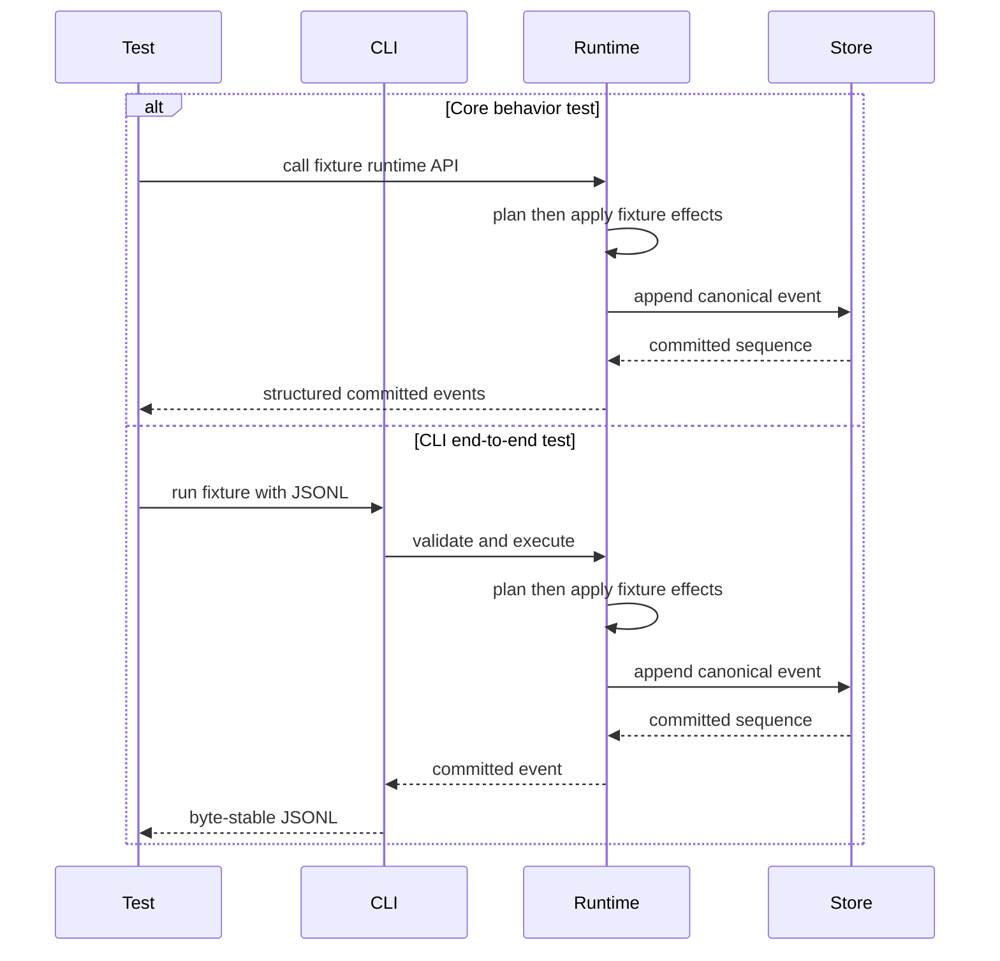

# Testing

**Flow security transition:** Existing Tool fixtures, schema, isolation and receipt tests verify the current legacy runtime. They do not prove the [accepted replacement security contract](SECURITY.md#accepted-flow-agent-security-target) (ADR-0166). D-063 owns the remaining native/approval choices and finite acceptance; after those decisions, use red-first tests and migrate runtime, definitions and evidence together. Both native replacement Executors require actual platform evidence before the first Flow Agent release.

Verification strategy. Tests enforce product behavior and the boundaries in `SECURITY.md`; fixed workloads provide the observational evidence defined by `PERFORMANCE.md`. Definition of Done (see `AGENTS.md`) requires both where relevant.

## MVP boundary

Flow Agent MVP tests must not require Watershed-owned project-history/VCS behavior. Tests may run in a normal Git checkout, but Flow Agent does not auto-commit, branch, slice or rewrite project history in the MVP.

## Test economy

Protect meaningful functionality from every milestone, including behavior established earlier. Each test must cover a distinct function, contract, risk or regression. Prefer compact table-driven or end-to-end cases and shared setup over line-by-line tests. Do not test that an unimplemented function or absent surface remains absent. A negative test is justified only when an implemented function or branch must reject a state reachable through other implemented behavior. Coverage remains a gate, not a reason for redundant or coverage-only tests.

## Layers

- **Unit/integration per crate** — standard Rust tests run with `cargo nextest` for deterministic, process-isolated execution (no shared-state leakage between tests) and flaky-test detection.
- **Runtime storage isolation** — `cargo test` loads `.cargo/test-isolation.toml`; `cargo-nextest` receives the same runner setting inline because it owns test execution. The child runner gives each launched test executable an explicit private `FLOW_AGENT_HOME`, leaves the parent environment unchanged and removes the home afterward.
- **Deterministic FSM tests (Flow Agent)** — given a Flow plus fixed inputs and provider/Tool results, tests assert recursive leaf/composite Phase execution, whole-result handoff, `result_from`, ordered exact-typed forward Transitions and fallthrough, local and global loop bounds, Instruction rendering, available Tool sets and failure without further loop or Transition. Tests prove that a Tool reference only makes the Tool available; only a provider request invokes it.
- **Context compiler tests (Flow Agent)** — `flow-context-v0` tests assert Tier 0 section/order completeness, active-scope filtering, whole-unit recent-interaction selection/eviction, cache-prefix boundaries, budget/estimator behavior, fail-before-provider errors and canonical context hashes/manifests. M1.1 fixtures cover bounded tagged root input, complete Phase-result handoff, typed Instruction parameters, provider-requested Tool parameters, context provenance and replay. Projections, mappings and artifact routing remain deterministic absence. Tool-result fixtures prove aggregate envelope sizing spills valid streams before the complete value exceeds 64 KiB. Tests also prove older sources remain in durable history while omitted from provider context (ADR-0058).
- **Golden flows** — recorded end-to-end flows replayed against stub-model/tool responses; event streams and output artifacts are byte-stable and diffed.
- **Event, persistence and recovery tests (Flow Agent)** — exercise every reachable commit boundary and failure class in the canonical lifecycle and storage contracts in `PROTOCOL.md`. Tests prove ordered durable prefixes, fail-closed divergence, at-most-once external dispatch, lease exclusivity and the exact functional boundaries linked from the M1.1 budget matrix.
- **Script/schema tests** — valid building-block scripts parse into the expected model; invalid scripts fail with useful diagnostics; scoped-registry tests cover transitive references, shared-definition deduplication, unrelated-block exclusion and closure limits. Raw `flow-run-input-v0` fixtures reject duplicate object members before materialization and enforce the ADR-0089 parser-recursion boundary separately from the semantic value-depth limit.
- **M1.1 authoring tests** — prove the complete public grammar and crash-safe transaction behavior canonical in `PROTOCOL.md`, including every selected exact/one-beyond boundary in the budget matrix.
- **Global Flow configuration tests** — assert that `FLOW_AGENT_HOME` is the sole implicit technical authority; ambient Workspace config and registries are never probed, merged or fallback sources; project-specific behavior resolves through an explicit Flow; and global authoring plus missing, invalid, inaccessible, unsafe or conflicting state fail before mutation. Separate instruction-loader tests prove ordered global-home and harness-start Workspace `AGENTS.md` discovery and prove their content cannot alter technical authority.
- **M1.1 provider/auth tests** — cover the canonical wire, credential lifecycle, parser and deadline state machines, durable attempt outcomes and redaction rules. Exact functional limits and fixtures are owned by the M1.1 budget matrix; isolation claims are owned by `SECURITY.md`.
- **M1.1 conversation tests** — cover identity pairing, branching, replay, Resume, reconciliation, status and recovery through reachable success, corruption and crash boundaries. Exact storage, scan and evidence fixtures are owned by the M1.1 limits matrix.
- **Portable continuation tests (planned)** — after D-058/D-062 decide the contract, translate every canonical archive, authority, branch-union, destination-rebinding, uncertainty and recovery acceptance row in `PROTOCOL.md`, `SECURITY.md` and those decisions into exact/one-beyond, tamper, forbidden-authority-field, repeated-import and reachable crash-boundary fixtures. Assert the resulting canonical Conversation tree and child Run, not a duplicate test-owned schema. Direct private-store copying is never a passing path.
- **Offline approval tests (planned)** — only if D-060 enables destination-local offline grants, prove their actor/device/resource/action scope, expiry, one-use behavior, audit and reconnect reconciliation. Baseline D-058 portability transfers no approval and does not wait for D-060.
- **Offline-after-provisioning tests (planned)** — after D-059/D-061 define the supported bundle and local inference process boundary, bind credential references to the selected provider/endpoint audience and reject mismatches before secret resolution. With network interfaces disabled and no remote auth, licensing, telemetry or update dependency, first run a productive local Flow; after M2, start and observe it through the same-host Meta-Harness control path; after M3, perform Liquid local reads and permissioned mutations in the same provisioned stack. Requested remote-only actions fail explicitly; sync reports offline/stale and waits resumably without blocking those local paths. Record selected model/runtime provenance and resource-admission evidence rather than claiming quality parity from model size.
- **M1 policy-emulation tests (SECURITY)** — exercise the finite decision matrix in `SECURITY.md` without claiming OS isolation.
- **Tool lifecycle tests (SECURITY)** — use real supported-target processes and controlled clocks to prove bounded launch, output, termination, cancellation and cleanup behavior. Platform guarantees and exclusions remain canonical in `SECURITY.md`; numeric limits remain canonical in the M1.1 budget matrix.
- **M1.2 Executor and OS-isolation tests** — Executor wire/framing conformance is platform-independent, while deterministic fake-companion process/lifecycle tests are Linux x64-only. Both installation paths and the official Default Sandbox Executor run in the pinned Ubuntu 24.04 x64 contract environment inside the Ubuntu CI job. The official Executor uses stock Bubblewrap/seccomp, and its outer network remains available so only the inner Executor denial can satisfy hostile network tests. Productive Tool execution on macOS fails closed, and positive network grants are not implemented. No test result certifies a Custom Executor.
- **Control-plane tests (Meta-Harness)** — Meta-Harness runs headlessly without Liquid; its CLI/API/service exposes the session registry, event/transcript streams and AgentPulse queries; at least two host-local agents share one normalized session/event model; cross-host process-control attempts are rejected; shared config resolves without duplicate per-agent config directories. Clients exercise the same public API through the bindings selected by D-023, not a duplicate backend.
- **Config-write audit tests (Meta-Harness)** — every config change yields an audit entry; sensitive changes block on approval.
- **Workspace history & agent-edit tests (Liquid)** — action-history and recovery behavior selected by D-028; revert semantics selected by D-031; Page/Block mutation schema; Block View and typed Connection behavior; external-agent CLI/API mutation; permission denial; actor/origin attribution; workspace event subscription; and a no-hidden-writes test proving every UI/CLI/API/Liquid-AI/external-agent/sync write passes through the mutation pipeline and records an action. Liquid's workspace history is a workspace VCS over its own data, not a project-code VCS.
- **ADR-0068 boundary tests (Flow Agent)** — functional tests exercise both sides of every applicable limit in the canonical [safety envelope](PERFORMANCE.md#adr-0068-safety-envelope), plus rotation without record splitting, immutable-object hash/deduplication/missing-object rejection, zero-byte object count enforcement before excess-entry open/retention and absence of any superseded aggregate stream cap.
- **Performance evidence** — fixed workloads follow [`PERFORMANCE.md`](PERFORMANCE.md). M1.1 runs on the fixed `ubuntu-24.04` x64 CI host; M1.2 runs in its pinned Ubuntu 24.04 x64 contract environment. Both run optimized and serially, and every warmup and sample uses a fresh child. CI retains the `m11-performance-evidence` and `m12-executor-startup-evidence` JSONL artifacts. Evidence collection fails only on an invalid workload, lifecycle, schema, measurement, report or missing artifact; timing, throughput and RSS values remain observations reviewed as a KPI.
- **Coverage gate** — from M1 (first real crate logic), the canonical coverage steps in [CI](.github/workflows/ci.yml) enforce **≥90% line coverage**; merge blocks below it. Ubuntu proves both installation paths with production binaries, then health-checks the instrumented replacements, repeats the same Custom-selection/reset acceptance check and aggregates the workspace suite plus the existing readiness-negative matrix in the pinned contract environment; macOS runs the workspace suite and Windows the shared-crate suite. Generated/FFI/CLI-arg-glue and evidence-only code may be excluded so the threshold measures meaningful logic, not boilerplate; region/function coverage are tracked as secondary signals (ADR-0022/ADR-0060).

Milestone pass/fail criteria and DoD are canonical in [`PLAN.md`](PLAN.md).

## Fixture contract (ADR-0034)

Checked registry fixtures follow the [Flow Agent V-Spec](docs/concept/V-Spec_FlowAgent.html); expected JSONL follows [`PROTOCOL.md`](PROTOCOL.md), with fixed fixture identities and timestamps for byte stability. Tests assert source-definition contracts separately from public event payloads.

- `smoke-flow`: the checked-in stream uses this event-type order: `session.started`, `flow.started`, `phase.entered`, `message.delta`, `message.completed`, `tool.started`, `tool.completed`, `message.delta`, `message.completed`, `phase.completed`, `flow.completed`, `session.completed`. Payloads identify one Phase, one Instruction and one read-only predefined-command Tool with no network or writes by those protocol fields.
- `hello-flow`: starts and ends with the same session/Flow lifecycle shape as `smoke-flow`; includes multiple `phase.entered`/`phase.completed` pairs, at least two Tool runs covering predefined-command and own-script Tools by public `tool_kind`, `read_only_mounts`, `writable_mounts`, one allowed-parameter case, at least one `tool.progress`, multiple Phase-scoped Instruction payloads and one subflow definition reused at least twice. Each subflow invocation has a distinct runtime `flow_id`, the same payload `flow_definition_id` and `parent_flow_id` set to the containing runtime Flow id.
- Sandbox-negative fixtures: tiny Flows for deterministic policy decisions about forbidden writes, forbidden network including hostname/DNS attempts, unconfigured environment reads, out-of-phase Tools, mount escape through links and interpreter misuse through an allowed command. They do not prove OS isolation. Each expected stream rejects before side effects and ends with `phase.failed` when a Phase was entered, followed by `error`, `flow.failed` and `session.failed`; if a fixture Tool invocation was attempted, it also contains `tool.failed`. Negative streams must not contain `tool.completed`, `phase.completed`, `flow.completed` or `session.completed`.

## M1.2 transition and Executor evidence

### Authorized Mac feasibility evaluation (ADR-0167)

The dev-only [native probe](scripts/probe-macos-self-protection.py) exercises disposable synthetic files on macOS ARM64; it neither changes nor enables the product Executor. Run `python3 scripts/probe-macos-self-protection.py --mode baseline` first: exit 1 is the required unprotected red control, not a passing guard. Then run the same assertions with `--mode profile`: exit 0 means only those native cases passed; exit 1 records a protection violation, and setup/launch failures are errors, never successful denial. Existing `sandbox-exec` and Python are required; the probe installs nothing.

The matrix distinguishes existing aliases from Tool-created hardlinks and relocation of a protected directory's parent. Its writable-handle case deliberately passes an already-open fixture descriptor: this tests the profile alone, not whether Flow leaks such descriptors. A complete launch boundary must also prove descriptor sanitization; an allowed inherited handle is not evidence that the production Executor forwards it. No observed case selects new installation restrictions.

The separate `--mode guarded-launch` experiment adds ancestor-unlink denial, closes the deliberately opened fixture descriptor at launch and rejects a fixture with an existing hardlink before launching a helper. It tests the same operations and labels readiness rejection and closed handles separately from OS denials. Those trial preconditions are not approved product restrictions or a production protected-object scanner. CI retains both profile and launcher results and fails if either reports a violation or setup error.

CI can run this experiment on the selected branch with `gh workflow run ci.yml --ref <topic-branch> -f mac_self_protection_evaluation=true`; every normal gate remains enabled. Retain the exact source revision and probe-step results. These initial filesystem cases do not test native build/Metal workloads, supported Apple API stability, signed distribution or the complete protected-object contract in D-063. A separate shipping decision and full native acceptance remain mandatory even if the probe passes.

**Native observation, 2026-09-07:** [CI run 34126835476, Mac job 101757384600](https://github.com/Open-Equilibrium/watershed/actions/runs/34126835476/job/101757384600) tested source `dcfc439fbebe501d9efbf8907fa0e1663c984d19` on macOS 26.6.2 ARM64, Darwin 25.6.0. The unprotected control completed all seven mutations and the permitted scratch write (expected exit 1). The profile allowed scratch writes and denied direct write/delete/replacement, a newly started child's write and a symlink alias write. Pre-existing hardlink-alias writes and inherited writable-handle writes still changed the protected fixture: profile exit 1, six cases passed and two violated the target. This disproves the simple path-only profile as a sufficient boundary, not every possible native design. No expectations were weakened; D-063 remains open.

The [expanded native probe, run 34128999853, Mac job 101764336210](https://github.com/Open-Equilibrium/watershed/actions/runs/34128999853/job/101764336210), at `c201cdb355c3a92e563671e00497d28cadd58f8e` on macOS 26.5.2 ARM64 / Darwin 25.5.0, completed all nine unprotected mutations (expected exit 1). The unchanged simple profile blocked the new-hardlink write attempt but allowed ancestor relocation followed by a protected-file write: seven cases passed and three violated the target, exit 1. This adds a distinct directory-identity requirement; it is not a comparison on the same OS patch version.

### Current legacy evidence

- **Continuous testability:** every Fixture test remains runnable without a Default Sandbox Executor and makes no OS-isolation claim. Productive Tool tests exercise the Executor protocol or the official Ubuntu backend; they never substitute Fixture emulation for isolation evidence.
- **Protocol conformance:** platform-neutral tests cover canonical Executor wire/framing and probe semantics. Deterministic Linux x64 fake companion processes prove that `Ready` is flushed before `Start`, the same process is retained, `Start` follows a successful `tool.started` commit, and no Tool cgroup leaf, Sandbox or Tool exists before a matching `Start`. They cover valid execution plus unknown version, closed-schema violations, duplicate members, malformed/oversized/unexpected stage output, mismatched request id, premature exit, preflight, `Start` publication and terminal deadlines, unsupported policy, missing/inactive/mismatched enforcement evidence and bounded redacted stderr. EOF, absent/malformed/mismatched `Start`, pre-Start cancellation and failed `tool.started` commit must not invoke execution; malformed, missing or late terminal evidence after `Start` fails closed under the durable uncertainty contract.
- **Installation and readiness:** one acceptance test installs the standard Ubuntu package with empty `PATH` and an arbitrary working directory; its administrator-run installer proves the sibling `flow-executor` as the sudo-invoking unprivileged account with an active systemd user manager and the exact delegated cgroup-v2 PIDs interfaces. The installer never enables lingering or adds a service and rolls back when readiness or cleanup fails. A second Ubuntu test uses the explicit `--no-default-executor` path, proves authoring, validation and Fixture execution still work without systemd/cgroup prerequisites, then proves a productive Tool Flow returns `executor_unavailable` before durable Run reservation or provider contact until an absolute Custom Executor override is configured. Core Flow tests prove readiness precedes reservation; the real official-Executor matrix and startup evidence prove productive dispatch and receipt validation. Unsafe, absent, replaced or incompatible siblings and overrides fail before Run creation.
- **Official boundary:** Ubuntu 24.04 x64 runs the hostile black-box matrix against real Tool descendants. It covers exact read-only/writable mounts, symlinks, hardlinks and replacement races, both runtime-read profiles, interpreter and environment escape, credential reads, Executor bootstrap image and descriptor reads, direct/indirect/DNS network attempts, process/session escape, descendants, timeout, cancellation, terminal-status integrity, output handling and teardown. Process-capacity cases prove that the configured count includes the Tool root, every descendant and every thread; exactly N succeeds, N+1 is denied and typed, concurrent leaves do not interfere, unrelated host processes remain unaffected, and normal, capacity, timeout, cancellation and Executor-crash paths leave no populated leaf or scope. The real matrix executes the descriptor-mount capability advertised by stock Ubuntu Bubblewrap; deterministic plan tests cover both native descriptor mounts and the supported `/proc/self/fd/<slot>` compatibility translation. Canonical-policy and applied-policy digests, receipt capacity and durable recovery expectation must match.
- **Runtime profiles:** `exact` fixtures prove that only the administrator-owned bounded executable/interpreter/library manifest is readable. `host-system-read` fixtures prove the fixed reviewed Ubuntu system roots are added only after explicit Agentic Engineer selection. Flow users, providers and Tools cannot change the profile; unsupported requirements have no fallback.
- **Receipt and recovery:** every successful execution returns a canonical enforcement receipt bound to the exact canonical policy bytes including final LF; Flow Agent rejects a missing or mismatched receipt and persists the validated receipt with the terminal Tool attempt. Replay of a definitive preflight rejection performs no `tool.started`, preflight, `Start` or Tool redispatch. Cancellation after committed `tool.started` but before `Start` persists exact `flow-attempt-cancelled-v0` output, and a missing recovery record is reconstructed from that terminal Run Log result without redispatch. Recovery after `Start` proves that evidence remains bound to the uncertain attempt without redispatch.
- **Fail closed:** missing prerequisites, incompatible protocol, unsupported capability, failed Sandbox preparation and failed readiness never select a weaker backend. Ubuntu readiness negatives cover missing systemd user manager, cgroup v2, PIDs controller, delegation, capacity-event counter and cleanup evidence. Official productive macOS execution rejects before Tool spawn; M1.2 Tool networking remains deny-all.
- **Custom Executors:** the public conformance suite and advisory probe run only on the supported Ubuntu 24.04 x64 platform and test only observable protocol behavior. Documentation and test output must state that passing them is not Flow Agent certification of compatibility, policy equivalence, security or operations.
- **Platform scope:** Ubuntu 24.04 x64 with systemd 255 and the directly probed cgroup-v2 interfaces is the current official productive M1.2 gate. Linux 6.8 already implements the required `pids.events` / `max` counter ([upstream source](https://github.com/torvalds/linux/blob/v6.8/kernel/cgroup/pids.c)); that interface does not exclude Ubuntu's 6.8 baseline. Readiness probes capabilities, not a kernel-version threshold. Source inspection is not a completed Linux 6.8 runtime test, and the CI container uses its host's kernel. macOS remains a fail-closed negative gate until its native backend is proven. The required native first-Flow-Agent-release targets and exclusions are canonical in [PLATFORMS.md](PLATFORMS.md); positive CIDR/port grants remain unsupported.

## Liquid MVP pass/fail (M3)

In addition to the staged M3 DoD in `PLAN.md`, Liquid must prove: deterministic first-action Block creation; flow and Arrange mode preserve canonical View order; synchronized Views share Block state while duplicate creates a new Block; last-View deletion follows the decided Connection/Automation cascade and is recoverable through History; layout never grants Connection or permission access; allow-only Roles deny unlisted Liquid actions and discovery/read requests even though an authorized device's full plaintext replica may contain those resources; mobile retains every Block with focused editing for complex Views; App code and MCP adapters cannot exceed declared capabilities; every write surface records an Action; external-agent changes can be reverted; replicas converge through the central Sync Server; headless replicas receive only opted-in Workspaces; replicated resources keep stable identities, changes remain resource-addressed and incompatible sync versions fail closed; and selected D-028/D-031/D-035 history, recovery and conflict behavior works. Selective authorized-resource replication is not an MVP gate and requires a later finite closure contract before implementation.

## AgentPulse as a quality gate

The same metrics AgentPulse reports (rework ratio, first-attempt success rate, cost-per-productive-outcome) are tracked in CI on golden flows once their formulas are decided in [D-010](docs/decisions/open-decisions.html#d-010).

## Development toolchain

Node is a dev/CI-only toolchain for documentation gates (HTML rendering and link-manifest generation), the Node advisory audit, the runtime package review gate, the Rust test-isolation runner and the cross-platform Python launcher. `package.json#engines.node` defines the supported Node range; [`.node-version`](.node-version) pins the reproducible development/CI version and `package.json#packageManager` pins pnpm. Ubuntu CI additionally exercises the repository tooling and HTML rendering at the declared Node minimum after the pinned gates. Watershed and Flow Agent have no Node product-runtime dependency.

Repository tooling requires Python 3.11 or newer for its standard-library TOML parser. The launcher verifies this before running a script and reports missing prerequisites without installing them.

## CI

- Required job names remain present for changes limited to [repository agent setup](AGENTS.md#conventions), but no product gates run. Mixed changes and manual runs retain every gate; pull requests compare their complete change against the base commit. Documentation-link inputs exclude repository agent setup.
- Flow Agent runs on its native Linux x86_64 and macOS ARM64 targets. Windows CI checks only the implemented shared crates, not Flow Agent or a Windows 11 Liquid release. Product-specific native evidence remains required by [PLATFORMS.md](PLATFORMS.md).
- Mandatory gates: `rustfmt --check` over every tracked Rust source, `cargo clippy`, `cargo nextest run --config 'target."cfg(all())".runner = ["node", "../../scripts/run-isolated-rust-test.mjs"]'`, `cargo --config .cargo/test-isolation.toml test --locked --workspace --all-features --doc` (shared packages only on Windows), complete Flow Agent performance-evidence artifacts, the M1 coverage gate, `cargo audit` + `cargo deny`, `pnpm audit`, and the `lychee` docs link + HTML render checks. Package selections are canonical in CI.
- A local cross-build or a Windows editor session cannot substitute for the pushed branch's native Flow Agent gates. Verify their actual CI results with `gh`.
- Block merge on any mandatory gate failure, including performance-evidence integrity and platform sandbox/parity checks; observed timing, throughput or RSS values do not fail the gate.
