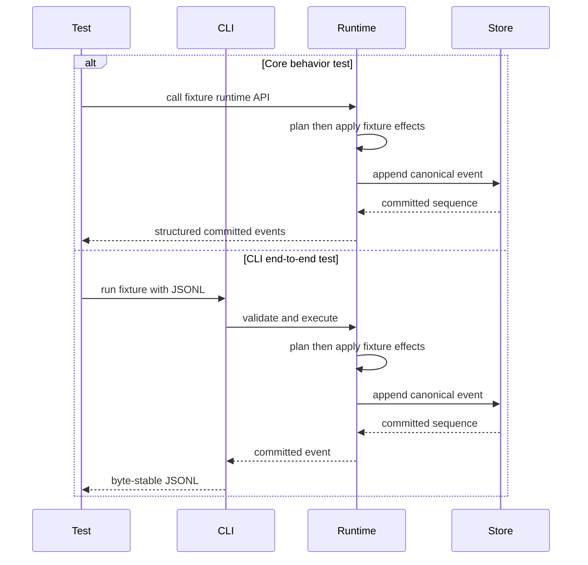

# Testing

**Flow security replacement:** Runtime, invocation policy, wire and fixtures now use the [accepted replacement](SECURITY.md#accepted-flow-agent-security-target), with complete native acceptance pending. CI targets native Ubuntu 24.04 x86_64 and macOS 26 ARM64, including release-artifact acceptance. Passing stages are recorded below; neither a partial native result, Windows shared tests nor historical feasibility observations prove the complete product gate. Manual administration, protected global/editable local instructions, overlapping locations and the full selected inventory remain required acceptance boundaries.

Verification strategy. Tests enforce product behavior and the boundaries in `SECURITY.md`; fixed workloads provide the observational evidence defined by `PERFORMANCE.md`. Definition of Done (see `AGENTS.md`) requires both where relevant.

## MVP boundary

Flow Agent MVP tests must not require Watershed-owned project-history/VCS behavior. Tests may run in a normal Git checkout, but Flow Agent does not auto-commit, branch, slice or rewrite project history in the MVP.

## Test economy

Protect meaningful functionality from every milestone, including behavior established earlier. Each test must cover a distinct function, contract, risk or regression. Prefer compact table-driven or end-to-end cases and shared setup over line-by-line tests. Do not test that an unimplemented function or absent surface remains absent. A negative test is justified only when an implemented function or branch must reject a state reachable through other implemented behavior. Coverage remains a gate, not a reason for redundant or coverage-only tests.

## Layers

- **Unit/integration per crate** — standard Rust tests run with `cargo nextest` for deterministic, process-isolated execution (no shared-state leakage between tests) and flaky-test detection.
- **Runtime storage isolation** — `cargo test` loads `.cargo/test-isolation.toml`; `cargo-nextest` receives the same runner setting inline because it owns test execution. The child runner gives each launched test executable an explicit private `FLOW_AGENT_HOME`, leaves the parent environment unchanged and removes the home afterward.
- **Deterministic FSM tests (Flow Agent)** — given a Flow plus fixed inputs and provider/Tool results, tests assert recursive leaf/composite Phase execution, whole-result handoff, `result_from`, ordered exact-typed forward Transitions and fallthrough, local and global loop bounds, Instruction rendering, available Tool sets and failure without further loop or Transition. Tests prove that a Tool reference only makes the Tool available; only a provider request invokes it.
- **Context compiler tests (Flow Agent)** — `flow-context-v0` tests assert Tier 0 section/order completeness, active-scope filtering, whole-unit recent-interaction selection/eviction, cache-prefix boundaries, budget/estimator behavior, fail-before-provider errors and canonical context hashes/manifests. M1.1 fixtures cover bounded tagged root input, complete Phase-result handoff, typed Instruction parameters, provider-requested Tool parameters, context provenance and replay. Projections, mappings and artifact routing remain deterministic absence. Tool-result fixtures prove aggregate envelope sizing spills valid streams before the complete value exceeds 64 KiB. Tests also prove older sources remain in durable history while omitted from provider context (ADR-0058).
- **Golden flows** — recorded end-to-end flows replayed against stub-model/tool responses; event streams and output artifacts are byte-stable and diffed.
- **Event, persistence and recovery tests (Flow Agent)** — exercise every reachable commit boundary and failure class in the canonical lifecycle and storage contracts in `PROTOCOL.md`. Tests prove ordered durable prefixes, fail-closed divergence, at-most-once external dispatch, lease exclusivity and the exact functional boundaries linked from the M1.1 budget matrix.
- **Script/schema tests** — valid building-block scripts parse into the expected model; invalid scripts fail with useful diagnostics; scoped-registry tests cover transitive references, shared-definition deduplication, unrelated-block exclusion and closure limits. Raw `flow-run-input-v0` fixtures reject duplicate object members before materialization and enforce the ADR-0089 parser-recursion boundary separately from the semantic value-depth limit.
- **M1.1 authoring tests** — prove the complete public grammar and crash-safe transaction behavior canonical in `PROTOCOL.md`, including every selected exact/one-beyond boundary in the budget matrix.
- **Global Flow configuration tests** — assert that `FLOW_AGENT_HOME` is the sole implicit technical authority; ambient Workspace config and registries are never probed, merged or fallback sources; project-specific behavior resolves through an explicit Flow; and global authoring plus missing, invalid, inaccessible, unsafe or conflicting state fail before mutation. Separate instruction-loader tests prove ordered global-home and harness-start Workspace `AGENTS.md` discovery and prove their content cannot alter technical authority.
- **M1.1 provider/auth tests** — cover the canonical wire, credential lifecycle, parser and deadline state machines, durable attempt outcomes and redaction rules. Exact functional limits and fixtures are owned by the M1.1 budget matrix; isolation claims are owned by `SECURITY.md`.
- **M1.1 conversation tests** — cover identity pairing, branching, replay, Resume, reconciliation, status and recovery through reachable success, corruption and crash boundaries. Exact storage, scan and evidence fixtures are owned by the M1.1 limits matrix.
- **Portable continuation tests (planned)** — after D-058/D-062 decide the contract, translate every canonical archive, authority, branch-union, destination-rebinding, uncertainty and recovery acceptance row in `PROTOCOL.md`, `SECURITY.md` and those decisions into exact/one-beyond, tamper, forbidden-authority-field, repeated-import and reachable crash-boundary fixtures. Assert the resulting canonical Conversation tree and child Run, not a duplicate test-owned schema. Direct private-store copying is never a passing path.
- **Offline approval tests (planned)** — only if D-060 enables destination-local offline grants, prove their actor/device/resource/action scope, expiry, one-use behavior, audit and reconnect reconciliation. Baseline D-058 portability transfers no approval and does not wait for D-060.
- **Offline-after-provisioning tests (planned)** — after D-059/D-061 define the supported bundle and local inference process boundary, bind credential references to the selected provider/endpoint audience and reject mismatches before secret resolution. With network interfaces disabled and no remote auth, licensing, telemetry or update dependency, first run a productive local Flow; after M2, start and observe it through the same-host Meta-Harness control path; after M3, perform Liquid local reads and permissioned mutations in the same provisioned stack. Requested remote-only actions fail explicitly; sync reports offline/stale and waits resumably without blocking those local paths. Record selected model/runtime provenance and resource-admission evidence rather than claiming quality parity from model size.
- **M1 policy-emulation tests (SECURITY)** — exercise the finite decision matrix in `SECURITY.md` without claiming OS isolation.
- **Tool lifecycle tests (SECURITY)** — use real supported-target processes and controlled clocks to prove bounded launch, output, termination, cancellation and cleanup behavior. Platform guarantees and exclusions remain canonical in `SECURITY.md`; numeric limits remain canonical in the M1.1 budget matrix.
- **M1.2 Executor and native self-protection tests** — wire/framing conformance is platform-independent; fake-companion and real-process tests require their supported native target. The integrated `native_contract` and `native_self_protection` suites replace the old `official_linux` broad-isolation matrix, with native installation and release-artifact acceptance on Ubuntu 24.04 x86_64 and macOS 26 ARM64. Test the retained lifecycle and direct-write invariants, ordinary host/network access and explicit failure without fallback. A test definition or passing mock does not prove the backend; no result certifies a Custom Executor.
- **Control-plane tests (Meta-Harness)** — Meta-Harness runs headlessly without Liquid; its CLI/API/service exposes the session registry, event/transcript streams and AgentPulse queries; at least two host-local agents share one normalized session/event model; cross-host process-control attempts are rejected; shared config resolves without duplicate per-agent config directories. Clients exercise the same public API through the bindings selected by D-023, not a duplicate backend.
- **Config-write audit tests (Meta-Harness)** — every config change yields an audit entry; sensitive changes block on approval.
- **Workspace history & agent-edit tests (Liquid)** — action-history and recovery behavior selected by D-028; revert semantics selected by D-031; Page/Block mutation schema; Block View and typed Connection behavior; external-agent CLI/API mutation; permission denial; actor/origin attribution; workspace event subscription; and a no-hidden-writes test proving every UI/CLI/API/Liquid-AI/external-agent/sync write passes through the mutation pipeline and records an action. Liquid's workspace history is a workspace VCS over its own data, not a project-code VCS.
- **ADR-0068 boundary tests (Flow Agent)** — functional tests exercise both sides of every applicable limit in the canonical [safety envelope](PERFORMANCE.md#adr-0068-safety-envelope), plus rotation without record splitting, immutable-object hash/deduplication/missing-object rejection, zero-byte object count enforcement before excess-entry open/retention and absence of any superseded aggregate stream cap.
- **Performance evidence** — fixed workloads follow [PERFORMANCE.md](PERFORMANCE.md). M1.1 retains its fixed `ubuntu-24.04` x64 host; M1.2 lifecycle evidence migrates to both native targets. Preserve all prior meaningful workloads and comparable observations. Both suites run optimized and serially, with a fresh child for each warmup/sample. CI retains their complete JSONL artifacts under the names in [CI](.github/workflows/ci.yml). Invalid workload, lifecycle, schema, measurement, report or missing artifact fails collection; timing, throughput and RSS remain observations reviewed as a KPI.
- **Coverage gate** — from M1, the canonical steps in [CI](.github/workflows/ci.yml) enforce **≥90% line coverage**; merge blocks below it. Native Ubuntu and macOS coverage must include the workspace suite, both installation paths, Custom selection/reset and applicable readiness negatives. Release binaries receive native acceptance separately; instrumented builds are health-checked before collecting coverage. Windows checks the shared-crate suite only. Generated/FFI/CLI-arg-glue and evidence-only code may be excluded so coverage measures meaningful logic; region/function coverage remain secondary signals (ADR-0022/ADR-0060). Migration never lowers the threshold or removes a still-required behavior test.

Milestone pass/fail criteria and DoD are canonical in [`PLAN.md`](PLAN.md).

## Fixture contract (ADR-0034)

Checked registry fixtures follow the [Flow Agent V-Spec](docs/concept/V-Spec_FlowAgent.html); expected JSONL follows [`PROTOCOL.md`](PROTOCOL.md), with fixed fixture identities and timestamps for byte stability. Tests assert source-definition contracts separately from public event payloads.

- `smoke-flow`: the checked-in stream uses this event-type order: `session.started`, `flow.started`, `phase.entered`, `message.delta`, `message.completed`, `tool.started`, `tool.completed`, `message.delta`, `message.completed`, `phase.completed`, `flow.completed`, `session.completed`. Payloads identify one Phase, one Instruction and one predefined-command Tool; they contain no filesystem/network containment claim.
- `hello-flow`: retains that session/Flow lifecycle shape, multiple Phase enter/complete pairs, at least two Tool runs covering predefined-command and own-script `tool_kind`, an allowed-parameter case, `tool.progress`, Phase-scoped Instructions and one subflow definition reused at least twice. Each subflow invocation has a distinct runtime `flow_id`, the same payload `flow_definition_id` and `parent_flow_id` set to its containing invocation. Removed mount/profile/network/capacity fields are not public Tool payloads.
- Sandbox-negative fixtures: retain the finite `agent-negative` failure workloads for write, network/DNS, unconfigured environment, out-of-phase Tool, link traversal and interpreter scenarios. These are deterministic fixture semantics and failure-lifecycle regressions, not productive OS guarantees. Each expected stream rejects modeled effects and closes the entered Phase/Flow/session with failure; an attempted fixture Tool also has `tool.failed`. No successful terminal events follow. Closed-schema rejection tests cover removed isolation fields before real effects; they must not silently accept old security requirements.

## M1.2 transition and Executor evidence

### Native verification status

| Revision / run | Established result | Limit |
|---|---|---|
| Previous baseline `54ebc88`, [run 34231319294](https://github.com/Open-Equilibrium/watershed/actions/runs/34231319294) | Passed native baseline. | Evidence for that previous implementation only. |
| Raw replacement `e001542`, [run 34232272591](https://github.com/Open-Equilibrium/watershed/actions/runs/34232272591) | RED on Linux and macOS; Windows shared tests pass. | Not new native GREEN or complete runtime verification. |
| Integrated replacement `f69dc42`, [run 34247329960](https://github.com/Open-Equilibrium/watershed/actions/runs/34247329960) | Linux: all 1,154 regular tests pass, none skipped; nextest exit 0. Release Executor: seven of eight acceptance tests pass, exit 100. Mac installer: 17 of 18 tests pass. | Release output-cap status reading reports a connection reset; Mac interruption cleanup remains RED at this revision. Expanded acceptance, native coverage, installation and performance proof remain outstanding. |

The old systemd/container gate and its broad-isolation assertions no longer define release acceptance. Native tests must run on Ubuntu 24.04 x86_64 and macOS 26 ARM64. Record actual command exits, runner identity and tested artifact; source inspection, cross-builds and Windows shared tests cannot fill missing native evidence.

### Authorized Mac feasibility evaluation (ADR-0167)

The records below are historical bounded observations from the feasibility probes, retained with their original successes, failures and setup limits. They are not results from the integrated production Executor. Keep their workloads and controls when validating the replacement, but report new product evidence separately above.

The npm extension adds three offline `npm run build` lifecycles to every comparison configuration: a dependency-free JavaScript build that executes generated JavaScript in a Node child, a native compile/run through `xcrun`, and a native compile/run with directly resolved compiler/SDK/linker paths. Each requires real prebuild/build/postbuild execution and verified output bytes, not merely exit 0; each unprotected control must also prove that its deliberate synthetic protected-file write was allowed. Existing Node/npm are required and their versions/paths are recorded. Empty explicit user/global npm configuration and private caches prevent use of operator npm settings; no dependencies are downloaded or installed. The fixture selects its package through `--prefix`, independently of the initial working directory. Successful builds also attempt a synthetic protected-file write and report its outcome. A sixth configuration adds read-only access to the existing Node installation/npm package while retaining project and executable-write entitlements; no runtime is copied, re-signed or installed. This is not React/Vite/Next.js, package-install, Python or actual Codex CLI binary coverage. The portable fixture/classifier and entitlement tests verify experimental setup, not Mac protection.

The final npm comparison at `136daaa94fcb5b3715d3e5e21f65968e6fca17bb` ([run 34203846083, Mac job 101988642325](https://github.com/Open-Equilibrium/watershed/actions/runs/34203846083/job/101988642325)) completed 178 observations across six configurations on macOS 26.6.2 ARM64 / Darwin 25.6.0, Xcode 26.6 / Apple clang 21.0.0, Node 24.20.0 and npm 11.19.0. Comparison exit 0 and `measurement_complete: true` mean the bounded observation matrix completed, not that every workload or security configuration passed. All three unprotected npm controls completed and changed their synthetic targets. All three checked-profile lifecycles completed (exit 0) while protected writes returned `EPERM` and targets stayed unchanged. In the runtime-read App Sandbox variant, the JavaScript lifecycle also completed (exit 0) with its protected write denied. The native `xcrun` lifecycle exited 1 at `xcrun: error: cannot be used within an App Sandbox.` The direct-native lifecycle compiled its output, then exited 1 when Node could not start that output (`EPERM`); no protected write was reached in either failed lifecycle. Original App variants still failed before Node startup (helper exit 10). The retained raw-profile counterexamples keep the aggregate Mac job red. At that experimental revision, product integration, editable-local/protected-global instruction acceptance and distribution proof were outstanding. The integrated replacement's current status is recorded above.

The first npm matrix at `403f258208d9f5ed379d56f033a2ecd8e3474d9c` ([Mac job 101984400595](https://github.com/Open-Equilibrium/watershed/actions/runs/34202527181/job/101984400595)) completed 148 observations with comparison exit 0. Its checked-profile/unprotected npm outcomes matched the final run, but every App variant failed before Node startup. Adding runtime-read access at `1b24634aad4a446ea72e13e48ea09303d929561d` ([Mac job 101987697267](https://github.com/Open-Equilibrium/watershed/actions/runs/34203554366/job/101987697267)) completed 178 observations with comparison exit 0: Node/npm started in the new variant, but npm exited 254 because its initial directory was the app container. Explicit package selection fixed this setup error. Remaining jobs in these superseded workflows were cancelled after their Mac measurements completed. Red-first local tests cover the lifecycle, output verification, required baseline writes, read-only runtime grants and execution from another initial directory; all 50 tooling tests passed. No intermediate setup failure is a blanket ban on Node/npm.

The dev-only [App Sandbox comparison](scripts/probe-macos-app-sandbox.py) runs with `python3 scripts/probe-macos-app-sandbox.py` on macOS ARM64. It compares the same synthetic native helper without protection, under the checked profile, under minimal App Sandbox, with an App Sandbox temporary absolute-path read/write exception for one synthetic project directory, and with that exception plus executable-write permission. The user-selected entitlement alone grants no selected directory; the exception is explicitly **not** a test of file-panel grants/bookmarks. Helpers use documented inheritance entitlements and local ad-hoc signatures, never a release identity. The probe compiles with the existing Xcode toolchain and installs nothing. Its unique home-directory fixtures are removed; OS-created synthetic app containers disappear with the disposable hosted runner. Exit 0 means the observation matrix completed, not that all mechanisms met the product requirements; exit 2 means incomplete measurement or setup failure. Command exits and observed mutations remain explicit. The opt-in CI experiment runs it even after the retained raw-profile counterexample fails. Windows classification tests are not sandbox evidence. Interpretation, source contracts and compatibility limits are canonical in the [comparison](docs/concept/flow-agent-native-protection-proposal.md#native-app-sandbox-comparison).

The complete five-configuration comparison ran at `32218b79d5c31fe0dc428d7c6974a8d41a3441fa`, [run 34162539716, Mac job 101867128496](https://github.com/Open-Equilibrium/watershed/actions/runs/34162539716/job/101867128496), on macOS 26.6.2 ARM64 / Darwin 25.6.0, Xcode 26.6 and Apple clang 21.0.0. The comparison step exited 0 with `measurement_complete: true` and 133 classified observations, including successful unprotected controls and explicit negative outcomes. Both App Sandbox project-exception variants allowed project edits, direct Git initialization and a direct SDK/linker-aware C build (command exits 0), denied separate protected-file writes (`EPERM`, helper exit 10), but allowed the deliberately passed writable handle, pre-existing project hardlink and protected file nested inside the granted project. `xcrun`-based workloads exited 1 in every App Sandbox variant. The newly compiled project's executable failed with `EPERM` (launcher exit 10), including with executable-write permission. Native helper-start markers distinguish a denied write from a helper that never started. All three own-container controls succeeded. These are measured configuration limitations, not a passing product security gate. The retained raw-profile step still failed, so the experimental Mac job remains red.

The initial comparison at `ddc56b3a1ba1304e32633678ac633e6764ac15ab` ([Mac job 101865463676](https://github.com/Open-Equilibrium/watershed/actions/runs/34161968538/job/101865463676)) completed 86 observations. The next at `22ed798fd190be6f29479efa82a9181bebfab1f5` ([Mac job 101866346283](https://github.com/Open-Equilibrium/watershed/actions/runs/34162267418/job/101866346283)) completed 106, adding direct Xcode-program and terminal cases and separating nested launch denial from actual helper write denial. Both comparison steps exited 0 before their superseded workflows' remaining jobs were cancelled. The final 133-observation run supersedes those intermediate matrices without erasing their failures. Local classification tests were red before implementation and before the nested-start refinement; all 47 repository tooling tests then passed. Native results do not replace the outstanding product integration, release distribution or full branch closeout gates.

The dev-only [native probe](scripts/probe-macos-self-protection.py) exercises disposable synthetic files on macOS ARM64; it neither changes nor enables the product Executor. Run `python3 scripts/probe-macos-self-protection.py --mode baseline` first: exit 1 is the required unprotected red control, not a passing guard. Then run the same assertions with `--mode profile`: exit 0 means only those native cases passed; exit 1 records a protection violation, and setup/launch failures are errors, never successful denial. Existing `sandbox-exec` and Python are required; the probe installs nothing.

The matrix distinguishes existing aliases from Tool-created hardlinks and relocation of a protected directory's parent. Its writable-handle case deliberately passes an already-open fixture descriptor: this tests the profile alone, not whether Flow leaks such descriptors. A complete launch boundary must also prove descriptor sanitization; an allowed inherited handle is not evidence that the production Executor forwards it. No observed case selects new installation restrictions.

The separate `--mode guarded-launch` experiment adds ancestor-unlink denial, closes the deliberately opened fixture descriptor at launch and rejects a fixture with an existing hardlink before launching a helper. It tests the same operations and labels readiness rejection and closed handles separately from OS denials. ADR-0169 now accepts the alias/ancestor restrictions; the fixture check is not a production protected-object scanner or approval of every launch condition. CI retains both profile and launcher results and fails if either reports a violation or setup error.

`--mode host-build` compares an unprotected and guarded `/bin/sh` workload using existing Xcode command-line tools: compile a small ARM64 C writer, verify its local code signature, write a project fixture and attempt a protected-file write. The guarded build must succeed while its protected write returns permission denial; the unprotected writer must change both fixtures. Each workload has a 30-second deadlock guard and a 4 MiB per-file cap for its generated binary/log; neither is a product performance requirement. No compiler, signing identity or certificate is installed or acquired. A local signature check is not Developer ID/notarization or release-provenance evidence.

The `lifecycle-baseline` and `lifecycle` modes exercise the same synthetic multi-root layout without and with protection: two homes, an outside-home platform store, installed/custom image names, internal publication aliases, metadata changes, a new-session child, current/later review-terminal handles and trusted-parent append/rename/hardlink publication after the child starts. A separate child writes only after its Tool parent has exited. Parameter-bound paths include quotes, a backslash, Unicode and a newline; paths are data, not profile source. Each mode exits 0 only when all its expected allowed/denied outcomes hold. The baseline must actually permit the dangerous operations; a setup error is never successful denial. The dev-only inventory counts all covered names of each inode and rejects external hardlinks, unsupported objects and incomplete/over-budget scans; it is not a race-safe production scanner. No real credentials, Flow homes or installed binaries are inspected. The [native protection design](docs/concept/flow-agent-native-protection-proposal.md) owns the accepted integration invariant and separately outstanding release acceptance.

CI can run this experiment on the selected branch with `gh workflow run ci.yml --ref <topic-branch> -f mac_self_protection_evaluation=true`; every normal gate remains enabled. Retain the exact source revision and per-mode exit codes. These bounded cases do not prove general build-system compatibility, Metal workloads, supported Apple API stability, signed distribution or cross-installation protection. ADR-0172 selects the Seatbelt mechanism, not release readiness; full native product acceptance remains mandatory even if the probe passes. Instruction protection must distinguish editable Workspace-local `AGENTS.md` from the protected global file under corrected ADR-0171.

**Native observation, 2026-09-07:** [CI run 34126835476, Mac job 101757384600](https://github.com/Open-Equilibrium/watershed/actions/runs/34126835476/job/101757384600) tested source `dcfc439fbebe501d9efbf8907fa0e1663c984d19` on macOS 26.6.2 ARM64, Darwin 25.6.0. The unprotected control completed all seven mutations and the permitted scratch write (expected exit 1). The profile allowed scratch writes and denied direct write/delete/replacement, a newly started child's write and a symlink alias write. Pre-existing hardlink-alias writes and inherited writable-handle writes still changed the protected fixture: profile exit 1, six cases passed and two violated the target. This disproves the simple path-only profile as a sufficient boundary, not every possible native design. No expectations were weakened; later approvals do not alter this recorded counterexample.

The [expanded native probe, run 34128999853, Mac job 101764336210](https://github.com/Open-Equilibrium/watershed/actions/runs/34128999853/job/101764336210), at `c201cdb355c3a92e563671e00497d28cadd58f8e` on macOS 26.5.2 ARM64 / Darwin 25.5.0, completed all nine unprotected mutations (expected exit 1). The unchanged simple profile blocked the new-hardlink write attempt but allowed ancestor relocation followed by a protected-file write: seven cases passed and three violated the target, exit 1. This adds a distinct directory-identity requirement; it is not a comparison on the same OS patch version.

The [combined launch probe, run 34129788986, Mac job 101766895007](https://github.com/Open-Equilibrium/watershed/actions/runs/34129788986/job/101766895007), at `0a9ffa86635f158d357a6c05ceda1f6fe615a641` on macOS 26.6.2 ARM64 / Darwin 25.6.0, repeated the complete red control and the three simple-profile violations. `guarded-launch` reported all ten cases passing (`ok: true`): it rejected the existing-hardlink fixture before any helper started, the removed descriptor returned `EBADF`, and ancestor relocation returned `EPERM`. The aggregate experiment step exited 1 because it retains the failed raw profile; it is not a green CI gate. These observations support further evaluation of the combined conditions, not production readiness or approval to impose those conditions on installations.

The [native build probe, run 34132338109, Mac job 101775184729](https://github.com/Open-Equilibrium/watershed/actions/runs/34132338109/job/101775184729), at `457f4c1763ae667834632d3ae308d0dc9189c1c9` on macOS 26.6.2 ARM64 / Darwin 25.6.0, repeated the full red control and recorded `profile` exit 1 (three violations), `guarded-launch` exit 0 (ten passing cases), and `host-build` exit 0. With Xcode 26.6 / Apple clang 21.0.0, both shell workloads compiled a 33,696-byte ARM64 writer, passed local signature verification and wrote the project fixture. The protected write succeeded without the guard (exit 0) and returned the expected permission-denial status under it (exit 10), leaving the protected fixture unchanged. Both complete build commands exited 0 without timing out. The aggregate experiment step still exited 1; this establishes one native shell/C workload under trial conditions, not complete installation, release-signing, Metal or product-readiness evidence.

The complete profile feasibility matrix was established in [run 34154056122, Mac job 101842078293](https://github.com/Open-Equilibrium/watershed/actions/runs/34154056122/job/101842078293), source `ccb1de1dc675d98687cd67fe44c4afa82ee7087b`, macOS 26.6.2 ARM64 / Darwin 25.6.0. It records `guarded-launch` exit 0 (10 cases), `host-build` exit 0 (both native shell/C workloads, including terminal-device denial in the guarded build), `lifecycle-baseline` exit 0 and `lifecycle` exit 0 (29 expected outcomes each). Dangerous baseline operations succeeded; the guarded file/device attempts returned permission denial and left protected data intact after trusted-parent updates. The detached helper remained restricted after its parent's observed exit 0. The two compiled binaries were 33,696 bytes and passed local signature verification with Apple clang 21.0.0. The original `baseline` again established all nine mutations, and the insufficient `profile` still exited 1 with three violations; the aggregate experimental step therefore remains red, not a green product gate. The final App Sandbox comparison job above repeated all these mode counts and exit codes unchanged on the same OS/architecture version.

The first lifecycle attempt at `a012da91d377703519c75842d7ddc57220775346` ([run 34153399014, Mac job 101840133726](https://github.com/Open-Equilibrium/watershed/actions/runs/34153399014/job/101840133726)) exited 2 in both lifecycle modes: its helper used Python's Linux-only `os.setxattr`. After using Darwin's native interface, [run 34153602277, Mac job 101840727367](https://github.com/Open-Equilibrium/watershed/actions/runs/34153602277/job/101840727367), at `a5a9ba14437e48c92d00e318a6cd357c4b9182e7`, completed the then-27-case lifecycle controls with both exits 0. The final 29-case result above supersedes that intermediate coverage without changing those expectations. The fixture inventory's three behavior tests also run in the cross-platform repository tooling suite. Hosted macOS execution is native OS/architecture evidence, not independently verified bare-metal execution or an installation test on the maintainer's Mac.

### Replacement acceptance matrix

The following are required outcomes, not a claim that their complete native run has passed.

- **Continuous testability and conformance:** Fixture tests remain runnable without a Default Executor. Preserve closed-schema, duplicate-member, version/framing, malformed/oversized/unexpected output, request-id, stderr-redaction and independent preflight/Start/terminal-deadline cases. Prove that the same retained process flushes `Ready`, that `tool.started` commits before `Start`, and that EOF, absent/malformed/mismatched `Start`, cancellation or commit failure before `Start` creates no Tool. After dispatch, missing, invalid or late evidence remains uncertain.
- **Native boundary:** [native_contract](flow-agent/flow-agent-executor/tests/native_contract.rs) exercises own-object/child writes, deletion/replacement, symlink/new-hardlink paths, ancestry, global/local instructions, descriptor/identity replacement before launch, terminal denial, host runtimes, networking, explicit environment, npm lifecycle and bounded terminal outcomes. [native_self_protection](flow-agent/flow-agent-executor/tests/native_self_protection.rs) exercises the real one-shot protocol and protected-file/project controls. Run both against native release artifacts as well as the ordinary test builds; inspect actual outcomes before claiming coverage complete.
- **Admission and publication:** verify selected home, platform stores, `flow`, selected Executor and any existing official sibling. Only explicit Custom selection permits a genuinely absent sibling (ADR-0175); unsafe existing siblings reject. Exercise no-follow discovery, outside aliases, internal publication aliases, overlapping roots counted once, unsupported/incomplete inventories, replaced identities, publication leases, and concurrent/interrupted create, append, hardlink, staged-file replacement and staged-directory rename. Inventory is once per prepared controller, not a retained-history rescan per Tool. Warned overlap never bypasses failed admission.
- **Inherited authority and lifetime:** preserve writable-handle removal, protected descriptor/image handling, metadata and mapped writes, new-session children, parent exit and current/later terminal-device cases. A surviving child must retain protection. Bounded root termination, cancellation and output collection must report what was observed; no test may equate a root exit or timeout with proof that every hostile descendant stopped.
- **Host compatibility controls:** retain ordinary project reads/writes and hardlinks, shell/C compilation and execution, direct Xcode compiler and `xcrun` paths, and offline npm `prebuild`/`build`/`postbuild` workloads that generate/run JavaScript or native children and verify outputs. Add real Python execution and available host-network/local-service controls from `native_contract`. Historical raw-profile, guarded-launch and App Sandbox comparisons retain their original expectations. A denied protected write counts only after the intended workload launches; setup failure is never successful denial. These finite workloads do not certify all build systems, GUI/Metal access or every interactive application.
- **Invocation and environment:** preserve parameter/type/argv bounds, interpreter and environment regressions as checks of admitted invocation and enforcement-launch integrity. Trusted programs still own their later path/action/dependency behavior. Environment values reach only the Tool inside the established boundary; ambient values and Flow-owned credentials are not forwarded. Write protection makes no credential-read-isolation claim.
- **Receipt and recovery:** canonical digest binds the complete `resolved_policy` plus final LF, including limits and protected descriptor/path/identity records. Require matching identity/platform/digest and `self_protection_active: true`, then persist the receipt with the terminal attempt. Preserve preflight-rejection replay, pre-Start cancellation with exact `flow-attempt-cancelled-v0`, recovery-record reconstruction, and post-Start uncertain-attempt binding without redispatch. Never infer rollback.
- **Output and failure:** preserve normal/nonzero/signal exits, exact and one-beyond output caps, simultaneous cap precedence, cancellation/deadline races, collector errors, drain deadlines, malformed terminal states and truthful durable closure. General network denial, runtime-read-profile equivalence, cgroup/PIDs ceilings and empty-leaf/absolute hostile-descendant cleanup are removed guarantees; do not retain them as passing criteria for this replacement.
- **Installation and readiness:** on each native target, exercise standard and `--no-default-executor` installations, empty `PATH`, arbitrary initial directory, create-only/unsafe-prefix rejection and cleanup limited to the attempt's own files. Test release artifacts separately from instrumented binaries. Authoring/validation/Fixture execution remains possible without the Default Executor; productive Tool dispatch fails before Run reservation/provider contact until an admissible selection is ready. Exercise Custom configure/reset and missing/unsafe/replaced programs. Applicable mechanism failures (Linux user namespaces/seccomp/Bubblewrap; Mac Seatbelt) reject without weaker fallback. Systemd/cgroup prerequisites and automatic host reconfiguration are not part of the replacement.
- **Distribution and support:** release-mode artifact acceptance is not final downloaded-bundle proof. Retain checksum/target/HTTPS rejection, native clean installation and applicable Mac quarantine/signing/notarization acceptance under [SECURITY.md](SECURITY.md). No Custom conformance/probe result certifies third-party enforcement. Broader OS ranges and external nested sandboxes require separate evidence under [PLATFORMS.md](PLATFORMS.md).

## Liquid MVP pass/fail (M3)

In addition to the staged M3 DoD in `PLAN.md`, Liquid must prove: deterministic first-action Block creation; flow and Arrange mode preserve canonical View order; synchronized Views share Block state while duplicate creates a new Block; last-View deletion follows the decided Connection/Automation cascade and is recoverable through History; layout never grants Connection or permission access; allow-only Roles deny unlisted Liquid actions and discovery/read requests even though an authorized device's full plaintext replica may contain those resources; mobile retains every Block with focused editing for complex Views; App code and MCP adapters cannot exceed declared capabilities; every write surface records an Action; external-agent changes can be reverted; replicas converge through the central Sync Server; headless replicas receive only opted-in Workspaces; replicated resources keep stable identities, changes remain resource-addressed and incompatible sync versions fail closed; and selected D-028/D-031/D-035 history, recovery and conflict behavior works. Selective authorized-resource replication is not an MVP gate and requires a later finite closure contract before implementation.

## AgentPulse as a quality gate

The same metrics AgentPulse reports (rework ratio, first-attempt success rate, cost-per-productive-outcome) are tracked in CI on golden flows once their formulas are decided in [D-010](docs/decisions/open-decisions.html#d-010).

## Development toolchain

Node is a dev/CI-only toolchain for documentation gates (HTML rendering and link-manifest generation), the Node advisory audit, the runtime package review gate, the Rust test-isolation runner and the cross-platform Python launcher. `package.json#engines.node` defines the supported Node range; [`.node-version`](.node-version) pins the reproducible development/CI version and `package.json#packageManager` pins pnpm. Ubuntu CI additionally exercises the repository tooling and HTML rendering at the declared Node minimum after the pinned gates. Watershed and Flow Agent have no Node product-runtime dependency.

Repository tooling requires Python 3.11 or newer for its standard-library TOML parser. The launcher verifies this before running a script and reports missing prerequisites without installing them.

## CI

- Required job names remain present for changes limited to [repository agent setup](AGENTS.md#conventions), but no product gates run. Mixed changes and manual runs retain every gate; pull requests compare their complete change against the base commit. Documentation-link inputs exclude repository agent setup.
- Flow Agent runs on its native Linux x86_64 and macOS ARM64 targets. Windows CI checks only the implemented shared crates, not Flow Agent or a Windows 11 Liquid release. Product-specific native evidence remains required by [PLATFORMS.md](PLATFORMS.md).
- Mandatory gates: `rustfmt --check` over every tracked Rust source, `cargo clippy`, `cargo nextest run --config 'target."cfg(all())".runner = ["node", "../../scripts/run-isolated-rust-test.mjs"]'`, `cargo --config .cargo/test-isolation.toml test --locked --workspace --all-features --doc` (shared packages only on Windows), complete Flow Agent performance-evidence artifacts, the M1 coverage gate, `cargo audit` + `cargo deny`, `pnpm audit`, and the `lychee` docs link + HTML render checks. Package selections are canonical in CI.
- A local cross-build or a Windows editor session cannot substitute for the pushed branch's native Flow Agent gates. Verify their actual CI results with `gh`.
- Block merge on any mandatory gate failure, including performance-evidence integrity and native self-protection, installation and release-artifact acceptance; observed timing, throughput or RSS values do not fail the gate.
