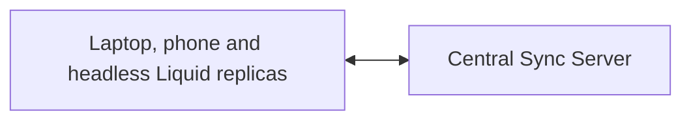
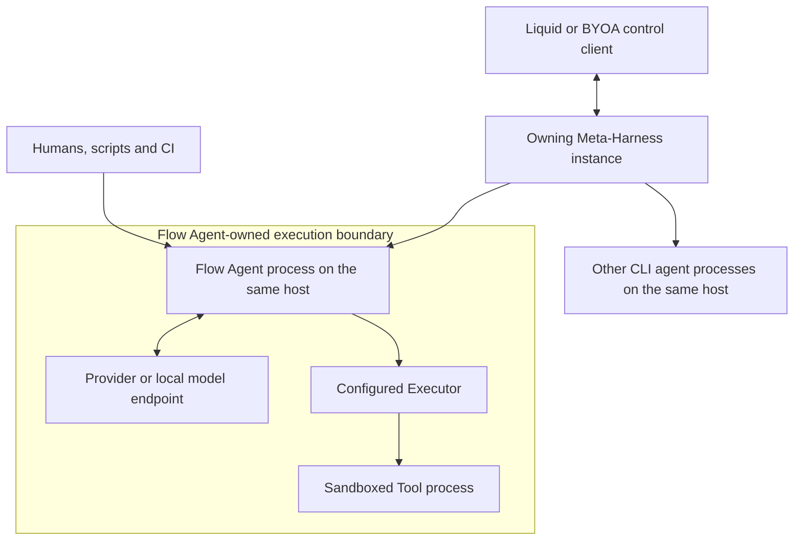

# Vision

## Thesis

AI-agent work should be **structured, observable, measurable and safely reversible**. Watershed is one **AGPL/free-software AI-native work platform** with three independently useful layers:

```text
Execution layer:         Flow Agent
Control layer:           Meta-Harness
Workspace/action layer:  Liquid
```

```text
Flow Agent makes agent work repeatable.
Meta-Harness makes agent work observable and governable.
Liquid makes human and agent work visible, composable and reversible.
```

This file owns the integrated platform model. Per-product internals live in the V-Specs; canonical terms live in `GLOSSARY.md`.

## Independent products, compound value

- **Flow Agent:** *Run repeatable, auditable AI-agent workflows from my CLI.*
- **Meta-Harness:** *Control, observe, measure and govern agents on one host.*
- **Liquid:** *Let humans and agents build and safely co-edit a local-first workspace.*

Each product works without the layers above it. Together they add normalized sessions, permissioned agent actions, cross-device workspace access and reversible human/agent collaboration.

The current M1.1 Flow Agent milestone extends the completed deterministic, fixture-bounded M1 foundation with practical provider/process execution. M1.2 adds the Flow-owned Executor and OS-isolation boundary described in the [executor architecture concept](docs/concept/flow-agent-executor-architecture.md); scope and evidence are canonical in `PLAN.md` and `SECURITY.md`.

Watershed is AGPL/free software: users can inspect, run, self-host, fork and verify its behavior. This is a public-good and community-trust posture, not an open-core monetization model (ADR-0019).

## Integration and ownership

Watershed is a monorepo, **not** a monolith. The products share `core` libraries and the versioned `proto` contract, but own separate processes and state.

- **Flow Agent** is CLI-only and host-local. Humans, scripts, CI or a Meta-Harness on the same host use its public CLI/event surfaces. It has one global configuration authority and no project-local configuration discovery; project-specific behavior is an explicit Flow. Nothing reads its private session store.
- **Meta-Harness** is a headless, host-scoped controller. It starts and controls only CLI agents on its own host, while authenticated clients may reach its public API remotely. Each instance owns its agent configurations, sessions, transcripts, agent schedules and AgentPulse metrics.
- **Liquid** is a local-first workspace and app-building product. Every interactive client reads and writes its local replica. A central Sync Server coordinates replicas; an optional headless Liquid replica lets server-hosted agents use the same workspace action boundary while user devices are offline.

Liquid is the only Watershed UI that controls agents. It projects one or more Meta-Harness instances into one experience while retaining each record's execution location, owner, freshness and command destination. A friendly location and session name hide infrastructure detail without inventing one global controller.

### Workspace sync plane



### Live agent-control plane



The Sync Server and headless Liquid replica are separate logical roles, though one hosted deployment may co-locate them. In the M3 MVP, user devices sync each authorized Workspace in full. Resource-scoped Roles govern Liquid surfaces but do not hide replicated bytes from the authorized device owner. Stable resource identity and versioned sync keep selective replication possible in a later protocol. A headless replica receives a Workspace only after workspace-level opt-in because it adds a server execution boundary.

Workspace sync and live agent control are separate planes. Offline replicas keep working locally. Cached agent state is visibly stale and cannot imply that a live command succeeded. Meta-Harness may start or observe Flow Agent but does not select or manage its Executor or Tool Sandbox.

## Local operation and portable continuity

Watershed's long-term core path is **offline after provisioning**. One device may run its Liquid replica, Meta-Harness, Flow Agent, local model endpoint, Executor and permitted Tools with network interfaces disabled. Remote providers, sync, MCP servers and remote control remain explicit optional capabilities; their absence never masquerades as success or blocks unrelated local work. This target is accepted architecture, not current M1.1 provider parity; the exact provisioning/local-provider contract remains [D-059](docs/decisions/open-decisions.html#d-059), and the executable local-runtime trust boundary remains [D-061](docs/decisions/open-decisions.html#d-061).

A Flow states model/runtime requirements, not host addresses. Each execution location resolves them through a **Runtime binding** that may differ by device. Endpoint paths, credential references, protected credential material, model/runtime artifacts and resource policy remain device-local and never become Flow or Conversation authority. Flow Agent uses only **Global Flow configuration**; it does not discover project-local configuration layers. Project-specific behavior is represented by an explicitly selected or authored Flow. Optional global and harness-start Workspace `AGENTS.md` files are instructions, not configuration authority.

A completed Conversation checkpoint may later move to another device and continue under a compatible Runtime binding. That **Portable continuation** always creates a new child Run in the existing Conversation tree, rechecks the selected Flow, destination capabilities, local actor and resources, and never replays prior provider or Tool effects. Integrations reauthorize their own resources; Liquid access additionally rechecks its Role and session grant. Exact recovery of an incomplete Run remains a stricter local compatibility contract. If disconnected devices continue the same checkpoint independently, they create separate branches rather than claiming the same linear Run; the archive, transfer and ownership protocol remains [D-058](docs/decisions/open-decisions.html#d-058), its authenticity root remains [D-062](docs/decisions/open-decisions.html#d-062), and offline approval/revocation semantics remain [D-060](docs/decisions/open-decisions.html#d-060).

Workspace replication, Conversation portability and model/runtime distribution are separate protocols with different authority, conflict and storage rules. None may read another product's private store or transfer credential-store records, Runtime-binding credential references, approvals or execution authority. Conversation archives remain sensitive because recorded user, provider or Tool content may itself contain secrets.

## Liquid integration boundary

Liquid's Page/Block/View UX, Workspace object lifecycle, Roles, logic levels, App and Block SDKs, and MCP model are canonical in the [Liquid V-Spec](docs/concept/V-Spec_Liquid.html), [glossary](GLOSSARY.md) and [security model](SECURITY.md).

Cross-product implications:

- Meta-Harness and Flow Agent never mutate Liquid storage directly; they use the Workspace CLI/API.
- App actions and Workspace mutations remain Liquid-owned, permissioned and recorded in History.
- Meta-Harness agent schedules may invoke Liquid actions only through that boundary; Liquid Automations may invoke authorized Meta-Harness actions through its public API.

## Integrated agent flow

1. A user or developer selects an agent harness, that adapter's configuration and a friendly execution location in Liquid. Flow Agent requires an explicit Flow from its global authority; other harnesses use their documented selection model. The owning host resolves any device-local Runtime binding.
2. Liquid calls the Meta-Harness that owns that location; a Meta-Harness schedule or event trigger may start the same run.
3. Meta-Harness starts and supervises the agent process on its host.
4. Liquid shows connection state, progress, transcript and a prompt/steering surface.
5. The run uses its Role to propose or execute permitted project actions and Liquid actions. Every Liquid mutation crosses the permissioned mutation pipeline and enters History.
6. The user may supervise, approve, steer or add follow-up prompts.
7. Meta-Harness retains execution records; Liquid retains its workspace History and cached projections.

Agents never receive authority merely because a Block is visible. They act through the Liquid CLI/API under the effective intersection of Role, session, App and provider capabilities.

## Positioning and non-goals

Position Watershed as structured agent execution + a neutral host-scoped control plane + a safe local-first workspace. Do not position it as another generic coding agent, a Notion clone, three unrelated products, a status UI for Flow Agent or a proprietary/open-core service.

- Liquid is an OS-abstracting app, not an operating system.
- Watershed does not implement project-code VCS/history in the MVP; normal Git projects remain external. Liquid History covers only Liquid workspace data.
- Meta-Harness does not control processes on another host.
- The Sync Server does not execute App Blocks or agent commands.
- Liquid does not bypass Meta-Harness to manage CLI agents.
