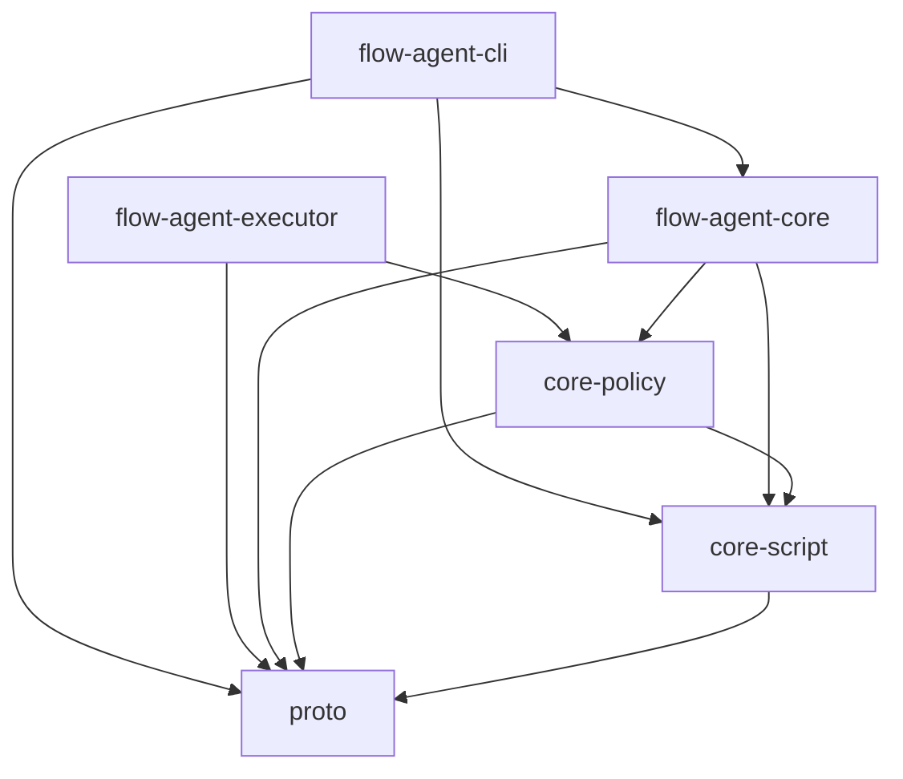
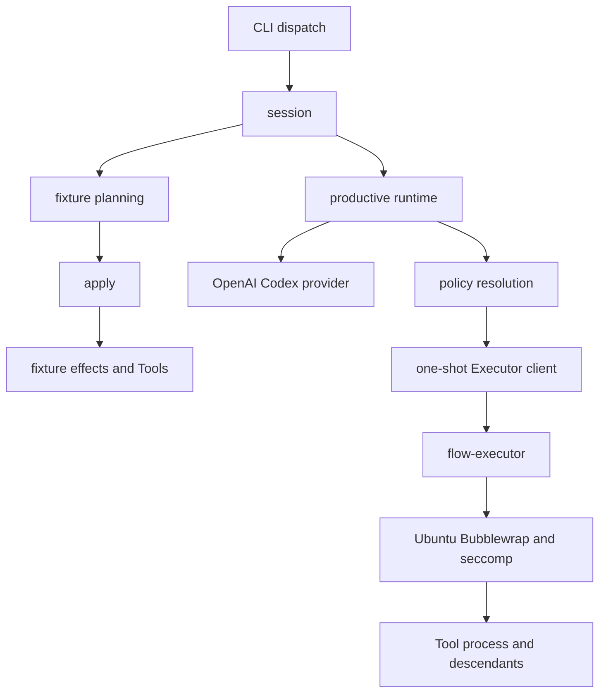
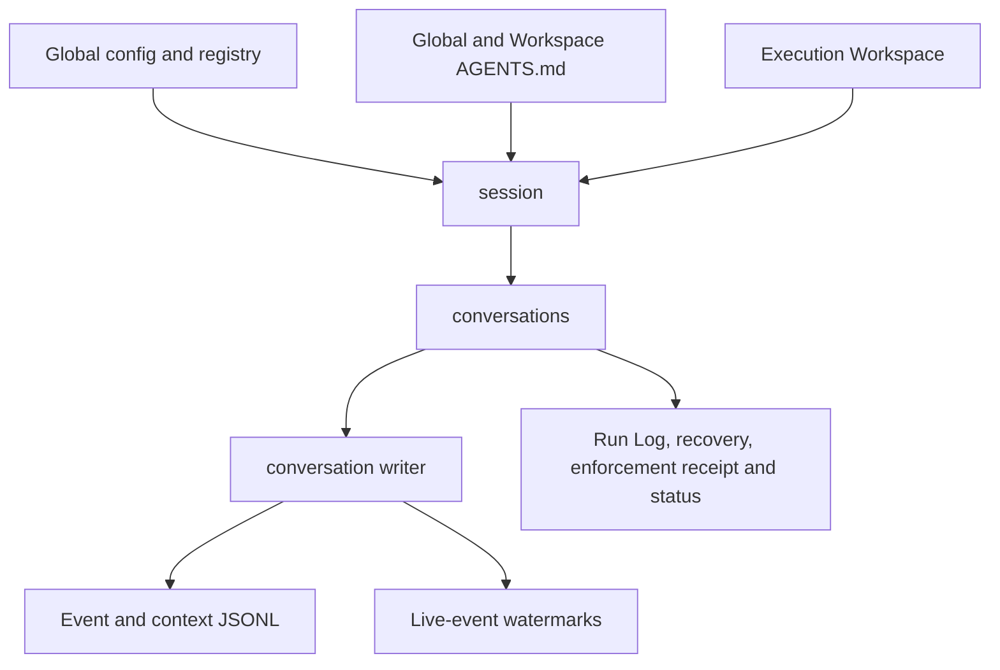

# Current implementation architecture

These diagrams map the Rust workspace and major Flow Agent responsibility paths. The [Flow Agent Executor architecture](concept/flow-agent-executor-architecture.md) explains the M1.2 isolation design. Product topology is canonical in [`VISION.md`](../VISION.md); runtime behavior and storage contracts are canonical in [`PROTOCOL.md`](../PROTOCOL.md). Security and evidence remain in [`SECURITY.md`](../SECURITY.md) and [`TESTING.md`](../TESTING.md).

## Rust workspace crates

Arrows mean “depends on.” This graph includes current Cargo workspace members only.

The package manifests are the executable dependency source of truth. `flow-agent-executor` is the companion binary launched through the protocol, not a library dependency of Flow Agent core.

## Flow Agent runtime responsibilities

These are major control/data paths, not an exhaustive Rust module dependency graph or public embedding API.

### Execution paths

The Fixture path is deterministic and in process and makes no OS-isolation claim. Productive Tool execution uses the one-shot Executor contract; official productive targets without the Ubuntu boundary fail closed.

### Persistence and inputs

See the [Flow Agent V-Spec](concept/V-Spec_FlowAgent.html#architecture) for responsibility boundaries. Current module declarations live in [`flow-agent-core/src/runtime/mod.rs`](../flow-agent/flow-agent-core/src/runtime/mod.rs); CLI composition lives in [`flow-agent-cli/src/dispatch.rs`](../flow-agent/flow-agent-cli/src/dispatch.rs).

## Configuration boundary

Flow Agent resolves technical configuration only from `FLOW_AGENT_HOME`, defaulting to `~/.flow` on Unix and `%USERPROFILE%\.flow` on Windows. Its `config.yaml` selects a registry only beneath that global home. Workspace `.flow` files and registries are never implicit inputs. Global-home and harness-start Workspace `AGENTS.md` files are loaded separately as ordered instructions and cannot alter technical authority. Executor selection is a separate protected administrator setting: the default derives the sibling `flow-executor`, while a Custom Executor requires an absolute override. [`PROTOCOL.md`](../PROTOCOL.md) owns both contracts.
