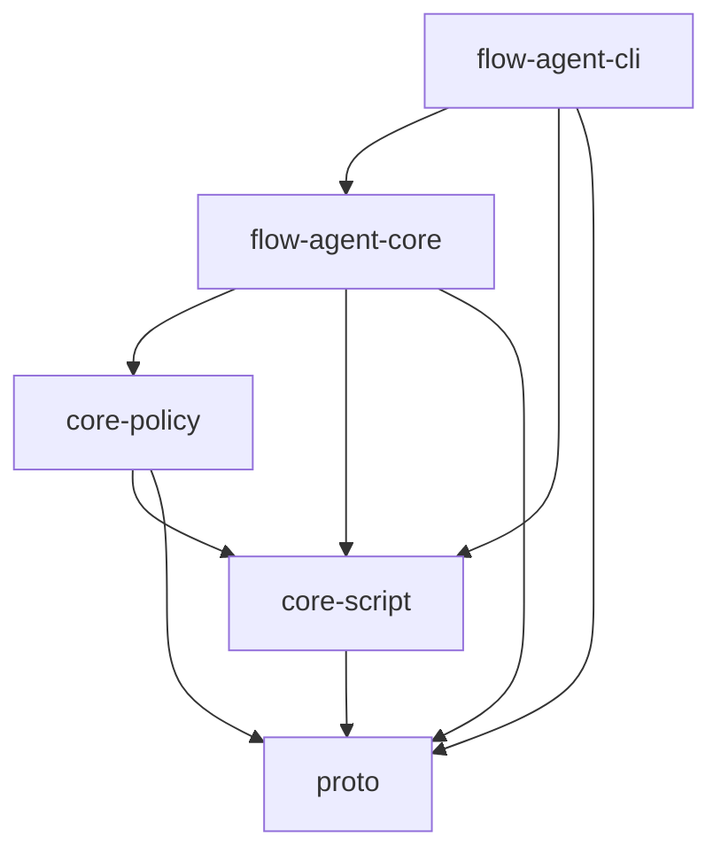
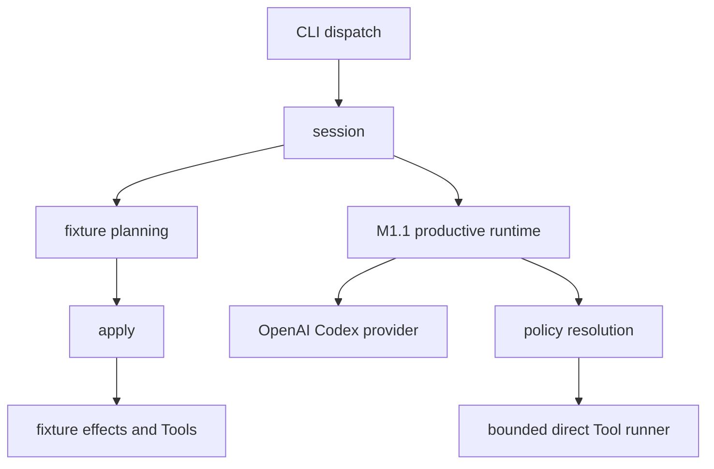
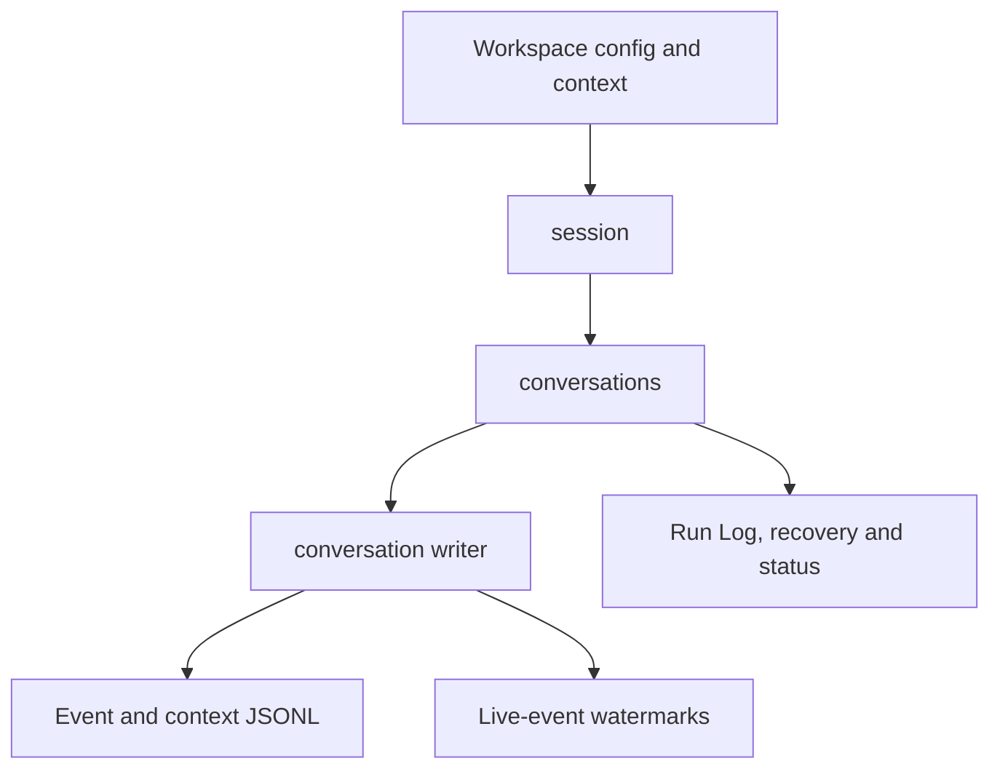

# Current implementation architecture

These diagrams map the current Rust workspace and major Flow Agent responsibility paths. They do not depict the planned M1.2 boundary; see the [Flow Agent Executor architecture](concept/flow-agent-executor-architecture.md) for that target. Product topology is canonical in [`VISION.md`](../VISION.md); runtime behavior and storage contracts are canonical in [`PROTOCOL.md`](../PROTOCOL.md). Security and evidence remain in [`SECURITY.md`](../SECURITY.md) and [`TESTING.md`](../TESTING.md).

## Rust workspace crates

Arrows mean “depends on.” This graph includes current Cargo workspace members only.

The package manifests are the executable dependency source of truth.

## Flow Agent runtime responsibilities

These are major control/data paths, not an exhaustive Rust module dependency graph or public embedding API.

### Execution paths

The fixture path is deterministic and in process. The current M1.1 productive Tool runner manages process stability but provides no OS-isolation boundary.

### Persistence and inputs

See the [Flow Agent V-Spec](concept/V-Spec_FlowAgent.html#architecture) for responsibility boundaries. Current module declarations live in [`flow-agent-core/src/runtime/mod.rs`](../flow-agent/flow-agent-core/src/runtime/mod.rs); CLI composition lives in [`flow-agent-cli/src/dispatch.rs`](../flow-agent/flow-agent-cli/src/dispatch.rs).
