# Flow Agent execution and security architecture

**Status: accepted replacement architecture, not implemented (ADR-0166–ADR-0172).** The [security contract](../../SECURITY.md#accepted-flow-agent-security-target) is normative. Mac Seatbelt, protected overlapping locations and the initial configuration review lifecycle are selected; [D-063](../decisions/open-decisions.html#d-063) retains the protected-inventory choice. Diagrams below specify intended outcomes; they are not evidence that the new boundary exists. Current Ubuntu execution still uses the legacy one-shot Bubblewrap/seccomp/cgroup implementation. macOS Tool execution still fails closed.

## Responsibility and architecture

Flow Agent controls the workflow; the Executor starts and supervises a Tool; the native boundary protects Flow-owned files from direct Tool/child writes. Engineers trust Tool code and everything it executes or delegates to. These are separate responsibilities, not interchangeable layers of certification.

| Component | Responsibility | Not its promise |
|---|---|---|
| Engineer | Select Building Blocks, trustworthy code/dependencies and explicit permission scopes. | A Tool's description or marketplace listing proves safety. |
| Flow Agent | Validate calls and transitions, retain Run authority, handle durable effects and mediate configuration changes. | Infer all effects of arbitrary commands or make Tool results truthful. |
| Executor | Preserve the existing short-lived companion seam, prepare mandatory protection before launch, bound transport/waiting and report observed results and cleanup. | Decide permissions, approve configuration, or certify third-party executors. |
| Native boundary | Block direct modifications of protected Flow objects by the Tool and its children. | Contain all other host effects, independent services or privileged actors. |
| Tool and dependency chain | Implement the admitted action correctly even for hostile inputs. | Rely on Flow to repair unsafe path handling, shell construction or delegated authority. |
| Authorized approver | Decide the exact proposed configuration change within the Engineer's permitted scope. | Grant unlimited access, approve on behalf of a different actor, or rewrite current Run authority. |

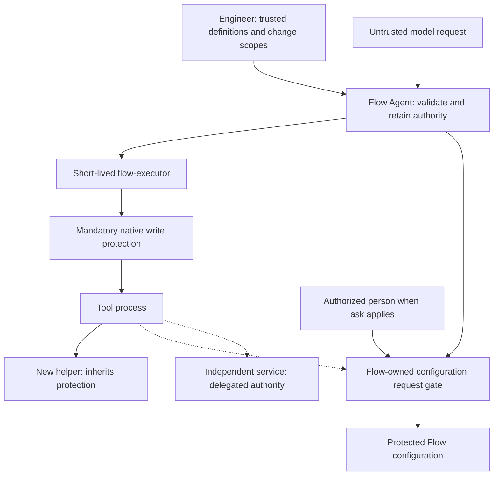

The existing `flow` / `flow-executor` separation remains useful; removing broad isolation does not require embedding every launcher in the controller. Flow owns selection and launch authorization. The companion never receives permission to let a Tool overwrite protected files. Configuration mediation belongs to Flow, not to an unrestricted privileged helper or a model-controlled replacement Executor. Current administrator-selected Custom Executors remain part of the trusted installation, without third-party certification; the replacement must not make a Custom selection an automatic protection bypass.

## Security case matrix

The cases partition the supported authority paths and failure classes. They are not a claim to enumerate every possible exploit or prove that an OS primitive is correct. Native acceptance must establish the general boundary and then exercise representative operations, not keep searching for spelling variants of commands.

| Case | Boundary and expected outcome |
|---|---|
| [1. Ordinary or invalid request](#1-ordinary-or-invalid-request) | Flow accepts only a valid in-scope invocation; trusted Tool code implements its effects. |
| [2. Direct protected write](#2-direct-protected-write) | Native denial, including child processes; no escalation or automatic retry. |
| [3. Configuration permission](#3-configuration-permission) | Deny, ask or scoped allow; Flow applies only a concrete authorized change. |
| [4. Changed or replayed approval](#4-changed-or-replayed-approval) | No stale consent, self-escalation or silent current-Run authority change. |
| [5. Compromised Tool](#5-compromised-tool) | Direct protected writes remain blocked; unrelated host effects and false results are not contained. |
| [6. Compromised new helper](#6-compromised-new-helper) | Helper inherits direct-write protection; the trusted dependency assumption is nevertheless broken. |
| [7. Independent third-party service](#7-independent-third-party-service) | Service acts with separate authority and may bypass Flow's local write guard. |
| [8. Missing boundary or interrupted execution](#8-missing-boundary-or-interrupted-execution) | No unprotected launch; post-launch uncertainty is not success or permission to replay. |
| [9. Parallel agents](#9-parallel-agents) | Separate Run ownership does not serialize shared project edits or reserve host resources. |
| [10. External sandbox](#10-external-sandbox) | Extra containment is possible only when nested prerequisites work; no fallback. |

### 1. Ordinary or invalid request

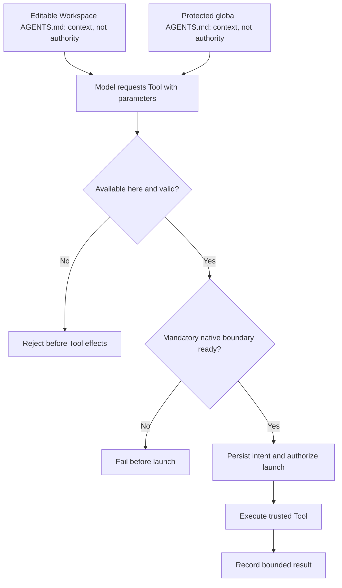

A read Tool must enforce its own promised project scope, including links, replacement races and hostile path input relevant to its implementation. Flow's parameter validation does not inspect every later file operation. A build Tool's dependency chain includes build scripts, plugins and project code, including code the model may have edited. A correct implementation must not confuse untrusted text with new execution authority.

The [instruction-file exclusion](../../SECURITY.md#native-self-protection-and-its-limits) applies only to Workspace-local inputs; the global file stays protected. Changed local instructions may steer the model toward a harmful but authorized request; this diagram promises unchanged permission checks, not harmless intent.

### 2. Direct protected write

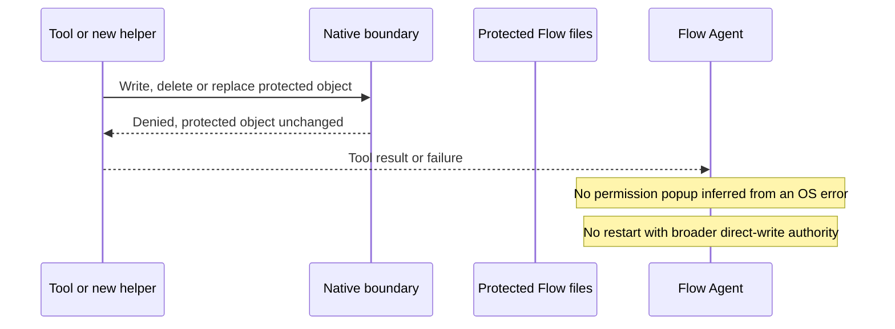

A direct-write block is not a whole-Tool rollback. The Tool may already have edited other files or contacted a service. A Tool may also catch an OS error and report success; the blocked write stays blocked, but Flow does not thereby know the Tool's result is truthful. The final native mechanism must cover object identity and child inheritance, not just match a path in command text. Configuration permission does not lift this guard.

### 3. Configuration permission

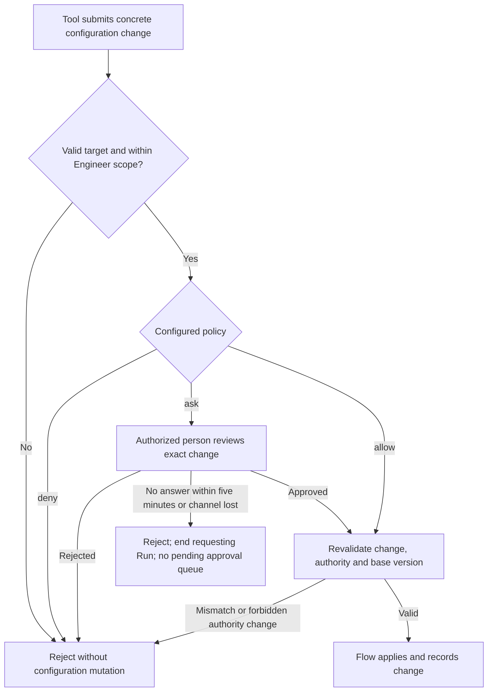

Ordinary assigned Tool execution still does not require a prompt. `ask` applies to the explicit configuration request, not arbitrary filesystem calls. `allow` remains a scoped permission, not a writable mount of the Flow home. No actor can approve more than the configured scope. Credential values must not appear in the review. The approved [catalog and terminal review lifecycle](../../SECURITY.md#configuration-and-migration-boundary) run after Tool completion; JSONL, redirected-input and unattended Runs reject `ask`. The diagram introduces no socket or new service contract.

### 4. Changed or replayed approval

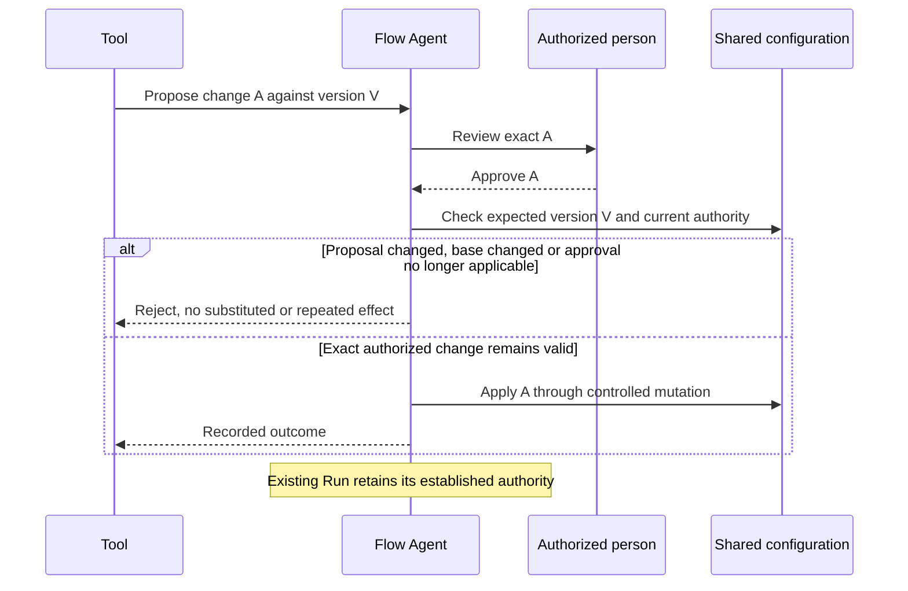

A request that raises the requesting Tool's own permission is forbidden even if another mutable setting appears harmless. The accepted lifecycle rejects version conflicts and reused consent, changes future Runs only and retains no pending approval after restart. Native channel protection and transaction/crash tests remain implementation acceptance, not completed evidence.

### 5. Compromised Tool

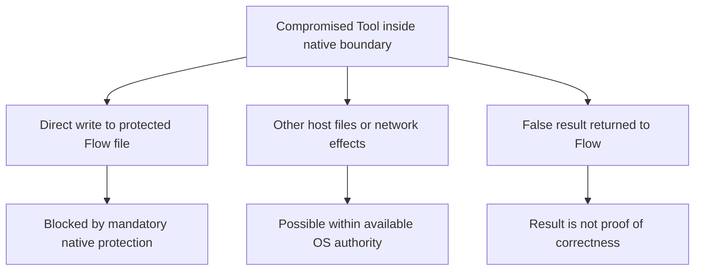

This violates the trusted-Tool assumption. The narrow direct-write guarantee still has to work within its declared scope, but it is not a certificate that running hostile code is safe. The Tool may damage project data, read accessible secrets, exhaust resources or lie. Flow does not automatically detect compromise. If the controller, installed enforcement component or OS itself is compromised, the enforcement assumption fails as well.

### 6. Compromised new helper

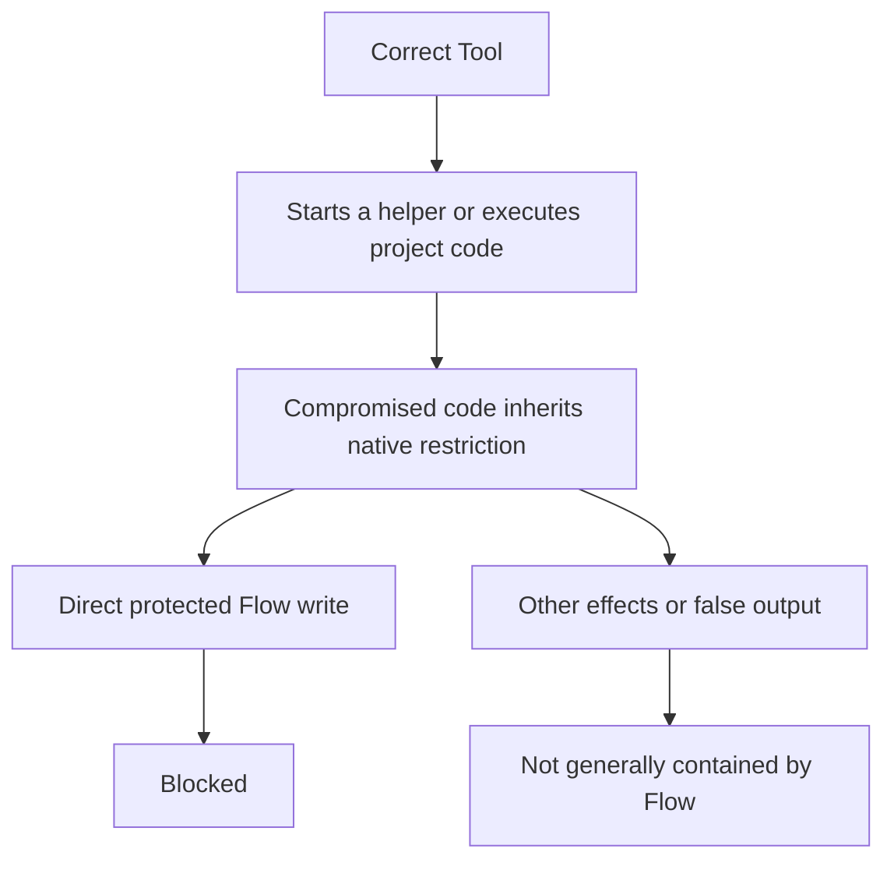

The parent being correct is insufficient: the complete executable chain must be trusted. The same reasoning applies to an imported library running inside the parent, an interpreter, a test runner or a dependency hook. A new process does not lose the direct-write restriction merely because another Tool launches it. A call to an independent service is different and belongs to case 7.

### 7. Independent third-party service

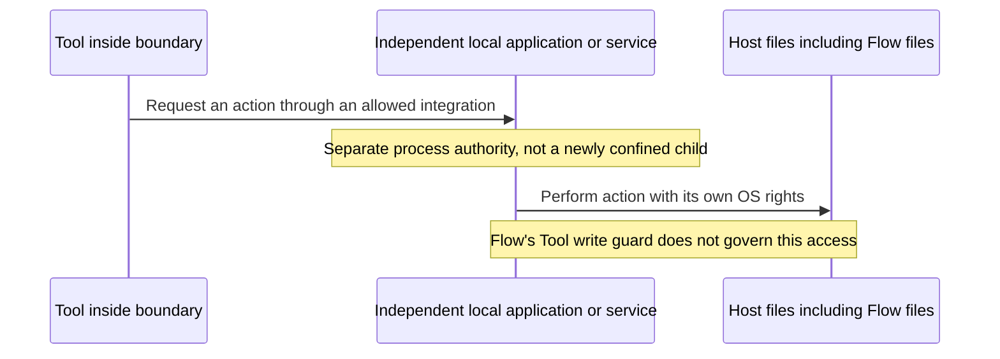

A trustworthy Tool can call a compromised service, or correctly request an intentionally powerful action from a trustworthy service. Either can affect Flow files if the service has the necessary local authority. Remote services can affect local files only through some local authority or access path; a remote request alone does not create local filesystem rights. The Engineer owns integration trust. Extending the guarantee to these actors would require another boundary decision, not a stronger warning message. An external sandbox may block the integration, but that is separate deployment protection.

### 8. Missing boundary or interrupted execution

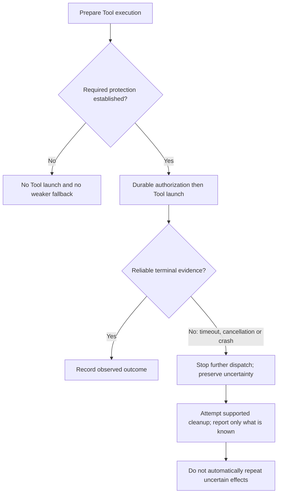

A timeout is not proof that every helper stopped. Removing hostile-descendant cleanup guarantees does not remove bounded waits, cancellation handling or honest recovery. A write restriction must survive in a child that outlives its parent for as long as that child can run; the new native acceptance must demonstrate that inheritance property. It does not promise that the child cannot keep changing its other admitted resources.

### 9. Parallel agents

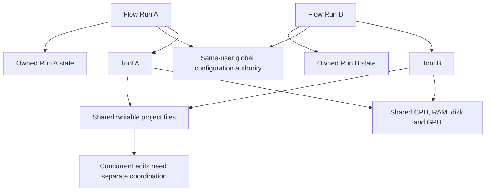

Private Run ownership is not a per-Run OS identity. Twenty correctly implemented Tools can still conflict on one file or overcommit a laptop. The native protected-object set and its behavior with multiple Flow homes must be explicit under D-063; a selected home's protection must not be advertised as automatic discovery and protection of every other installation. No project-code VCS, scheduler or new cross-agent locking product is introduced here.

### 10. External sandbox

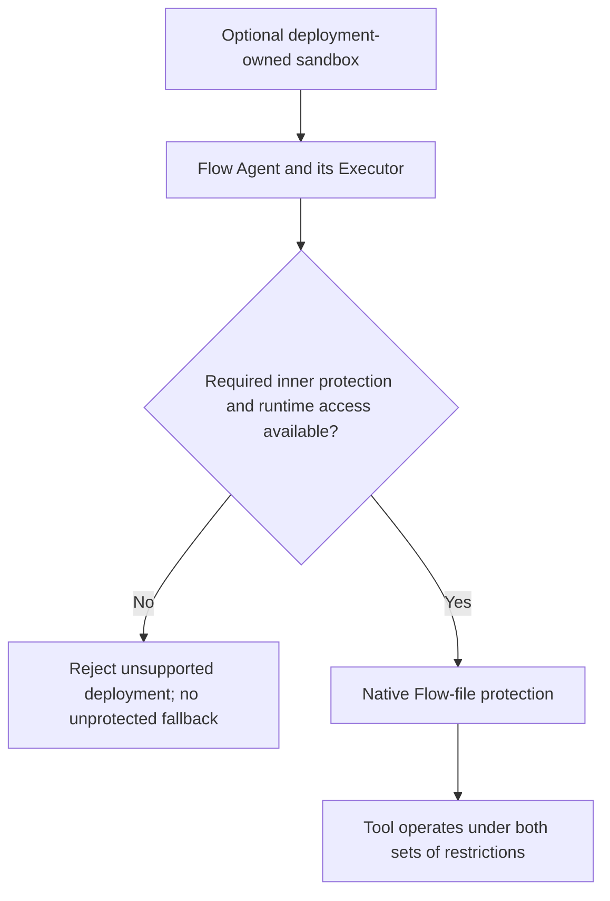

An outer container, VM or sandbox can add filesystem, network or resource limits. It may also block the native mechanism, provider connection or intended Mac automation. Compatibility must be tested with real nested execution; there is no support promise for arbitrary sandbox products. A user-selected outer environment does not turn a Linux guest into native macOS Tool support or replace required native release evidence.

## Migration and native acceptance

The [native protection proposal](flow-agent-native-protection-proposal.md) specifies the evaluated candidate's object/lifecycle rules, native App Sandbox comparison and outstanding product acceptance. Only the explicitly accepted rules in `SECURITY.md`, including ADR-0169's file-layout restrictions, are policy; experimental success is not shipping approval.

The [current wire contract](../../PROTOCOL.md#m12-executor-protocol-adr-0146-adr-0160-adr-0161-adr-0162), [legacy test matrix](../../TESTING.md#m12-transition-and-executor-evidence) and [legacy startup workload](../../flow-agent/benchmarks/M1_2_STARTUP_EVIDENCE.md) remain executable evidence for the code that exists. Do not publish new permission fields while silently retaining incompatible semantics, remove old checks before their replacement, or claim that a mock proves native protection.

D-063 must close the remaining protected-inventory choice before a coherent schema/runtime/fixture migration; the Mac mechanism and configuration review lifecycle are already selected. Native tests must then cover each in-scope outcome above on the [release targets](../../PLATFORMS.md), including ordinary Mac development workloads, child inheritance, direct write/delete/replacement, conflicting or stale consent, missing protection, cancellation and crash outcomes. Benchmark the new complete invocation lifecycle without estimated thresholds. External-service exclusions must remain visible in user-facing claims. Standard Tools and marketplace decisions remain [D-066](../decisions/open-decisions.html#d-066) and [D-067](../decisions/open-decisions.html#d-067).
