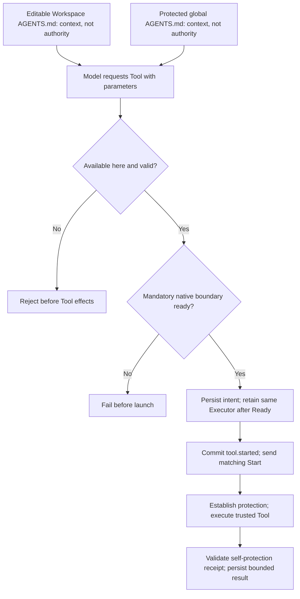
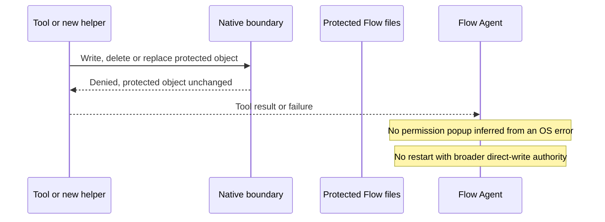
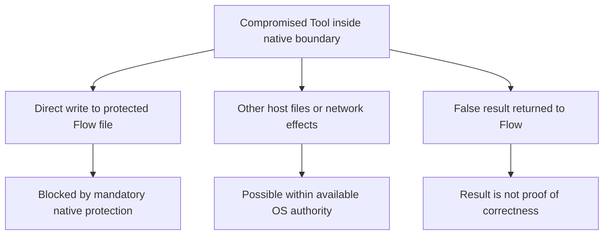
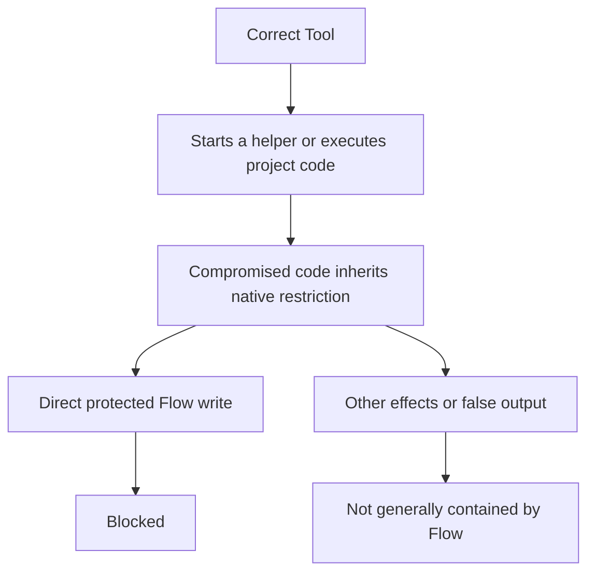
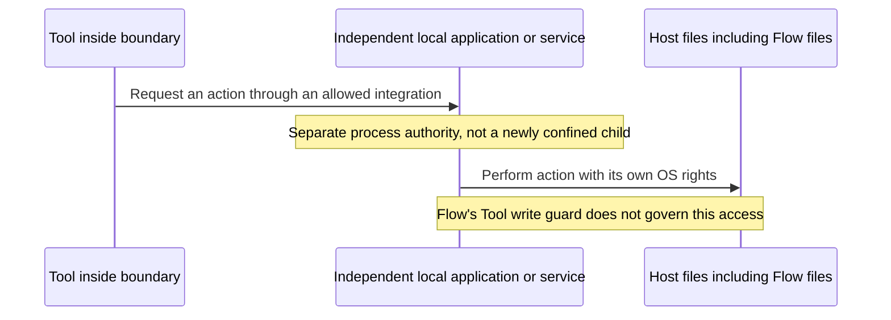
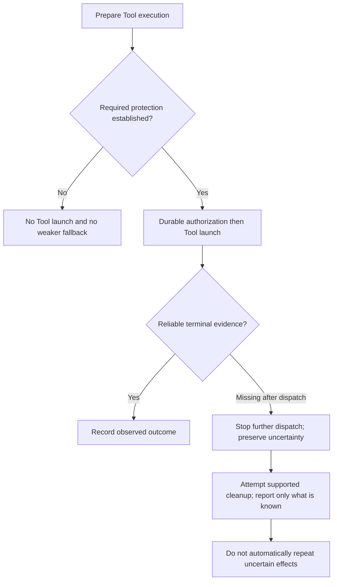
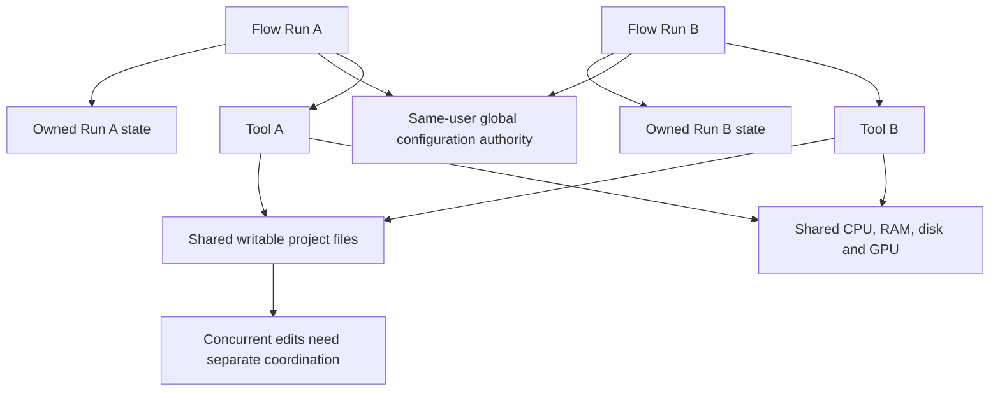
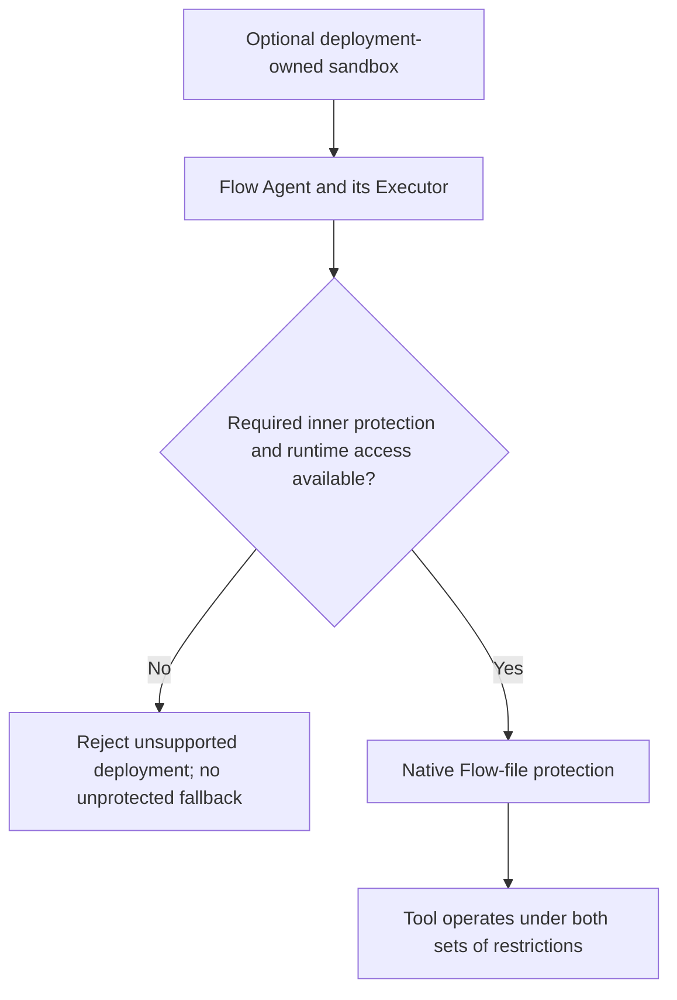

# Flow Agent execution and security architecture

**Status: replacement integrated; native verification pending.** The [security contract](../../SECURITY.md#accepted-flow-agent-security-target) is normative. Linux Bubblewrap/seccomp and Mac Seatbelt now implement the narrow replacement, including selected-home protection and warned overlapping locations. The diagrams explain the required boundary; they are not full runtime verification. [TESTING.md](../../TESTING.md#m12-transition-and-executor-evidence) owns native results and gaps. Future features belong only to the [roadmap](../../PLAN.md#later-flow-agent-roadmap).

## Responsibility and architecture

Flow Agent controls the workflow; the Executor starts and supervises a Tool; the native boundary protects Flow-owned files from direct Tool/child writes. Engineers trust Tool code and everything it executes or delegates to. These are separate responsibilities, not interchangeable layers of certification.

| Component | Responsibility | Not its promise |
|---|---|---|
| Engineer | Select Building Blocks, trustworthy code/dependencies and explicit permission scopes. | A Tool's description or marketplace listing proves safety. |
| Flow Agent | Validate calls and transitions, retain Run authority and handle durable effects. Configuration administration remains manual for the first Flow Agent release. | Infer all effects of arbitrary commands or make Tool results truthful. |
| Executor | Preserve the existing short-lived companion seam, prepare mandatory protection before launch, bound transport/waiting and report observed results and cleanup. | Decide permissions, approve configuration, or certify third-party executors. |
| Native boundary | Block direct modifications of protected Flow objects by the Tool and its children. | Contain all other host effects, independent services or privileged actors. |
| Tool and dependency chain | Implement the admitted action correctly even for hostile inputs. | Rely on Flow to repair unsafe path handling, shell construction or delegated authority. |

The `flow` / `flow-executor` separation remains. Flow admits the protected inventory once under publication leases and validates each invocation; the short-lived companion receives the exact resolved policy and establishes protection before the first Tool instruction. [PROTOCOL.md](../../PROTOCOL.md#m12-executor-protocol-adr-0146-adr-0160-adr-0161-adr-0162) owns descriptor, digest and receipt details. Configuration administration is manual. Administrator-selected Custom Executors remain trusted installation code and cannot serve as an automatic protection bypass; only explicit Custom selection permits an absent official sibling (ADR-0175).

## Security case matrix

The cases partition the supported authority paths and failure classes. They are not a claim to enumerate every possible exploit or prove that an OS primitive is correct. Native acceptance must establish the general boundary and then exercise representative operations, not keep searching for spelling variants of commands.

| Case | Boundary and expected outcome |
|---|---|
| [1. Ordinary or invalid request](#1-ordinary-or-invalid-request) | Flow accepts only a valid in-scope invocation; trusted Tool code implements its effects. |
| [2. Direct protected write](#2-direct-protected-write) | Native denial, including child processes; no escalation or automatic retry. |
| [3. Compromised Tool](#3-compromised-tool) | Direct protected writes remain blocked; unrelated host effects and false results are not contained. |
| [4. Compromised new helper](#4-compromised-new-helper) | Helper inherits direct-write protection; the trusted dependency assumption is nevertheless broken. |
| [5. Independent third-party service](#5-independent-third-party-service) | Service acts with separate authority and may bypass Flow's local write guard. |
| [6. Missing boundary or interrupted execution](#6-missing-boundary-or-interrupted-execution) | No unprotected launch; post-launch uncertainty is not success or permission to replay. |
| [7. Parallel agents](#7-parallel-agents) | Separate Run ownership does not serialize shared project edits or reserve host resources. |
| [8. External sandbox](#8-external-sandbox) | Extra containment is possible only when nested prerequisites work; no fallback. |

### 1. Ordinary or invalid request

A read Tool must enforce its own promised project scope, including links, replacement races and hostile path input relevant to its implementation. Flow's parameter validation does not inspect every later file operation. A build Tool's dependency chain includes build scripts, plugins and project code, including code the model may have edited. A correct implementation must not confuse untrusted text with new execution authority.

The [instruction-file exclusion](../../SECURITY.md#native-self-protection-and-its-limits) applies only to Workspace-local inputs; the global file stays protected. Changed local instructions may steer the model toward a harmful but authorized request; this diagram promises unchanged permission checks, not harmless intent.

### 2. Direct protected write

A direct-write block is not a whole-Tool rollback. The Tool may already have edited other files or contacted a service. A Tool may also catch an OS error and report success; the blocked write stays blocked, but Flow does not thereby know the Tool's result is truthful. Native acceptance must prove object identity and child inheritance for the integrated mechanism; a path match in command text is insufficient. No Tool permission lifts this guard.

### 3. Compromised Tool

This violates the trusted-Tool assumption. The narrow direct-write guarantee still has to work within its declared scope, but it is not a certificate that running hostile code is safe. The Tool may damage project data, read accessible secrets, exhaust resources or lie. Flow does not automatically detect compromise. If the controller, installed enforcement component or OS itself is compromised, the enforcement assumption fails as well.

### 4. Compromised new helper

The parent being correct is insufficient: the complete executable chain must be trusted. The same reasoning applies to an imported library running inside the parent, an interpreter, a test runner or a dependency hook. A new process does not lose the direct-write restriction merely because another Tool launches it. A call to an independent service is different and belongs to case 5.

### 5. Independent third-party service

A trustworthy Tool can call a compromised service, or correctly request an intentionally powerful action from a trustworthy service. Either can affect Flow files if the service has the necessary local authority. Remote services can affect local files only through some local authority or access path; a remote request alone does not create local filesystem rights. The Engineer owns integration trust. Extending the guarantee to these actors would require another boundary decision, not a stronger warning message. An external sandbox may block the integration, but that is separate deployment protection.

### 6. Missing boundary or interrupted execution

A timeout is not proof that every helper stopped. Removing hostile-descendant cleanup guarantees does not remove bounded waits, cancellation handling or honest recovery. A write restriction must survive in a child that outlives its parent for as long as that child can run; native acceptance must demonstrate that inheritance property. It does not promise that the child cannot keep changing its other admitted resources.

### 7. Parallel agents

Private Run ownership is not a per-Run OS identity. Twenty correctly implemented Tools can still conflict on one file or overcommit a laptop. ADR-0174 protects this installation's required objects; Tools from an independently configured home do not automatically protect another home. Shared-home Runs retain the same protected set, not mutual Run isolation. No project-code VCS, scheduler or new cross-agent locking product is introduced here.

### 8. External sandbox

An outer container, VM or sandbox can add filesystem, network or resource limits. It may also block the native mechanism, provider connection or intended Mac automation. Compatibility must be tested with real nested execution; there is no support promise for arbitrary sandbox products. A user-selected outer environment does not turn a Linux guest into native macOS Tool support or replace required native release evidence.

## Integration and native acceptance

The [native protection design](flow-agent-native-protection-proposal.md) owns protected-object discovery, alias/ancestor invariants and the historical App Sandbox comparison. Linux uses a host-root bind with targeted read-only protection, read-only `/proc`, private `/dev` and seccomp; Mac uses narrow parameter-bound Seatbelt rules. Neither enforces general network denial, runtime-read profiles or process/thread capacity. The invariant is mandatory direct-write protection of this installation's selected home, platform stores and required program objects, inherited by new helpers. Other homes and independent services remain outside it.

Runtime, policy/schema, wire and fixtures have been migrated. The [native test matrix](../../TESTING.md#m12-transition-and-executor-evidence) and release-artifact acceptance are being migrated from the prior systemd/container gate to Ubuntu 24.04 x86_64 and macOS 26 ARM64. Native GREEN for this replacement is not available. Historical feasibility and passing Windows shared tests cannot establish complete protected-set admission, publication races, child lifetime or native installation correctness.

Acceptance must retain ordinary shell/C, Python and npm build workloads with explicit allowed controls, alongside protected-write/alias/ancestry denial, global versus local instructions, missing protection, manual/internal publication, bounded output, cancellation and honest crash/recovery outcomes. [PERFORMANCE.md](../../PERFORMANCE.md) owns complete lifecycle observations. Standard Tools and the later marketplace remain [D-066](../decisions/open-decisions.html#d-066) and [D-067](../decisions/open-decisions.html#d-067).
