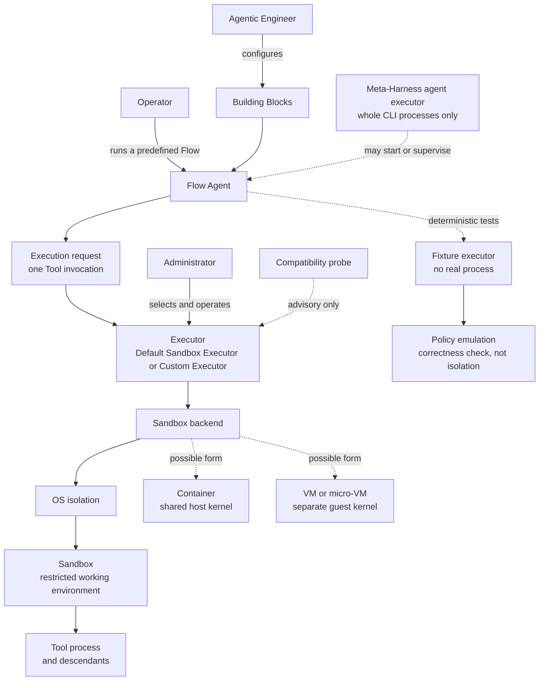
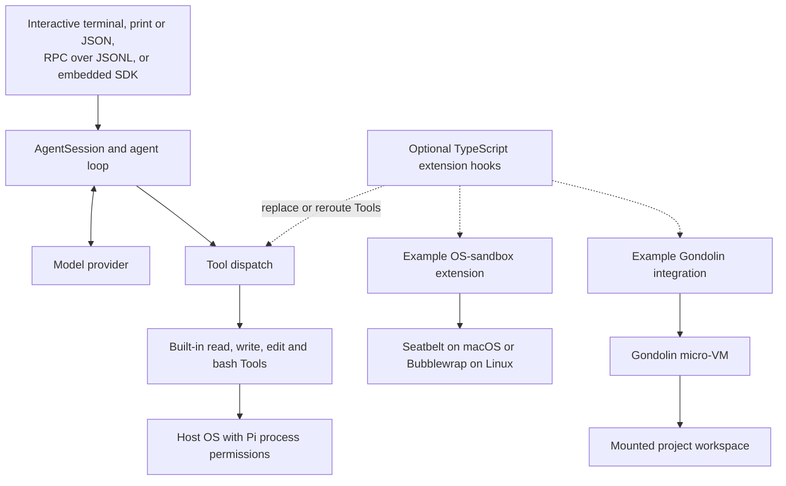
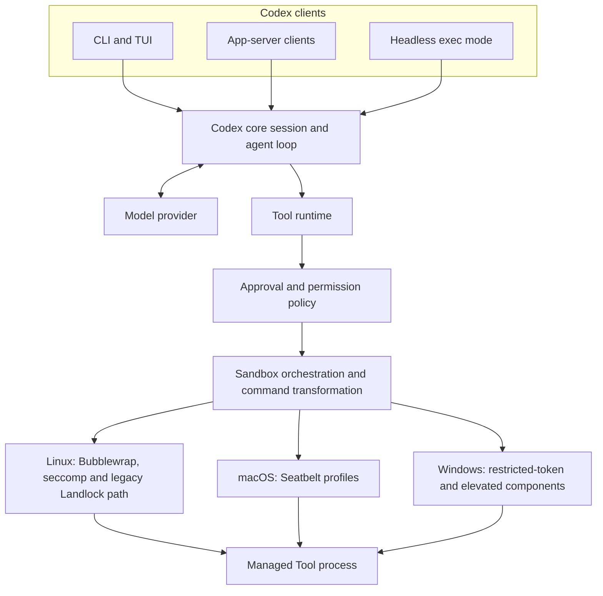
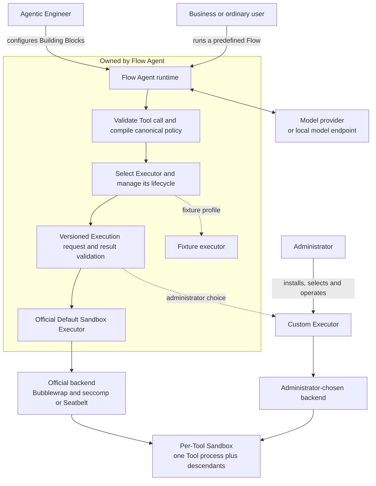
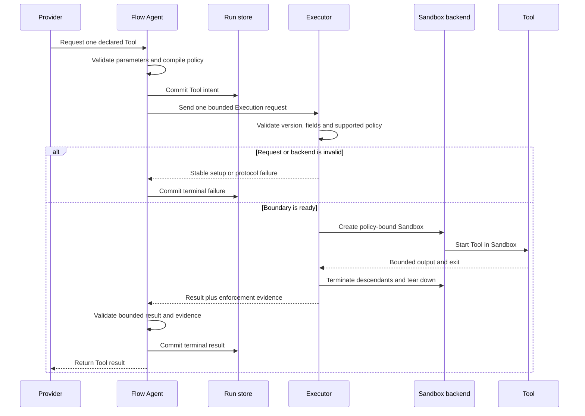
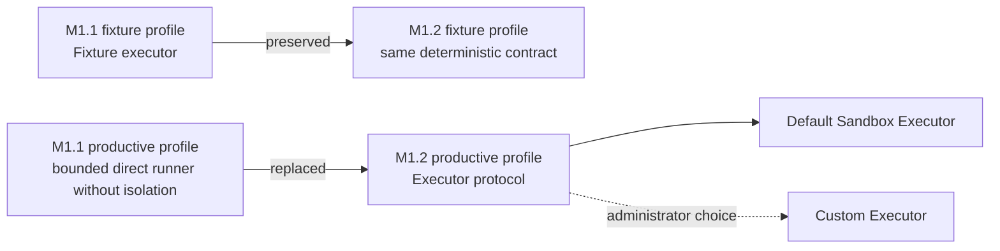
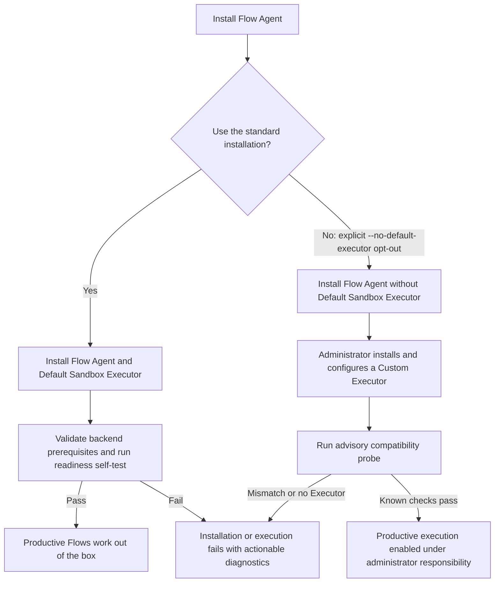

# Flow Agent executor and sandbox architecture

This document explains the accepted M1.2 target in plain language and visualizes the reference architectures that informed it. Normative milestone scope lives in [`PLAN.md`](../../PLAN.md), security invariants in [`SECURITY.md`](../../SECURITY.md), the Executor contract in [`PROTOCOL.md`](../../PROTOCOL.md), test rules in [`TESTING.md`](../../TESTING.md), and canonical terms in [`GLOSSARY.md`](../../GLOSSARY.md).

## Decision in one minute

Flow Agent owns the rules and the execution decision. An Executor understands those rules and turns one Tool request into a safely managed process. A Sandbox backend supplies the actual restricted working environment. These are separate responsibilities.

The standard M1.2 installation includes the official Default Sandbox Executor, so a new user can run a productive Flow immediately. An administrator may explicitly opt out and configure a Custom Executor. Flow Agent provides a versioned protocol, development documentation, actionable errors and an advisory compatibility probe; it does not certify third-party software.

M1.2 is deliberately smaller than Codex's complete execution stack. It adds one narrow companion process and two official platform adapters, not a daemon, remote execution service, VM manager, container platform or third-party compatibility program. Meta-Harness and Liquid receive no Executor or Tool-Sandbox responsibility.

## Glossary as one picture

The easiest mental model is a restaurant: Flow Agent checks the order and chooses the kitchen; the Executor understands the order and manages the cooking; the Sandbox backend supplies the locked kitchen; the Tool does the work inside it. A VM, container or OS primitive is a type of kitchen, not the person translating the order. Meta-Harness's separately named agent executor only starts or supervises the whole restaurant; it never chooses or manages a Tool's locked kitchen.

## Open-source references

The diagrams below describe the cited source snapshots, not contracts Watershed promises to copy.

### Pi Coding Agent

Pi is a deliberately small, extension-first coding harness. Its built-in Tools run with the Pi process's user permissions, and its project-trust feature controls what configuration is loaded rather than sandboxing Tool effects. Optional extensions can replace Tool operations: one cited example wraps bash with OS sandbox primitives; another reroutes file and shell Tools into a Gondolin micro-VM.

Gondolin is therefore an isolation technology and Pi integration, not a Flow Agent Executor. It could become the backend behind a future Custom Executor only if an administrator implements the Flow protocol and accepts responsibility for that integration.

What Flow Agent adopts from Pi is the narrow, replaceable integration seam. It does not adopt Pi's default no-sandbox security posture because ordinary Flow users must receive a safe, working default.

### Codex CLI

Codex owns an integrated product security stack: approval decisions, permission profiles, sandbox selection, command transformation, managed networking, process lifecycle and platform-specific helpers cooperate inside one project. The pinned Linux implementation prefers system Bubblewrap, can use a bundled copy, applies a seccomp network filter and retains an explicit legacy Landlock path. macOS and Windows have separate native implementations.

This design supports Codex's broad interactive coding-agent surface, but its complexity is not the minimum required for M1.2. Flow Agent needs its own policy-aware Executor boundary and one supported backend per MVP platform; it does not need Codex's approval UX, managed proxy, remote exec server, interactive process multiplexing or Windows stack.

### What the scope reduction really means

The Executor protocol itself is a modest boundary; trustworthy OS enforcement, packaging and hostile tests are the expensive parts. M1.2 remains a security-critical milestone, but it avoids most of the surrounding product machinery visible in Codex.

| Capability | Flow Agent M1.2 | Codex reference stack |
|---|---|---|
| Translate product policy into a process request | Required | Required |
| Bound process I/O, timeout, cancellation and descendants | Required, reusing M1.1 lifecycle work where safe | Required with broader interactive modes |
| Linux and macOS native isolation | Required | Required and more feature-rich |
| Default packaging, readiness check and hostile matrix | Required | Required |
| Interactive approval/escalation UX | Not included | Integrated |
| PTY and long-lived interactive process multiplexing | Not included | Integrated |
| Positive-domain managed network proxying | Not included; deny all | Integrated |
| Remote execution/server variants | Not included | Present in the wider project |
| Windows Sandbox implementation | Post-MVP | Integrated platform stack |
| General container, VM or micro-VM management | Post-MVP integration | Outside the narrow comparison |

The practical reduction is therefore substantial, but not “just call Bubblewrap.” Flow Agent avoids several independent subsystems and one MVP platform; it still must prove that every declared Building-Block restriction survives policy translation, process launch and descendant behavior on two exact targets. Security verification, rather than JSON plumbing, is likely to dominate M1.2 effort.

## Flow Agent target architecture

Provider traffic stays in Flow Agent, outside the Tool Sandbox. This permits remote providers and local model endpoints even while every Tool receives deny-all network access. Only the Tool process and its descendants cross the Executor boundary.

The Fixture executor remains an in-process deterministic test double. It is not a production escape hatch and makes no OS-isolation claim.

### Responsibility split

| Owner | Must do | Must not claim or do |
|---|---|---|
| Agentic Engineer | Configure Building Blocks, Tool identities and least-capability boundaries. | Shift security choices to an ordinary Flow user. |
| Ordinary user / Operator | Select and run a predefined Flow; see clear setup or execution failures. | Understand sandbox products before a standard installation can run. |
| Flow Agent runtime | Validate Tool calls, compile policy, select and start the configured Executor, validate responses, persist lifecycle state and fail closed. | Provide the isolated filesystem/kernel itself or silently fall back to the M1.1 unsandboxed runner. |
| Default Sandbox Executor | Validate one request, translate policy, invoke the supported backend, manage one process tree, bound I/O/time and return result plus enforcement evidence. | Become a long-lived daemon, general VM manager or remote job service in M1.2. |
| Sandbox backend | Construct and enforce the filesystem, process and network boundary. | Interpret Building Blocks or decide Flow policy. |
| Administrator using a Custom Executor | Install, configure, assess, secure, monitor and update that Executor and backend. | Treat a successful probe as certification by Flow Agent. |

Meta-Harness may later start or observe the `flow` process like another CLI agent. It does not select, install, supervise or certify Flow Executors and does not manage Tool Sandboxes. Giving it that responsibility would make standalone Flow Agent less safe and would couple M1.2 to a later product. Liquid likewise remains outside this boundary.

## One Tool invocation

One Executor process handles one Tool invocation in M1.2. Communication is one versioned JSON request on standard input and one versioned JSON result on standard output; bounded standard error is diagnostic only. Flow Agent resolves the Executor to an administrator-configured absolute path, never through shell or workspace `PATH` lookup. There is no daemon, socket protocol, pooled guest or remote transport in the MVP.

This narrow boundary contains the work difference versus Codex. Flow still has to implement policy translation, lifecycle control, diagnostics and hostile tests, but it does not have to reproduce a full interactive coding-agent execution subsystem.

## M1.1 to M1.2 without losing testability

Before M1.2 is complete, all M1 and M1.1 fixture and productive tests remain runnable under their current claims. During M1.2, the Executor protocol is developed against deterministic fake Executors before an OS backend is required. At M1.2 release, the fixture path remains independent of any installed Sandbox, while productive execution on claimed platforms fails closed unless a configured Executor proves basic readiness.

The old M1.1 direct runner may remain as internal reused lifecycle code, but it is not a selectable productive fallback after M1.2. This prevents an installation or backend failure from quietly removing the promised boundary.

## Installation contract

`--no-default-executor` is the package-manager-independent semantic name for the explicit opt-out. Each eventual installer must expose that choice without making it the default. A standard installation is not successful until its supported backend is present and the readiness self-test passes. The opt-out installation may still validate, author and run fixture-profile Flows; productive execution gives a clear `executor_unavailable` failure until an Executor is selected with `flow executor configure --path <absolute-path>`. The selection is user-global administrator configuration, never a Workspace Building Block or provider decision.

## M1.2 supported matrix

| Target | Official backend | Network posture | Claim |
|---|---|---|---|
| Ubuntu 24.04 x64 | Bubblewrap namespaces and mounts plus seccomp | Tool network namespace isolated; deny all | Official Default Sandbox Executor target after the hostile matrix passes. No Landlock-only fallback. |
| macOS 26 arm64 | Native Seatbelt profile | Deny all for Tool processes | Official Default Sandbox Executor target after semantic-parity and hostile tests pass. |
| Windows | None in the MVP | Productive execution unavailable | Post-MVP decision and evidence; Windows does not drive the M1.2 design. |
| Other systems or versions | None claimed | Fail closed | An administrator may attempt a Custom Executor without any Flow Agent guarantee. |

Positive CIDR/port egress grants remain disabled in M1.2. The future network decision must prove DNS, encrypted DNS, indirect connection and descendant behavior before any allow rule is advertised. Flow Agent's own provider connection is not a Tool egress grant.

### Possible later modules

The Executor protocol is intentionally backend-neutral. Potential later administrator or community integrations include OCI runtimes such as Docker or Podman; Lima or Apple Container; Firecracker or Cloud Hypervisor; gVisor; Kata Containers; and Gondolin. Bubblewrap and Seatbelt are the official initial backends. These names are research candidates, not a support roadmap, endorsement or compatibility statement. Each integration owner must evaluate platform fit, licensing, supply chain, policy equivalence, startup cost and escape evidence.

## Test and error rules

- Keep the fixture executor deterministic, in process and independent of OS Sandbox installation.
- Test the Executor protocol first with fake companion processes: success, unknown version, malformed or oversized output, timeout, premature exit, unsupported policy and missing evidence.
- Test both installation paths: the standard path is runnable after its readiness check; the explicit opt-out preserves authoring, validation and fixture execution while productive execution fails clearly until configured.
- Run the full hostile escape matrix only against the official Default Sandbox Executor on each exact claimed target. It covers filesystem traversal, links and races, protected paths, interpreters, environment and credential exposure, direct and indirect network access, process/session escape, descendants, timeout, cancellation and teardown.
- Prove that an unavailable or failed Executor never falls back to direct unsandboxed execution and never spawns the Tool when preflight fails.
- Exercise Custom Executors only against the versioned protocol conformance suite. Passing that suite or the compatibility probe does not certify security, policy equivalence or production compatibility.
- Error families distinguish installation/configuration (`executor_unavailable`), version/protocol (`executor_protocol_mismatch`, `executor_invalid_response`), policy/backend setup (`executor_policy_unsupported`, `sandbox_setup_failed`) and Tool runtime failures. Diagnostics are bounded and redact sensitive values.

## Trade-offs and quality goals

**Advantages**

- Ordinary users get a working, secure-by-default local installation.
- Flow policy remains independent of any one sandbox vendor or virtualization product.
- Administrators retain informed choice without transferring that decision to business users.
- One-shot processes and a narrow JSON contract are easier to audit, test and replace than a daemon or remote service.
- Linux and macOS local execution cover the first laptop/server use cases while preserving a future path to containers, VMs and local models.

**Costs and residual risks**

- Flow Agent still owns a security-sensitive Default Sandbox Executor, its policy mapping, packaging and regression matrix.
- A versioned external protocol adds compatibility and diagnostic work even though Flow Agent makes no third-party guarantee.
- Bubblewrap and Seatbelt differ, so equivalence must be proven at the capability level rather than by identical implementation.
- Custom Executors join the administrator's trusted computing base and may falsely report enforcement evidence.
- Deny-all Tool networking limits early use cases until a later positive-egress design is proven.

This split best matches the project KPIs: minimal one-shot protocol, maintainable ownership, modular backends, low steady-state overhead, scale through independent invocations, stable fail-closed behavior and security claims bounded by evidence.

## Pinned reference sources

Research snapshot: 2026-08-17.

- Pi Coding Agent, commit [`8720548`](https://github.com/earendil-works/pi/tree/87205484bf749c2140fef5d1bea68995d57e739c), MIT: [`README.md`, `security.md` and `rpc.md`](https://github.com/earendil-works/pi/tree/87205484bf749c2140fef5d1bea68995d57e739c/packages/coding-agent), the [`sandbox/index.ts` OS-sandbox example](https://github.com/earendil-works/pi/tree/87205484bf749c2140fef5d1bea68995d57e739c/packages/coding-agent/examples/extensions/sandbox), the [`gondolin/index.ts` Tool-routing example](https://github.com/earendil-works/pi/tree/87205484bf749c2140fef5d1bea68995d57e739c/packages/coding-agent/examples/extensions/gondolin), and the root `LICENSE` in the pinned snapshot.
- OpenAI Codex CLI, commit [`21cfd36`](https://github.com/openai/codex/tree/21cfd369efca2df70c904c580b2e7e2e3eddb3c3), Apache-2.0: [`tools/sandboxing.rs` orchestration](https://github.com/openai/codex/tree/21cfd369efca2df70c904c580b2e7e2e3eddb3c3/codex-rs/core/src/tools), the [core execution adapter](https://github.com/openai/codex/tree/21cfd369efca2df70c904c580b2e7e2e3eddb3c3/codex-rs/core/src/sandboxing), [`manager.rs` and `seatbelt.rs` policy transformation](https://github.com/openai/codex/tree/21cfd369efca2df70c904c580b2e7e2e3eddb3c3/codex-rs/sandboxing/src), the [Linux helper and backend behavior](https://github.com/openai/codex/tree/21cfd369efca2df70c904c580b2e7e2e3eddb3c3/codex-rs/linux-sandbox), the [Windows sandbox implementation](https://github.com/openai/codex/tree/21cfd369efca2df70c904c580b2e7e2e3eddb3c3/codex-rs/windows-sandbox-rs/src), and the root `LICENSE` in the pinned snapshot.

No source above is a Watershed dependency or support promise merely because it informed this decision. Any later dependency requires the repository's normal licensing, security and supply-chain review.
