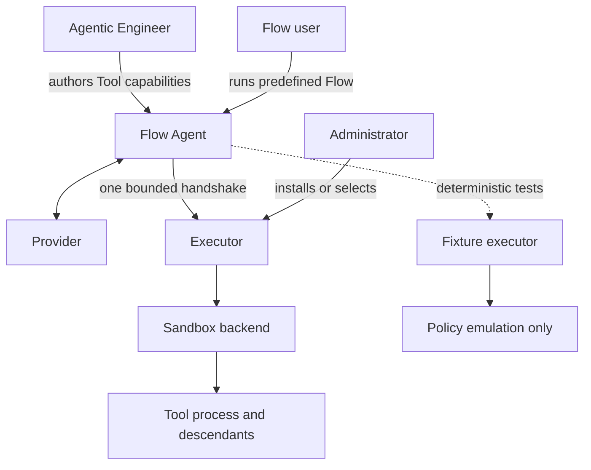
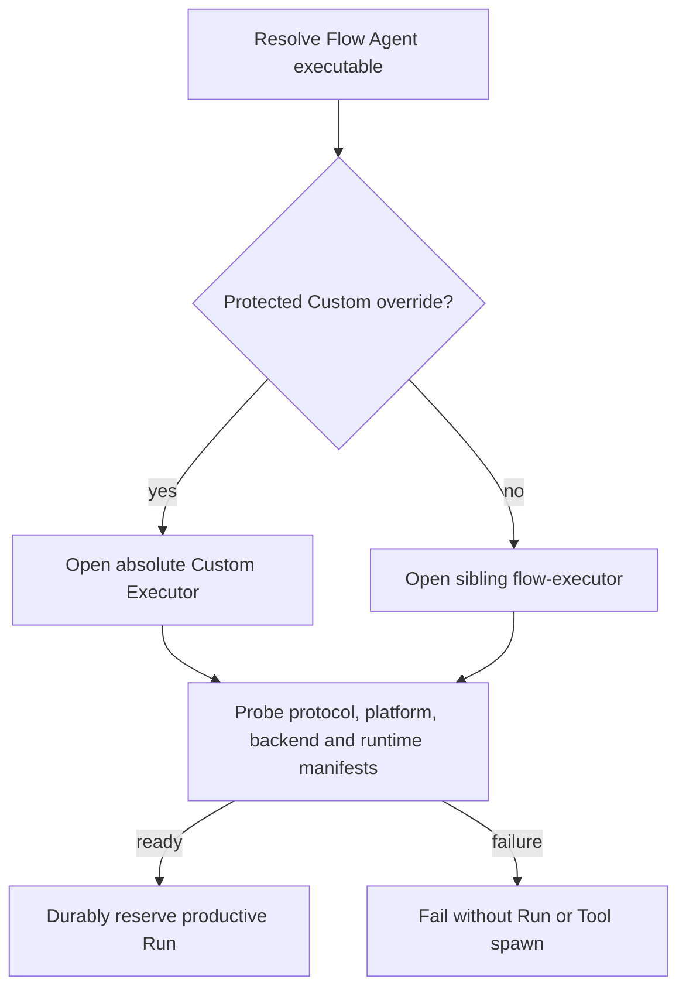
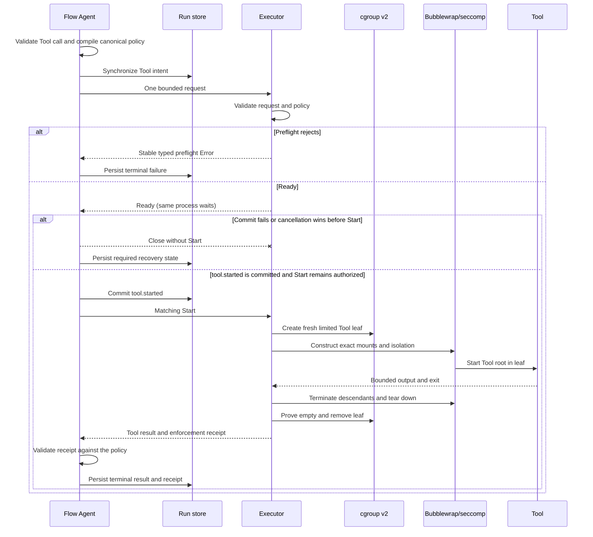

# Flow Agent Executor and Sandbox architecture

This document explains the accepted M1.2 design. Normative milestone scope lives in [`PLAN.md`](../../PLAN.md), wire behavior in [`PROTOCOL.md`](../../PROTOCOL.md), security invariants in [`SECURITY.md`](../../SECURITY.md), evidence in [`TESTING.md`](../../TESTING.md), and terms in [`GLOSSARY.md`](../../GLOSSARY.md).

## Decision in one minute

Flow Agent validates a Tool request and compiles its policy. One short-lived Executor translates that policy and manages one Tool process tree in a fresh Sandbox. The Sandbox backend constructs the operating-system boundary. Provider traffic remains in Flow Agent, outside the Tool Sandbox.

The standard installation supplies an official, statically linked `flow-executor` sibling. An administrator may explicitly omit it or select an absolute Custom Executor override. Building Blocks, Flow users, providers, Tools, Workspaces and environment variables cannot select or replace the Executor. Failure never chooses a weaker path.

The official productive M1.2 backend is stock Bubblewrap plus seccomp inside a transient systemd user scope with a delegated cgroup-v2 PIDs controller on Ubuntu 24.04 x64. The required host interfaces are probed directly; no kernel-version guess or weaker fallback is used. All productive Tool execution, including an administrator-owned Custom Executor, is limited to that platform. macOS, Windows and other targets fail before Executor selection or Tool spawn; provider-only Flows do not use this boundary. A Custom Executor receives no Flow Agent compatibility or security guarantee.

## Responsibility split



| Owner | Responsibility |
|---|---|
| Agentic Engineer | Select the Tool identity, parameters, exact mounts, runtime-read profile, positive process/thread capacity and deny-all network policy. |
| Flow Agent | Validate authority, derive the selected Executor, prove readiness, compile canonical policy, persist attempt state, validate both handshake stages and fail closed. |
| Executor | Preflight one request, wait for explicit `Start`, translate its exact capabilities, manage one Tool process tree and return a bounded Tool result or typed error. |
| Sandbox backend | Construct and enforce filesystem, process and deny-all network isolation. |
| Administrator | Own the installed sibling or protected Custom Executor override and assess any third-party implementation. |

The Fixture executor remains in process, deterministic and independent of Sandbox installation. It is not a productive escape hatch and makes no isolation claim. Meta-Harness may supervise the whole `flow` CLI process but never selects or manages a Flow Tool Sandbox; Liquid has no responsibility in this boundary.

## Selection and readiness



The standard installer includes the sibling unless the administrator chooses `--no-default-executor`. `flow executor configure --path <absolute-path>` selects a protected Custom Executor override; `flow executor configure --default` removes it. Resolution never uses the Workspace, `PATH`, a shell, the working directory or provider output.

Flow Agent probes the selected object once before durable productive Run reservation. An absent, unsafe, replaced, incompatible or unready object fails with stable diagnostics and creates no Run. Official readiness includes an active systemd user manager plus delegated cgroup-v2 capacity and cleanup evidence; installation neither enables lingering nor adds a Watershed service. A passing probe is advisory, not certification; every Tool execution still validates its enforcement receipt.

On Ubuntu 24.04 x64, implementers can run the public observable-protocol check without changing their current configuration:

```bash
cargo run --locked -p flow-agent-core --features m12-startup-evidence --example custom_executor_conformance -- --executor /absolute/path/to/flow-executor
```

The isolated check probes the Custom Executor and dispatches one fixed exact-profile `/bin/echo` request. Passing is advisory evidence only; it does not certify compatibility, policy equivalence, security or operations. [`TESTING.md`](../../TESTING.md) defines the canonical coverage boundary.

## One Tool invocation



One Executor process spans the bounded handshake for one invocation. It first enters one empty transient systemd scope so the PIDs controller is delegated for that invocation; this envelope contains no Tool. A failed `tool.started` commit or cancellation before `Start` closes the waiting process without creating a Tool boundary; the canonical [durable-attempt contract](../../PROTOCOL.md#m11-codex-subscription-provider) owns the distinct recovery outcomes. Only after matching `Start` does the Executor create the limited Tool cgroup leaf and Bubblewrap boundary. The configured positive capacity counts the Tool root, every descendant and every thread; trusted Executor and Sandbox supervisor processes stay outside the leaf. Capacity exhaustion is typed from the leaf's kernel event evidence. There is no daemon, socket, persistent per-Flow Sandbox, pooled guest or remote transport. Exact request, framing, descriptor, digest and receipt rules live in the canonical [`PROTOCOL.md` process and framing contract](../../PROTOCOL.md#process-and-framing-contract).

## Filesystem and runtime reads

Each `read_only_mounts` entry becomes an exact read-only mount and each `writable_mounts` entry an exact writable mount. Flow Agent resolves and verifies sources before dispatch so later path replacement cannot redirect a mount.

Every Tool uses one runtime-read profile:

- `exact` is the default. It exposes only the bounded executable/interpreter/library objects advertised by the administrator-owned Executor readiness response.
- `host-system-read` is an explicit Agentic Engineer choice. It adds only the official Executor's fixed reviewed read-only Ubuntu system roots.

Flow selects the configured profile before compiling the policy. The Executor cannot add a runtime path afterward, and Flow users, providers and Tools cannot change or escalate the profile. The official Ubuntu Executor is statically linked, so its own bootstrap does not require broad runtime reads; a dynamic official artifact fails readiness.

The backend uses stock Ubuntu Bubblewrap and preserves the verified mount identities while constructing the Tool boundary. A protected inner supervisor validates the boundary, supervises the Tool as Sandbox PID 1 and returns its terminal status. Missing or inconsistent evidence fails closed. There is no bundled Bubblewrap, Landlock-only path, broad compatibility mount or unsandboxed fallback. The canonical protocol contract linked above owns inherited-descriptor and older-Bubblewrap self-reexec mechanics.

## Supported matrix

| Target | Official behavior |
|---|---|
| Ubuntu 24.04 x64 | Stock Bubblewrap namespaces and exact mounts plus seccomp; transient systemd user scope; delegated cgroup-v2 PIDs leaf with reliable capacity and cleanup evidence; isolated Tool network namespace; deny all. |
| macOS | Productive Tool execution fails closed. Reconsider only after a post-M1.2 review proves supported controls that prevent or contain process creation and guarantee descendant teardown without private-API debt. |
| Windows and other targets | Productive Tool execution fails closed before Executor selection or Tool spawn. Custom Executors are not enabled. |

Positive Tool egress remains disabled. Provider traffic is not Tool egress.

## Reference architectures

The cited projects informed the boundary but are neither dependencies nor support promises.

### Pi Coding Agent

Pi's built-in Tools use the Pi process's host authority. Extensions can replace Tool operations with OS-sandbox or Gondolin integrations. Flow Agent adopts the narrow replaceable seam, but supplies a fail-closed default boundary instead of transferring isolation choice to an ordinary user.

### Codex CLI

Codex integrates approvals, permission profiles, command transformation, managed networking, lifecycle and several platform helpers. Flow Agent needs only its policy-aware one-shot Executor, Ubuntu backend, lifecycle and evidence. It does not add interactive approvals, PTYs, a proxy, a remote execution service, a bundled Sandbox binary or multiple official platform stacks.

This reduction keeps the product boundary auditable. The security-critical work remains exact capability translation, packaging, descendant cleanup and hostile black-box evidence, not the JSON transport itself.

## Evidence and quality goals

The canonical test matrix is in [`TESTING.md`](../../TESTING.md). It covers protocol framing, selection/readiness, exact mounts and replacement races, both runtime profiles, stock Bubblewrap compatibility, exact process/thread capacity, independent concurrent leaves, cleanup and crash collection, deny-all networking, receipts, persistence/recovery, installation opt-out and fail-closed targets. Performance observations include the complete fresh scope/cgroup/Sandbox lifecycle and follow [`PERFORMANCE.md`](../../PERFORMANCE.md); no estimated timing, throughput or RSS value is a release gate.

## Pinned reference sources

Research snapshot: 2026-08-17.

- Pi Coding Agent, commit [`8720548`](https://github.com/earendil-works/pi/tree/87205484bf749c2140fef5d1bea68995d57e739c), MIT: [`README.md`, `security.md` and `rpc.md`](https://github.com/earendil-works/pi/tree/87205484bf749c2140fef5d1bea68995d57e739c/packages/coding-agent), the [`sandbox/index.ts` example](https://github.com/earendil-works/pi/tree/87205484bf749c2140fef5d1bea68995d57e739c/packages/coding-agent/examples/extensions/sandbox), and the [`gondolin/index.ts` example](https://github.com/earendil-works/pi/tree/87205484bf749c2140fef5d1bea68995d57e739c/packages/coding-agent/examples/extensions/gondolin).
- OpenAI Codex CLI, commit [`21cfd36`](https://github.com/openai/codex/tree/21cfd369efca2df70c904c580b2e7e2e3eddb3c3), Apache-2.0: [sandbox orchestration](https://github.com/openai/codex/tree/21cfd369efca2df70c904c580b2e7e2e3eddb3c3/codex-rs/core/src/sandboxing), [Linux backend](https://github.com/openai/codex/tree/21cfd369efca2df70c904c580b2e7e2e3eddb3c3/codex-rs/linux-sandbox), and [platform policy transformation](https://github.com/openai/codex/tree/21cfd369efca2df70c904c580b2e7e2e3eddb3c3/codex-rs/sandboxing/src).

Any later dependency requires the repository's normal licensing, security and supply-chain review.
