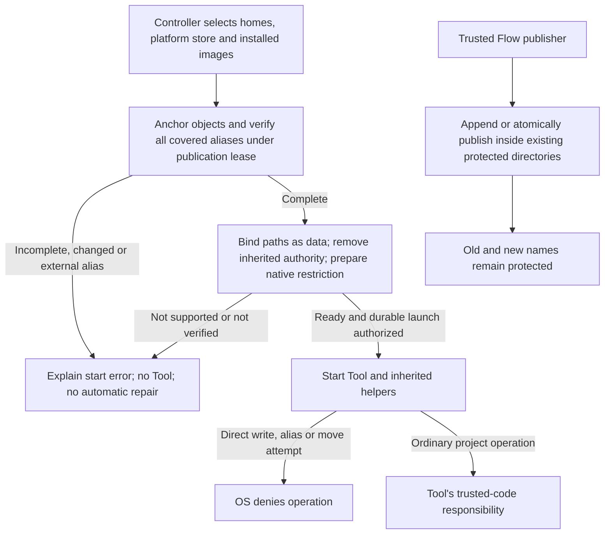

# Native Flow-file protection proposal

**D-063 proposal, not a shipping decision or implemented Executor.** The accepted guarantees and exclusions belong to [SECURITY.md](../../SECURITY.md#accepted-flow-agent-security-target). This document specifies the candidate needed to decide whether the Mac mechanism is worth integrating. [TESTING.md](../../TESTING.md#authorized-mac-feasibility-evaluation-adr-0167) owns reproducible commands, native observations and their limits. The existing Linux implementation and fail-closed Mac product behavior remain unchanged.

## Recommendation and user consequences

Evaluate the native macOS profile mechanism as one part of a checked launch boundary, not as a path-only rule. Retain the short-lived Default Executor. Do not require a Linux VM, administrator privileges, a permanent service or an additional product runtime on Mac. `sandbox-exec` is supplied by macOS; Python is only the development probe's driver.

The proposed boundary combines protected directories/program names, complete alias admission, inherited-handle removal, ancestor-move denial and terminal-channel isolation. An invalid installation must produce an actionable start error, never an automatic repair or an unprotected Tool. ADR-0169 accepts the alias and ancestor-move restrictions and reconfirms independent-service responsibility. The complete protected-object set, terminal-device policy and unsupported Apple-interface maintenance risk still require approval before implementation as a release backend.

Ordinary non-interactive shell commands and project builds remain the intended use case. Tools receive bounded input/output pipes, not the human review terminal. The proposed terminal-device denial can break programs requiring direct terminal access, interactive password prompts or terminal-user-interface libraries. It is not a general promise that every Mac application works. Native GUI automation through independent services and Metal compatibility require their own evidence; neither is established by a C compilation test.

## Native App Sandbox comparison

The practical comparison is now separate from the earlier documentation-only assessment. [TESTING.md](../../TESTING.md#authorized-mac-feasibility-evaluation-adr-0167) owns exact commands, source revisions and hosted ARM64 evidence. No Windows result is used as Mac proof. No production Executor, administrator service or release-signing identity is involved.

### What Apple recommends

The [SDK manual mirror for `sandbox-exec`](https://keith.github.io/xcode-man-pages/sandbox-exec.1.html) explicitly marks the command deprecated and recommends App Sandbox. The consulted sources do not supply a detailed deprecation rationale, a removal date or evidence that the old mechanism is inherently insecure. Do not turn deprecation into those claims. Apple's [current App Sandbox overview](https://developer.apple.com/documentation/security/app-sandbox) documents the supported entitlement-based resource boundary; App Sandbox is required for Mac App Store distribution, not limited to that distribution channel.

The models differ: the profile candidate starts from host access and subtracts protected writes and terminal access. App Sandbox starts with constrained app authority and adds resource grants. These are native OS mechanisms, not Linux VMs. A supported app model is not a drop-in supported replacement for every custom command profile.

### Configurations and fair controls

- **Unprotected:** the same native helper performs the dangerous operations successfully. This establishes reachable effects, not protection.
- **Checked profile:** the previously evaluated profile plus alias admission and descriptor removal. The retained raw-profile failures remain in the original probe.
- **Minimal App Sandbox:** signed app and bundled helper, app-sandbox entitlement, helper inheritance, and user-selected read/write entitlement without an actual selection. Its own synthetic app container is the positive control; refusing an unselected project is expected, not a product defect.
- **App Sandbox with project exception:** add Apple's documented temporary absolute-path read/write exception for one synthetic project directory. This is a fixed grant in the locally signed experiment, not a real file-selection or persistent-bookmark workflow.
- **App Sandbox with executable-write permission:** retain that project exception and additionally enable `com.apple.security.files.user-selected.executable`; report its effect separately rather than assuming a failed build workflow cannot be configured correctly.

The [Apple file-access guide](https://developer.apple.com/documentation/security/accessing-files-from-the-macos-app-sandbox) describes container access, recursive folder selection and executable-write permission. Its restriction on execution outside app/container locations is specifically stated for **user-selected-file entitlements**, not proof that all host execution is impossible under every App Sandbox configuration. The [helper guide](https://developer.apple.com/documentation/xcode/embedding-a-helper-tool-in-a-sandboxed-app) supplies bundled-helper inheritance and local ad-hoc signing. The [temporary-exception reference](https://developer.apple.com/library/archive/documentation/Miscellaneous/Reference/EntitlementKeyReference/Chapters/AppSandboxTemporaryExceptionEntitlements.html) documents the separate path grant used here. Temporary exceptions are not established as a suitable release design merely because they work locally.

### Observed security and compatibility

The completed five-way comparison contains 133 observations: 26 each for the unprotected and checked-profile configurations, and 27 each for the three App Sandbox configurations, including their own-container controls. All unprotected mutation/control operations succeeded. No table entry is a general application-certification claim. Both project-exception variants produced the same functional outcomes below.

| Case | Checked profile | App Sandbox with project exception |
|---|---|---|
| Write ordinary project file | Allowed | Allowed |
| Write/delete/replace separate Flow file; change its metadata or mapped bytes | Explicit OS denial | Explicit OS denial |
| New-session child and bundled helper write separate Flow file | Explicit OS denial after helper startup | Explicit OS denial after helper startup |
| Existing external helper writes separate Flow file | Starts, then write denied | Starts, then write denied; minimal App Sandbox could not start this helper |
| Symlink pointing to separate Flow file; create new hardlink from it | Denied | Denied |
| Existing hardlink in the writable project pointing to Flow file | Layout rejected before launch | Write succeeds without that admission check |
| Deliberately passed writable protected handle | Removed before launch | Write succeeds if deliberately passed |
| Flow file underneath the writable project directory | Still denied by explicit protected subdirectory rule | Writable through the containing directory grant |
| Move parent of separate protected directory | Denied | Denied |
| Write controller's synthetic terminal device | Denied | Denied |
| `/bin/sh` small noninteractive workload | Completes | Completes |
| `/usr/bin/git --version`; `xcrun clang --version`; build through `xcrun` | Complete | Exit 1: `xcrun: error: cannot be used within an App Sandbox.` |
| Directly resolved Xcode Git version and new synthetic repository | Complete | Complete |
| Direct compiler with explicit SDK and linker location | Builds native program | Builds native program |
| Run that newly built program | Completes | Denied despite the successful build, both without and with executable-write permission |

The hardlink and handle results are **not App Sandbox escape claims**: granting an existing alias or passing already-open authority is a launcher/layout problem. App Sandbox also needs checked launch conditions. Conversely, the checked profile's successful rejection is not an OS-only result. Neither experiment promises whole-host safety or control over independent services.

The nested-directory case matters to the product: granting a whole project or home directory is not equivalent to “everything in that directory except Flow's own files.” An App Sandbox design must refuse overlapping broad grants, arrange separate protected storage or establish another supported protection method. The test does not prove that all alternative layouts are impossible or approve a changed user workflow.

`xcrun` is Apple's tool locator/launcher. Its refusal does not mean Git and compilers cannot run: the controller resolved existing Xcode tool locations before sandboxing, and the actual programs then ran without copying or re-signing them. However, arbitrary build scripts may invoke the refused launcher internally. The successful tiny direct build does not establish compatibility with those scripts, Xcode projects or every installed development tool.

The generated program's launch returned `EPERM` in both project-exception variants; its file existed and the compiler exited 0. Adding executable-write permission to the app did not fix this compiler/helper workload. The experiment does not identify the precise quarantine/signature/helper-entitlement cause or prove that every supported execution arrangement is impossible. A container-based build/output arrangement would be a different, untested workflow, not transparent compatibility with arbitrary project commands.

### User experience, terminal interaction and remaining proof

For the profile candidate, ordinary host paths remain the default; installation admission establishes the protected exceptions. For App Sandbox, the user or installer must establish usable resource grants. A genuine folder-selection/bookmark workflow, grant overlap checks and stable signed distribution remain untested. Re-signing a test app with a fixture-specific absolute path is **not** a proposed per-user installation procedure.

Programs that may need a private interactive terminal include `sudo` password prompts, `ssh`/`scp` password or key-passphrase prompts, a `git commit` that opens an editor, Vim/Nano, `less`, `fzf` and interactive coding-agent interfaces. These are compatibility examples, not individually tested failures. A simple stdin question is different from opening a terminal device. Noninteractive modes such as `git commit -m ...` may avoid that editor interaction, but do not certify hooks, authentication or every child process. Never solve password handling by forwarding secrets into Tool input/logs. A private Tool terminal separated from human approval would be a different design requiring approval and native tests, not an automatic fallback.

Both approaches stay native, with no VM-induced Linux/host split. The probe records individual elapsed times, but different cold/warm states, fixed ordering and failed workloads preclude an overhead ranking. No latency, memory, GPU or all-workload performance conclusion follows. Metal/ML inference, GUI automation, real file-picker/bookmark grants, release signatures/notarization, downloaded-package quarantine and other macOS versions remain untested. The profile's prior 29-case publication/parent-exit/later-terminal matrix was not fully repeated for App Sandbox; do not imply evidence parity there.

For the approved broad host-tool use case, the checked profile remains the more direct candidate, with explicit deprecated-interface maintenance risk. App Sandbox is a real alternative with working protection and some native development operations, but still requires a separately approved grant/layout/compatibility design. This comparison authorizes neither shipping mechanism and does not make either release-ready.

## Complete proposed protected set

Resolve the following from trusted controller/installation configuration before Tool launch, never from model output or a Tool-supplied exclusion. Anchor canonical objects using the existing no-follow filesystem discipline; do not later resolve authority again through mutable path text.

| Object class | Proposed coverage and update rule |
|---|---|
| Selected `FLOW_AGENT_HOME` | Entire directory tree: Global Flow configuration, registry, instructions stored there, runtime history, context/objects, locks and staging files. Directory coverage also protects files created later. |
| Additional Flow homes | An explicit administrator-owned set fixed before execution. The default shared home covers concurrent Runs using that home; there is no whole-disk search or automatic promise for undisclosed independent homes. The administrator must admit every home needing mutual protection before starting those Tools. |
| Platform credential/selection store | Entire Flow-owned platform directory, including `credentials.json`, `executor.json`, locks and staging names. These are outside the selected home today; their locations remain canonical in [PROTOCOL.md](../../PROTOCOL.md). The inventory inspects metadata, never credential contents. |
| Installed program objects | Current `flow`, the official sibling `flow-executor` and any explicitly selected Custom Executor, including every covered name of the same file. Reject missing or unresolved objects. Custom code still belongs to the trusted installation, not third-party certification. |
| Path ancestry | Prevent Tools from removing or renaming any canonical ancestor of a protected directory or program. Do not prohibit ordinary unrelated child-file edits in those ancestors. Moving a parent folder containing Flow data is consequently unavailable to Tools. |
| Review channel | Controller owns and pins its terminal before running Tools. No terminal/approval handles are inherited. Deny direct access to the supported Mac terminal-device namespace, including later-created terminals; protect `/dev/tty` and console paths as well as the selected device. This prevents a different Run's new terminal from becoming an unguarded direct entry point. |

Undisclosed installations, project files, backups and exported copies are not automatically protected objects. Changing the admitted home/image set is manual installation maintenance, not one of the automated configuration fields. Do not claim that an already-running Tool acquires protection for a newly admitted outside directory: its native policy is immutable. Maintenance must account for previously started helpers; bounded waiting is not proof that all of them ended.

## General invariant, not command-name filtering

At admission, every regular protected file's total hardlink count must equal the number of its distinct names covered by the protected set. Count an overlapping root only once. Reject external aliases, unsupported file types, incomplete scans, changed identities and inability to establish the complete set. Ordinary project hardlinks remain allowed.

This admits a legitimate temporary hardlink **inside** a protected directory without permitting an alias outside it. It does not relax the runtime's existing storage-format, ownership, durability or incomplete-publication checks. A protected leftover stage is not automatically a valid completed authoring operation.

The invariant is preserved during execution because:

1. All admitted names are covered by native write denial; children inherit that denial across ordinary spawn, session changes and parent exit.
2. Tools cannot create new hardlinks from protected objects, change their metadata, replace them or move their protected ancestry outside the policy.
3. Flow-owned publishers create, append, link and rename only within the already protected directory set. Replacement and newly created files remain covered by directory policy; no per-file policy refresh is needed.
4. No writable protected handle, directory capability or review handle reaches the Tool. Only explicitly constructed Tool I/O is inherited. A pre-opened writable handle defeats the path-only profile and must be removed before execution.

Existing Flow processes must coordinate initial admission with their protected-file publication operations using an installation-owned lease and anchored identities. A scan racing a publisher is retried within a bounded admission attempt or rejected; it is not a valid snapshot. Do not serialize entire Runs or ordinary project work behind that admission lease. Do not rescan all retained history for every Tool call: retain one verified controller admission and preserve it through checked publisher operations. Measure the cost of the actual scanner and contention during integration; the small fixture scan supplies no large-history performance claim.

Unconfined external writers, privileged actors and controller/OS compromise are the existing trust exclusions, not problems solved by the lease. Cooperative locks alone never constrain a malicious Tool. The native restriction is what preserves the established set against Tool code.



## Launch, publication and failure protocol

- **Prepare:** initialize required Flow-owned directories through trusted setup, acquire admission, verify identities/alias coverage and build an immutable protected set. Missing prerequisites or a path that cannot be represented safely are explicit readiness failures. The candidate uses fixed profile structure and parameter-bound path data; shell interpolation and embedding untrusted path text as profile source are unnecessary.
- **Start:** the existing controller/one-shot Executor seam retains durable intent, `Ready`/`Start` ordering, bounded transport and exact request binding. Install the native restriction and remove all unintended descriptors before the first Tool instruction. Launch trusted enforcement code with a separate sanitized environment; apply Engineer-admitted Tool environment values only inside the established boundary, never to the enforcement launcher's loader or startup hooks. The replacement protocol must identify the exact applied protected set without pretending the old broad-isolation receipt still describes it.
- **Publish:** preserve existing create-only hardlink publication, append, staged-file replacement and staged-directory rename. Both temporary and final names stay protected. A failed cleanup can leave a protected stage and an honestly incomplete outcome; it cannot silently move that stage to a writable project directory.
- **Install:** finalize program publication before a new installation starts Tools. Current installation does not upgrade existing programs. An external hardlink to a selected program is a readiness error; an interrupted install must be finalized or deliberately repaired by its owner. This proposal does not add an automatic updater or change system/kernel policy.
- **Finish/crash:** terminate further dispatch and retain truthful effects/uncertainty evidence. The restriction stays on a surviving helper; protection must not depend on the Executor remaining alive. Do not promise that arbitrary hostile descendants have all been killed. Never redispatch an uncertain effect.

## Configuration review integration

The [approved ADR-0168 workflow](../../SECURITY.md#configuration-and-migration-boundary) is normative, not another proposal here. Its implementation must use separate controller-owned input, discard pre-review buffered input, safely render untrusted output and show an unmistakable controller review of the exact change. Render control and bidirectional formatting characters visibly rather than executing or visually hiding them. A Tool's stdout, a literal `yes`, an escape sequence or a forged attention event must never count as consent. A native terminal-open denial is necessary evidence, not a completed approval UI or transaction test.

```mermaid
sequenceDiagram
  participant T as Tool or surviving helper
  participant G as Native restriction
  participant F as Flow controller
  participant U as Local owner
  T-->>F: Tool output and explicit proposal
  Note over F: Output is untrusted data, not consent
  F->>F: Finish Tool; validate proposal; stop further dispatch
  T->>G: Open current or later review terminal
  G-->>T: Direct access denied; no inherited review handle
  F->>U: Controller-owned exact-change review
  alt Explicit valid consent within five minutes
    U-->>F: Approve this proposal
    F->>F: Revalidate version and scope; atomic publication for future Runs
  else Refusal, silence, cancellation or lost channel
    F->>F: Reject and end requesting Run; no retained approval queue
  end
```

An Engineer-authorized independent GUI/automation service may act with its own authority, including on a terminal. That remains delegated host authority, not direct Tool-channel isolation. Do not advertise secure human approval against a compromised controller, terminal application or such a service. If a deployment needs that stronger guarantee, this proposal is insufficient; a separately trusted approval surface would require another decision.

## Finite evidence and release acceptance

The executable matrix partitions file access, alias admission, publication, inherited authority, helper lifetime, review-device access and ordinary host-program compatibility. It deliberately includes unprotected controls. It is not an exhaustive list of commands or a mathematical proof that Apple's private implementation has no defects.

| Evidence boundary | What constitutes completion |
|---|---|
| Native feasibility | Existing direct-write/link/handle controls plus multi-root publication, metadata/mapped writes, ordinary project writes/hardlinks, child inheritance, parent exit and current/later terminal tests pass on native ARM64 macOS. The raw path-only profile remains a recorded counterexample. |
| Product admission | Implement anchored discovery and coordinated publication, then run real runtime/installer concurrency and interruption tests. The fixture scanner is deliberately single-owner; its passing tests do **not** prove race-safe production admission. |
| Configuration transaction | Implement ADR-0168 and test actual CLI review, pre-buffered/forged output, wrong/stale/reused consent, exact scope, rejection/timeout/channel loss, simultaneous publishers and each crash boundary. No mock interaction may be reported as native end-to-end consent evidence. |
| Distribution | Build the actual download package; verify checksum failure paths, clean installation, quarantine/Gatekeeper behavior and the chosen release signing/notarization process on macOS. The local generated C binary's signature proves none of these. No release identity or credential is acquired by the probe. |
| Release support | Approve the mechanism and protected-set restrictions, publish the tested OS range, retain Linux x86_64 and macOS ARM64 native gates and full lifecycle observations. Unsupported or failed readiness has no weaker fallback. OS updates require revalidation; a deprecated interface can force a compatibility update or explicit refusal. |

The implementation and distribution rows are **release gates**, not tests completed by this proposal. Do not select a release OS range solely from one hosted runner patch version. The [native comparison](#native-app-sandbox-comparison) establishes specific App Sandbox successes and restrictions, not arbitrary host-program compatibility; [D-063](../decisions/open-decisions.html#d-063) retains the shipping decision. A passing feasibility matrix supports a candidate, not the claim that it is the only possible design or already release-ready.
